# 趣知桌面版 - 产品设计

<div align="center">
  <h1>🎓 趣知桌面版产品设计</h1>
  <p>现代化桌面知识管理应用的产品设计与用户体验</p>
</div>

---

## 📖 目录

1. [产品概述](#1-产品概述)
2. [市场分析](#2-市场分析)
3. [用户研究](#3-用户研究)
4. [产品定位](#4-产品定位)
5. [功能规划](#5-功能规划)
6. [用户体验设计](#6-用户体验设计)

---

## 1. 产品概述

### 1.1 产品愿景

**打造最优雅、最高效的桌面知识管理生态**

让知识工作者能够通过直观美观的界面，高效地组织、管理和利用个人知识资产，构建属于自己的知识体系。

### 1.2 产品使命

- **智能化知识管理** - 通过AI技术提升知识组织和检索效率
- **极致用户体验** - 现代化设计语言，流畅的交互体验
- **知识图谱可视化** - 让知识关系一目了然
- **数字图书管理** - 统一管理多格式数字资源

### 1.3 核心价值主张

- **视觉美学**: 深色主题+毛玻璃效果，护眼且现代
- **智能问答**: AI驱动的知识检索和问答系统
- **图谱化思维**: 可视化知识关系，构建知识网络
- **离线优先**: 桌面端原生体验，数据安全可控

### 1.4 目标用户群体

- **学生群体**: 大学生、研究生、博士生
- **知识工作者**: 研发人员、咨询师、分析师
- **内容创作者**: 作家、博主、自媒体从业者
- **研究人员**: 科研工作者、数据分析师

---

## 2. 市场分析

### 2.1 市场现状

**知识管理软件市场规模持续增长**

- 全球知识管理软件市场预计2025年达到1,135亿美元
- 个人知识管理需求激增，疫情后远程办公加速需求
- 现有产品多为网页端，桌面端体验普遍不佳

### 2.2 竞品分析

#### 直接竞品

| 产品 | 优势 | 劣势 | 市场定位 |
|------|------|------|----------|
| Obsidian | 插件生态丰富 | 学习门槛高 | 专业用户 |
| Logseq | 本地优先，开源 | UI设计一般 | 程序员群体 |
| Roam Research | 双向链接先驱 | 订阅制昂贵 | 企业用户 |

#### 间接竞品

| 产品 | 特点 | 目标群体 |
|------|------|----------|
| Notion | 全能型工作空间 | 团队协作 |
| Evernote | 传统笔记应用 | 个人用户 |
| OneNote | Microsoft生态 | Office用户 |

### 2.3 市场机会

- **桌面端体验差异化**: 相对于网页端产品的性能优势
- **视觉设计空白**: 现有产品UI设计普遍落后
- **本地化需求**: 中文用户的本地化使用习惯
- **AI集成机会**: 知识图谱+AI问答的创新组合

---

## 3. 用户研究

### 3.1 目标用户画像

#### 用户画像1: 研究生小张

- **基本信息**: 25岁，计算机专业研究生
- **使用场景**: 文献管理、论文写作、知识整理
- **痛点**: 文献分散存储，知识点关联性不强
- **需求**: 可视化知识关系，便于论文引用

#### 用户画像2: 产品经理小李

- **基本信息**: 28岁，互联网公司产品经理
- **使用场景**: 竞品分析、行业研究、需求整理
- **痛点**: 信息碎片化严重，缺乏系统整理
- **需求**: 高效检索，数据可视化

#### 用户画像3: 自媒体作者老王

- **基本信息**: 32岁，知识付费博主
- **使用场景**: 素材收集、内容创作、知识沉淀
- **痛点**: 素材管理混乱，创作效率不高
- **需求**: 美观界面，素材快速检索

### 3.2 用户需求层次

#### 基础需求 (Must Have)

- **文件管理**: 多格式文档存储和管理
- **搜索功能**: 全文检索，快速定位内容
- **笔记记录**: 支持markdown、富文本编辑
- **分类组织**: 标签、文件夹等组织方式

#### 期望需求 (Should Have)

- **智能问答**: AI驱动的知识问答系统
- **知识图谱**: 可视化知识关系网络
- **数据分析**: 使用数据统计和可视化
- **界面美观**: 现代化UI设计

#### 兴奋需求 (Could Have)

- **多端同步**: 云端数据同步
- **插件扩展**: 功能插件生态系统
- **协作功能**: 团队知识共享
- **移动端适配**: 移动设备支持

### 3.3 使用场景分析

#### 场景1: 学术研究

```
用户目标: 整理研究文献，构建知识体系
使用流程: 导入文献 → 添加笔记 → 建立关联 → 可视化分析
关键需求: 文献管理、知识关联、图谱可视化
```

#### 场景2: 工作学习

```
用户目标: 提升工作效率，积累专业知识
使用流程: 收集资料 → 分类整理 → 快速检索 → 知识复用
关键需求: 分类管理、全文搜索、数据统计
```

#### 场景3: 内容创作

```
用户目标: 素材管理，提高创作效率  
使用流程: 素材收集 → 灵感记录 → 内容创作 → 发布分享
关键需求: 素材管理、灵感捕捉、快速编辑
```

---

## 4. 产品定位

### 4.1 产品定位声明

**面向知识工作者的现代化桌面知识管理工具**

趣知桌面版定位为一款专为中文用户设计的高颜值、高性能桌面知识管理应用，通过AI技术和可视化设计，让知识管理变得简单优雅。

### 4.2 差异化优势

#### 设计优势

- **视觉设计领先**: 深色主题+毛玻璃效果
- **流畅动效**: 精心设计的交互动画
- **统一色彩系统**: 基于#38b2ac的完整设计语言

#### 技术优势

- **桌面端性能**: Electron架构，原生体验
- **AI技术集成**: 智能问答，知识推荐
- **可视化能力**: 知识图谱，数据大屏

#### 功能优势

- **知识关联**: 双向链接，图谱可视化
- **多格式支持**: PDF、Markdown、富文本等
- **数据洞察**: 学习分析，使用统计

### 4.3 品牌理念

- **极简**: 去除冗余，专注核心功能
- **美观**: 现代设计，视觉愉悦
- **智能**: AI赋能，提升效率
- **安全**: 本地存储，数据可控

---

## 5. 功能规划

### 5.1 功能模块总览

```mermaid
graph TD
    A[趣知桌面版] --> B[我的首页]
    A --> C[知识问答]
    A --> D[知识图谱]  
    A --> E[知识库]
    A --> F[学习数据]
    A --> G[笔记]
    A --> H[设置]
    
    B --> B1[快速访问]
    B --> B2[最近使用]
    B --> B3[数据概览]
    B --> B4[智能推荐]
    
    C --> C1[对话管理]
    C --> C2[助手配置]
    C --> C3[会话历史]
    C --> C4[智能回复]
    
    D --> D1[节点管理]
    D --> D2[关系构建]
    D --> D3[图谱可视化]
    D --> D4[路径分析]
    
    E --> E1[文档导入]
    E --> E2[分类管理]
    E --> E3[阅读器]
    E --> E4[笔记批注]
    
    F --> F1[使用统计]
    F --> F2[知识分析]  
    F --> F3[数据可视化]
    F --> F4[趋势预测]
    
    G --> G1[笔记编辑]
    G --> G2[Markdown支持]
    G --> G3[标签管理]
    G --> G4[快速搜索]
    
    H --> H1[模型配置]
    H --> H2[显示设置]
    H --> H3[数据管理]
    H --> H4[快捷键]
```



### 5.2 核心功能详述

#### 5.2.1 我的首页

**个性化工作台，快速访问核心功能**

**功能特性:**

- **数据仪表盘**: 知识库统计、使用情况概览
- **快速操作**: 新建笔记、导入文档、搜索入口
- **最近使用**: 最近访问的文档和笔记
- **智能推荐**: 基于使用习惯的内容推荐
- **进度跟踪**: 学习进度、目标完成情况

**交互设计:**

- 卡片式布局，信息层次清晰
- 拖拽排序，个性化定制
- 实时数据更新，动态效果

#### 5.2.2 知识问答

**AI驱动的智能问答系统**

**功能特性:**

- **多助手管理**: 支持创建多个AI助手，每个助手独立配置
- **对话管理**: 每个助手支持多个对话主题，组织清晰
- **自然语言输入**: 支持中文自然语言问答
- **智能检索**: 在知识库中查找相关内容
- **上下文理解**: 基于对话历史的语义理解
- **答案生成**: 基于检索结果生成准确答案
- **模型配置**: 支持多种AI模型提供商（OpenAI、Claude、本地模型等）
- **系统提示词**: 可自定义助手的系统提示词和行为
- **记忆系统**: 支持长期记忆和上下文记忆
- **MCP集成**: 支持Model Context Protocol，增强AI能力

**技术实现:**

- 本地向量数据库存储
- 语义搜索算法
- 大语言模型集成(支持本地/云端多种模型)
- 流式响应，实时展示生成内容

#### 5.2.3 知识图谱

**可视化知识关系网络**

**功能特性:**

- **双向链接**: 文档间的双向关联关系
- **图谱可视化**: 3D/2D知识关系图展示
- **节点管理**: 知识点的创建、编辑、删除
- **关系分析**: 节点重要性、路径分析
- **图谱搜索**: 在图谱中快速定位节点
- **样式自定义**: 节点颜色、大小、布局算法

**可视化特性:**

- 力导向布局算法
- 节点聚类和分组
- 交互式缩放和平移
- 路径高亮显示

#### 5.2.4 知识库

**数字图书管理中心**

**功能特性:**

- **多格式导入**: PDF、EPUB、Markdown、Word等
- **智能分类**: 自动识别文档类型和主题
- **内置阅读器**: 支持多种格式的原生阅读
- **批注笔记**: 划线、高亮、添加笔记
- **全文搜索**: 跨文档的全文检索功能
- **阅读统计**: 阅读时长、进度跟踪

**阅读体验:**

- 护眼模式和字体调节
- 书签和目录导航
- 阅读进度同步
- 批注导出功能

#### 5.2.5 笔记

**快速记录和整理**

**功能特性:**

- **Markdown编辑器**: 支持完整的Markdown语法
- **实时预览**: 所见即所得的编辑体验
- **标签管理**: 多层级标签系统
- **全文搜索**: 快速定位笔记内容
- **双向链接**: 笔记间建立链接关系
- **版本历史**: 自动保存编辑历史

#### 5.2.6 学习数据

**知识管理数据洞察**

**功能特性:**

- **使用统计**: 应用使用时长、功能使用频率
- **知识增长**: 知识库规模增长趋势
- **学习分析**: 学习效率、知识点掌握度
- **热点内容**: 最常访问的文档和知识点
- **时间分析**: 使用时间分布、效率分析
- **报表导出**: 支持多种格式的数据导出

**可视化组件:**

- 交互式图表(基于@ant-design/charts)
- 实时数据大屏
- 自定义报表配置

#### 5.2.7 设置

**完整的配置管理系统**

**功能特性:**

- **模型设置**: AI模型提供商配置、API密钥管理、模型选择
- **显示设置**: 主题切换、字体大小、语言选择
- **数据管理**: 数据备份、导出、导入、清理
- **文档设置**: 默认保存位置、自动保存间隔
- **搜索设置**: 搜索引擎配置、索引管理
- **快捷键**: 自定义快捷键配置
- **MCP配置**: Model Context Protocol服务器配置
- **记忆设置**: AI记忆功能配置

### 5.3 功能优先级

#### P0 - 核心功能 (MVP)

- ✅ 基础文档管理
- ✅ 笔记编辑器  
- ✅ 全文搜索 
- ✅ 简单分类
- ✅ AI问答系统（已实现）
- ✅ 设置系统（已实现）

#### P1 - 重要功能

- 🔄 知识图谱基础功能
- ✅ 智能问答系统（已实现）
- 🔄 多格式阅读器
- 🔄 数据统计面板

#### P2 - 增强功能

- 🕐 高级图谱可视化
- 🕐 AI内容推荐
- 🕐 批注和高亮
- 🕐 学习数据报表

#### P3 - 扩展功能

- 🕐 插件系统
- 🕐 多端同步
- 🕐 团队协作
- 🕐 API开放

---

## 6. 用户体验设计

### 6.1 设计原则

#### 美学原则

- **视觉统一**: 统一的色彩、字体、间距系统
- **层次清晰**: 合理的信息层级和视觉权重
- **现代感**: 毛玻璃效果、渐变、阴影等现代设计语言

#### 可用性原则

- **简单易用**: 降低学习成本，直观的操作流程
- **效率优先**: 减少操作步骤，提供快捷键支持
- **容错性**: 提供撤销功能，避免误操作

#### 可访问性原则

- **对比度**: 确保足够的颜色对比度
- **键盘导航**: 完整的键盘操作支持
- **屏幕阅读器**: 支持无障碍技术

### 6.2 信息架构

#### 导航结构

```
趣知桌面版
├── 我的首页 (默认页面)
│   ├── 快速操作区
│   ├── 数据概览
│   ├── 最近使用  
│   └── 智能推荐
├── 知识问答
│   ├── 助手管理
│   │   ├── 助手列表
│   │   ├── 助手配置
│   │   │   ├── 模型设置
│   │   │   ├── 系统提示词
│   │   │   ├── 记忆配置
│   │   │   ├── 知识库
│   │   │   ├── MCP集成
│   │   │   └── 常用短语
│   │   └── 对话主题
│   ├── 对话界面
│   ├── 历史记录
│   └── 收藏夹
├── 知识图谱  
│   ├── 图谱画布
│   ├── 节点管理
│   └── 关系设置
├── 知识库
│   ├── 文档列表
│   ├── 分类管理
│   ├── 阅读器
│   └── 笔记中心
├── 笔记
│   ├── 笔记列表
│   ├── 编辑器
│   ├── 标签管理
│   └── 搜索
├── 学习数据
│   ├── 使用统计
│   ├── 知识分析
│   └── 自定义报表
└── 设置
    ├── 通用设置
    ├── 模型设置
    ├── 显示设置
    ├── 数据管理
    ├── 文档设置
    ├── 搜索设置
    ├── MCP设置
    ├── 记忆设置
    ├── 快捷键
    └── 关于
```

#### 页面布局

- **侧边栏**: 主导航，可折叠设计
- **内容区**: 核心功能展示区域
- **状态栏**: 显示当前状态和快捷操作

### 6.3 用户流程设计

#### 新用户引导流程


#### 核心操作流程

**知识问答流程:**


**文档管理流程:**


### 6.4 交互设计规范

#### 操作反馈

- **即时反馈**: 鼠标悬停、点击的视觉反馈
- **进度指示**: 长时间操作的进度显示
- **状态变化**: 明确的状态切换动画

#### 快捷键支持

| 功能 | 快捷键 | 描述 |
|------|--------|------|
| 全局搜索 | `Cmd/Ctrl + K` | 打开全局搜索 |
| 新建笔记 | `Cmd/Ctrl + N` | 创建新笔记 |
| 快速问答 | `Cmd/Ctrl + Q` | 打开问答界面 |
| 切换侧边栏 | `Cmd/Ctrl + B` | 折叠/展开侧边栏 |
| 知识图谱 | `Cmd/Ctrl + G` | 打开知识图谱 |
| 设置 | `Cmd/Ctrl + ,` | 打开设置页面 |

### 6.5 视觉设计系统

#### 色彩系统

```css
:root {
  /* 主色调 */
  --primary-color: #38b2ac;
  --primary-dark: #329a94;
  --primary-light: #4dc4bc;
  
  /* 背景色 */
  --bg-primary: #0f0f23;
  --bg-secondary: #1a1a2e;
  --bg-tertiary: #16213e;
  
  /* 文本色 */
  --text-primary: #ffffff;
  --text-secondary: rgba(255, 255, 255, 0.65);
  --text-tertiary: rgba(255, 255, 255, 0.45);
  
  /* 功能色 */
  --success: #52c41a;
  --warning: #faad14;
  --error: #f5222d;
  --info: #1890ff;
}
```

#### 字体系统

- **主字体**: -apple-system, BlinkMacSystemFont, 'Segoe UI', 'PingFang SC'
- **代码字体**: 'Fira Code', 'Consolas', monospace
- **标题字重**: 600
- **正文字重**: 400

#### 间距系统

- **基础单位**: 4px
- **常用间距**: 8px, 12px, 16px, 24px, 32px, 48px

#### 动画系统

- **过渡时长**: 0.3s (标准), 0.15s (快速), 0.5s (慢速)
- **缓动函数**: cubic-bezier(0.25, 0.46, 0.45, 0.94)
- **毛玻璃效果**: backdrop-filter: blur(15px)

---

## 📝 总结

### 🎯 产品核心优势

1. **现代化设计**: 深色主题+毛玻璃效果的视觉体验
2. **AI赋能**: 智能问答和语义搜索提升使用效率
3. **知识图谱**: 可视化知识关系，构建知识网络
4. **桌面端体验**: 原生性能和离线优先的使用体验
5. **完整的AI集成**: 支持多种模型提供商，灵活配置

### 📈 功能亮点

- ✅ 多助手对话系统
- ✅ 灵活的模型配置
- ✅ 系统提示词自定义
- ✅ MCP协议集成
- ✅ 记忆系统支持
- ✅ 流式响应体验

### 🎖️ 设计特色

- 统一的视觉设计语言
- 流畅的交互动画
- 完善的键盘操作支持
- 清晰的信息架构
- 现代化的UI组件

通过系统化的产品设计和精细化的用户体验，趣知桌面版致力于成为知识管理领域的优秀产品，为用户创造真正的价值。

---

*本文档将随着产品开发进展持续更新和完善。*
*最后更新: 2025-10-19*
