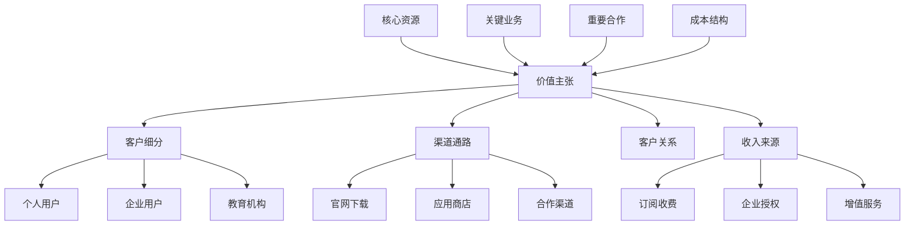
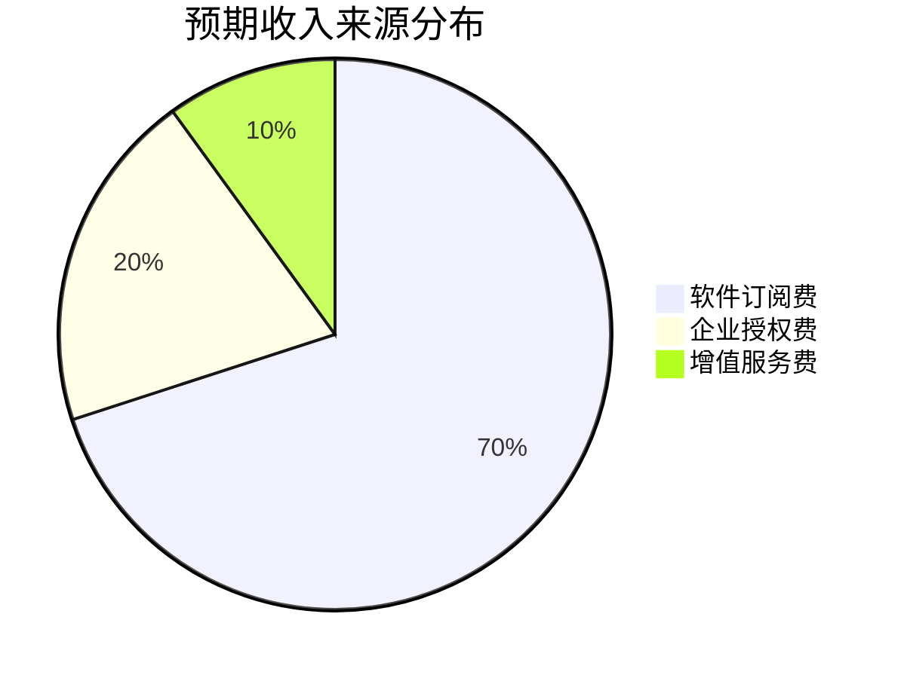

# 趣知桌面版 - 商业模式

  <h1>💰 趣知桌面版商业模式</h1>
  
可持续发展的商业化策略与运营规划

---

## 📖 目录

1. [商业模式概述](#1-商业模式概述)
2. [产品定价策略](#2-产品定价策略)
3. [收入来源](#3-收入来源)
4. [市场推广策略](#4-市场推广策略)
5. [成功指标](#5-成功指标)
6. [风险评估](#6-风险评估)

---

## 1. 商业模式概述

### 1.1 商业模式画布

### 1.2 核心价值

**为用户创造的价值:**

- **效率提升**: 通过AI和自动化提升知识管理效率50%以上
- **知识资产**: 帮助用户构建个人知识资产体系
- **美学体验**: 提供赏心悦目的使用体验
- **数据安全**: 本地存储，完全掌控自己的数据

**商业化潜力:**

- **B2C市场**: 个人知识管理需求旺盛
- **B2B市场**: 企业知识管理解决方案
- **教育市场**: 学校和教育机构的需求
- **增值服务**: AI能力、云同步等高级功能

### 1.3 目标市场规模

**市场估算:**

- **中国市场**: 知识工作者约2亿人
- **目标用户**: 其中10%有知识管理需求（2000万）
- **付费意愿**: 约5%愿意付费（100万）
- **市场空间**: 按年费99元计算，约1亿元市场规模

---

## 2. 产品定价策略

### 2.1 免费增值模式

#### 基础版 (免费)

**功能限制:**

- ✅ 文档数量限制: 1000个文档
- ✅ 存储空间: 2GB本地存储  
- ✅ 基础功能: 文档管理、搜索、简单分类
- ✅ AI问答: 每日10次免费额度
- ✅ 笔记功能: 基础Markdown编辑
- ✅ 知识图谱: 最多100个节点

**适用人群:**

- 个人轻量使用
- 尝试产品功能
- 学生用户

#### 专业版 (¥99/年)

**功能特性:**

- ✅ 无文档数量限制
- ✅ 无存储空间限制
- ✅ 完整功能: 知识图谱、学习数据
- ✅ AI问答: 无限制使用（需自备API Key）
- ✅ 多助手支持: 创建无限个AI助手
- ✅ 高级搜索: 语义搜索、向量检索
- ✅ 数据导出: 支持多种格式导出
- ✅ 优先技术支持
- ✅ 云同步功能（即将推出）

**适用人群:**

- 专业知识工作者
- 内容创作者
- 重度使用用户

#### 企业版 (¥299/年/用户)

**功能特性:**

- ✅ 专业版所有功能
- ✅ 团队协作功能
- ✅ 集中管理后台
- ✅ 数据同步和备份
- ✅ 企业级安全
- ✅ SSO单点登录
- ✅ 定制化部署支持
- ✅ 专属客户经理
- ✅ SLA服务保障
- ✅ 批量授权优惠

**适用人群:**

- 企业团队
- 研发部门
- 咨询公司
- 研究机构

### 2.2 订阅收费模式

#### 订阅价格体系

| 版本 | 月付 | 年付 | 终身授权 | 优惠幅度 |
|------|------|------|----------|----------|
| 专业版 | ¥19/月 | ¥99/年 | ¥399 | 年付优惠56% |
| 企业版 | ¥49/月 | ¥299/年 | ¥999 | 年付优惠50% |

#### 教育优惠

- **学生优惠**: 凭学生证享受5折优惠
- **教育机构**: 批量采购享受3-5折优惠
- **学术研究**: 提供免费学术授权

#### 促销策略

- **早鸟价**: 首批用户终身5折
- **推荐奖励**: 推荐好友获得1个月免费使用
- **年度促销**: 黑五、双11等节日促销
- **升级优惠**: 从基础版升级享受折扣

---

## 3. 收入来源

### 3.1 主要收入构成

#### 软件订阅费 (70%)

**个人订阅:**

- 专业版年费: ¥99/年
- 预期付费用户: 1万人（第一年）
- 预期收入: 99万元

**企业订阅:**

- 企业版年费: ¥299/年/用户
- 预期企业客户: 50家，平均20用户
- 预期收入: 30万元

#### 企业授权费 (20%)

**私有化部署:**

- 一次性授权费: 5-20万元
- 年度维护费: 授权费的20%
- 定制开发服务费

**合作伙伴:**

- OEM授权
- 白标服务
- 技术授权

#### 增值服务费 (10%)

**专业服务:**

- 数据迁移服务: ¥500-2000
- 定制化培训: ¥1000/天
- 企业部署咨询: ¥2000/天
- 数据恢复服务: ¥100-500

**API调用:**

- AI能力API: ¥0.01/次
- 向量检索API: ¥0.005/次
- 知识图谱API: ¥0.02/次

### 3.2 收入增长预测

#### 三年收入预测

| 年份 | 用户数 | 付费率 | 年收入 | 增长率 |
|------|--------|--------|--------|--------|
| Year 1 | 10万 | 10% | 100万 | - |
| Year 2 | 30万 | 12% | 360万 | 260% |
| Year 3 | 80万 | 15% | 1200万 | 233% |

#### 收入里程碑

- **6个月**: 达到10万元月收入
- **12个月**: 达到100万元年收入
- **24个月**: 达到500万元年收入
- **36个月**: 达到1000万元年收入

---

## 4. 市场推广策略

### 4.1 推广阶段规划

#### 初期推广 (0-6个月)

**目标**: 获得1000名种子用户

**策略:**

- **产品内测**: 
  - 邀请200名种子用户内测
  - 收集用户反馈快速迭代
  - 建立核心用户社群

- **社区运营**:
  - 在知乎、小红书发布产品文章
  - 在即刻、微博进行产品分享
  - 参与知识管理相关讨论

- **内容营销**:
  - 发布知识管理方法论文章
  - 制作产品使用教程视频
  - 撰写技术博客吸引开发者

- **KOL合作**:
  - 邀请知识管理领域KOL试用
  - 邀请B站UP主制作测评视频
  - 与播客合作推广

**预算**: 5万元

- 种子用户奖励: 2万元
- KOL合作费用: 2万元
- 内容制作: 1万元

#### 成长期推广 (6-18个月)

**目标**: 获得10万注册用户，1万付费用户

**策略:**

- **付费广告**:
  - 微信朋友圈广告
  - 知乎信息流广告
  - 百度搜索广告
  - 字节跳动广告平台

- **合作推广**:
  - 与印象笔记、Notion等产品合作
  - 与在线教育平台合作
  - 与出版社、图书馆合作

- **用户转介**:
  - 推荐好友奖励机制
  - 用户分享激励
  - 团购优惠活动

- **线下活动**:
  - 参加知识管理相关会议
  - 举办用户见面会
  - 校园推广活动

**预算**: 50万元

- 付费广告: 30万元
- 合作推广: 10万元
- 线下活动: 10万元

#### 成熟期推广 (18个月以后)

**目标**: 建立品牌认知，扩大市场份额

**策略:**

- **品牌建设**:
  - 品牌形象升级
  - 行业影响力打造
  - 用户口碑传播

- **渠道拓展**:
  - 建立代理商体系
  - 拓展企业直销渠道
  - 应用商店优化

- **国际化**:
  - 产品国际化适配
  - 海外市场拓展
  - 多语言支持

- **生态建设**:
  - 插件生态建设
  - 开发者社区运营
  - API生态建设

**预算**: 200万元/年

- 品牌建设: 80万元
- 渠道拓展: 80万元
- 生态建设: 40万元

### 4.2 用户增长策略

#### 获客渠道

**免费渠道 (70%)**:

- 内容营销
- 社交媒体
- 口碑传播
- SEO优化
- 社区运营

**付费渠道 (30%)**:

- 搜索广告
- 信息流广告
- KOL合作
- 线下活动

#### 留存策略

**新用户引导:**

- 首次使用引导流程
- 新手任务和奖励
- 示例数据和模板

**持续激活:**

- 定期推送有价值内容
- 新功能通知
- 使用技巧分享
- 成就系统

**付费转化:**

- 免费试用高级功能
- 限时优惠活动
- 付费功能体验
- 升级引导

---

## 5. 成功指标

### 5.1 产品指标

#### 用户增长指标

**注册与活跃:**

- **用户注册量**: 月新增用户数
- **用户留存率**: 
  - 次日留存率 > 60%
  - 7日留存率 > 40%  
  - 30日留存率 > 25%
- **活跃用户数**: 
  - 日活跃用户(DAU)
  - 月活跃用户(MAU)
  - DAU/MAU比率 > 20%

**使用深度:**

- **使用时长**: 平均单次使用时长 > 30分钟
- **功能使用率**: 各核心功能的使用率
- **用户行为**: 
  - 文档导入数量 > 50/用户
  - 问答使用频率 > 5次/周
  - 图谱互动次数 > 3次/周

#### 用户满意度指标

- **NPS得分**: 净推荐值 > 50
- **应用评分**: App Store/其他平台评分 > 4.5
- **用户反馈**: 用户反馈响应率 > 90%，平均处理时间 < 24小时
- **问题解决率**: 用户问题解决率 > 95%

### 5.2 商业指标

#### 收入指标

**经常性收入:**

- **月度经常性收入(MRR)**: 月度订阅收入
  - 目标: Year 1: ¥8万, Year 2: ¥30万, Year 3: ¥100万

- **年度经常性收入(ARR)**: 年度订阅收入  
  - 目标: Year 1: ¥100万, Year 2: ¥360万, Year 3: ¥1200万

- **每用户平均收入(ARPU)**: 平均每用户贡献收入
  - 目标: ¥100/年

- **客户生命周期价值(LTV)**: 单个用户的总价值
  - 目标: ¥300 (3年生命周期)

#### 成本指标

**获客与维护:**

- **客户获取成本(CAC)**: 获取单个付费用户的成本
  - 目标: < ¥50

- **LTV/CAC比例**: 应大于3:1
  - 目标: > 6:1

- **运营成本**: 服务器、开发、运营等成本控制
  - 目标: < 收入的40%

#### 转化指标

**付费转化:**

- **免费到付费转化率**: > 10%
- **试用到付费转化率**: > 20%
- **续费率**: 年度续费率 > 80%
- **升级率**: 基础版到专业版升级率 > 15%

### 5.3 里程碑目标

#### 短期目标 (6个月)

- ✅ 完成MVP版本发布
- 🎯 获得10,000名注册用户
- 🎯 获得1,000名付费用户
- 🎯 用户留存率达到目标
- 🎯 收集1,000份用户反馈
- 🎯 实现月收入8万元

#### 中期目标 (12个月)

- 🎯 月活跃用户达到50,000人
- 🎯 付费用户达到10,000人
- 🎯 月收入达到30万元
- 🎯 完成v1.2版本发布
- 🎯 建立用户社区
- 🎯 NPS得分 > 50

#### 长期目标 (24个月)

- 🎯 月活跃用户达到200,000人
- 🎯 付费用户达到30,000人  
- 🎯 年收入达到1000万元
- 🎯 建立完整产品生态
- 🎯 成为知识管理领域知名品牌
- 🎯 开始国际化布局

---

## 6. 风险评估

### 6.1 技术风险

#### 高风险项

| 风险项 | 概率 | 影响 | 缓解策略 |
|--------|------|------|----------|
| AI模型集成复杂度 | 高 | 高 | 分阶段实施，先简单后复杂；提供多种模型选择 |
| 跨平台兼容性问题 | 中 | 高 | 早期测试，持续集成；建立测试设备池 |
| 大数据量性能问题 | 中 | 中 | 性能测试，优化算法；虚拟化和缓存 |
| 数据安全问题 | 低 | 高 | 加密存储，定期备份；安全审计 |

#### 中风险项

| 风险项 | 概率 | 影响 | 缓解策略 |
|--------|------|------|----------|
| 第三方依赖更新 | 中 | 中 | 版本锁定，定期更新；依赖审查 |
| 数据迁移问题 | 低 | 高 | 完善的备份恢复机制；版本兼容性 |
| 内存泄漏问题 | 中 | 中 | 内存监控，代码审查；性能测试 |
| API兼容性 | 中 | 中 | API版本管理；向后兼容 |

### 6.2 市场风险

#### 竞争风险

**风险因素:**

- **大厂入局**: 可能面临大型科技公司的竞争
  - 概率: 中
  - 影响: 高
  - 缓解: 专注差异化功能，建立用户社区，快速迭代

- **开源替代**: 开源项目的快速发展可能冲击市场
  - 概率: 高
  - 影响: 中
  - 缓解: 提供更好的用户体验和技术支持，增值服务差异化

- **价格战**: 竞品可能采取价格战策略
  - 概率: 中
  - 影响: 中
  - 缓解: 强化产品价值，提供更多增值服务

#### 需求风险

**风险因素:**

- **需求变化**: 用户需求可能快速变化
  - 概率: 中
  - 影响: 中
  - 缓解: 敏捷开发，快速响应用户反馈；定期用户调研

- **市场萎缩**: 知识管理市场可能饱和
  - 概率: 低
  - 影响: 高
  - 缓解: 拓展新市场和应用场景；产品多元化

- **技术替代**: AI技术可能完全改变知识管理方式
  - 概率: 中
  - 影响: 高
  - 缓解: 保持技术前瞻性，及时转型；AI能力持续升级

### 6.3 运营风险

#### 团队风险

**风险因素:**

- **人员流失**: 核心开发人员可能离职
  - 概率: 中
  - 影响: 高
  - 缓解: 知识文档化，交叉培训；股权激励

- **技能缺失**: 可能缺乏某些关键技能
  - 概率: 中
  - 影响: 中
  - 缓解: 外部顾问，技术培训；灵活用工

- **团队协作**: 远程协作可能影响效率
  - 概率: 低
  - 影响: 中
  - 缓解: 完善的协作工具和流程；定期线下会议

#### 资源风险

**风险因素:**

- **开发资源**: 开发周期可能超预期
  - 概率: 中
  - 影响: 中
  - 缓解: 分阶段发布，MVP先行；灵活调整计划

- **资金压力**: 可能面临资金不足
  - 概率: 中
  - 影响: 高
  - 缓解: 控制开发成本，快速商业化；寻求融资

- **服务器成本**: AI服务可能导致成本激增
  - 概率: 低
  - 影响: 中
  - 缓解: 用户自备API Key；优化算法降低调用

### 6.4 合规风险

**风险因素:**

- **数据隐私**: 用户数据隐私保护
  - 概率: 低
  - 影响: 高
  - 缓解: 本地存储优先；隐私政策透明

- **知识产权**: 可能面临专利侵权风险
  - 概率: 低
  - 影响: 中
  - 缓解: 专利检索，法律咨询；自主创新

- **AI合规**: AI服务的合规性要求
  - 概率: 中
  - 影响: 中
  - 缓解: 遵守AI相关法规；内容审核机制

---

## 📝 总结

### 🎯 商业模式核心

1. **免费增值模式**: 低门槛获客，高价值转化
2. **多元化收入**: 个人订阅+企业授权+增值服务
3. **渐进式推广**: 从种子用户到大众市场
4. **数据驱动**: 基于指标优化运营决策

### 📈 成功关键因素

1. **产品价值**: 真正解决用户痛点，创造价值
2. **用户体验**: 持续优化产品易用性和美观度
3. **技术创新**: 保持AI和可视化技术的领先性
4. **社区建设**: 建立活跃的用户社区和反馈机制
5. **商业化平衡**: 在免费和付费功能间找到平衡点

### 🎖️ 竞争优势

- **设计领先**: 深色主题+毛玻璃效果的现代化视觉
- **AI赋能**: 灵活的AI模型配置和强大的问答能力
- **本地优先**: 数据安全可控，离线使用
- **开放生态**: 支持多种AI模型，不锁定用户

通过科学的商业模式设计和务实的运营策略，趣知桌面版有望在知识管理市场获得成功，实现用户价值和商业价值的双赢。

---

*本文档将随着市场变化和业务发展持续更新和完善。*
*最后更新: 2025-10-19*

