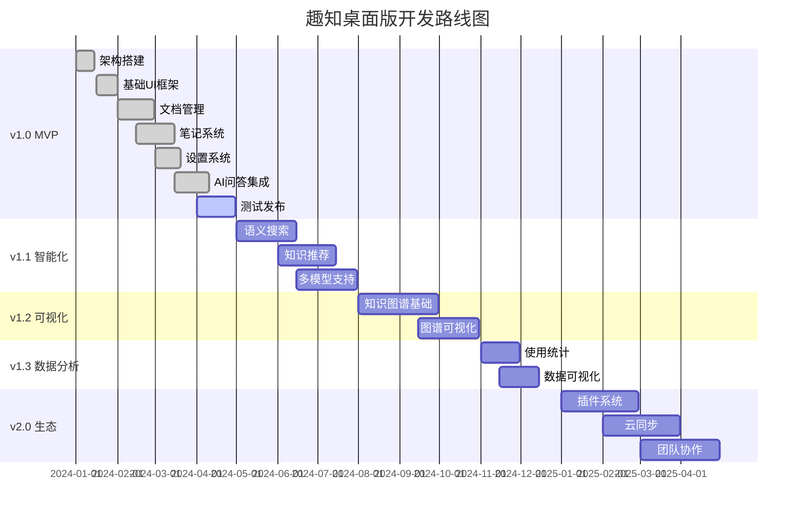
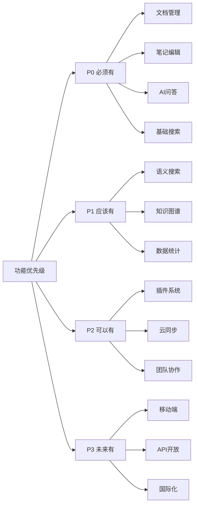
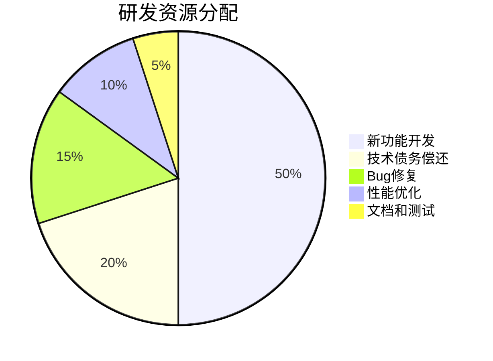

# 趣知桌面版 - 产品规划

<div align="center">
  <h1>🗺️ 趣知桌面版产品规划</h1>
  <p>产品发展路线图与版本迭代计划</p>
</div>

---

## 📖 目录

1. [产品路线图](#1-产品路线图)
2. [版本规划](#2-版本规划)
3. [功能优先级](#3-功能优先级)
4. [技术债务管理](#4-技术债务管理)
5. [团队与资源规划](#5-团队与资源规划)

---

## 1. 产品路线图

### 1.1 整体规划时间线



### 1.2 发展阶段

#### 第一阶段：MVP验证 (已完成90%)

**时间**: 2024 Q1 - Q2

**核心目标**: 验证产品核心价值，获得种子用户

**已完成功能**:
- ✅ Electron + React 架构搭建
- ✅ 现代化UI系统（深色主题+毛玻璃效果）
- ✅ 基础文档管理
- ✅ Markdown笔记编辑
- ✅ AI问答系统
- ✅ 多助手管理
- ✅ 对话主题管理
- ✅ 完整的设置系统
- ✅ 本地数据持久化

**待完成功能**:
- 🔄 全文搜索功能
- 🔄 文档导入和管理
- 🔄 Beta测试和优化

**成功标准**:
- 获得1,000名种子用户
- 产品基本功能稳定可用
- 收集100+用户反馈

#### 第二阶段：智能增强 (2024 Q3)

**时间**: 2024年5月 - 7月

**核心目标**: 增强AI能力，提升智能化水平

**规划功能**:
- 🕐 语义搜索引擎
- 🕐 基于向量的知识检索
- 🕐 智能内容推荐
- 🕐 多AI模型提供商支持
- 🕐 RAG（检索增强生成）
- 🕐 知识库向量化

**技术挑战**:
- 向量数据库选型和集成
- 文档向量化性能优化
- 语义搜索准确度

**成功标准**:
- 搜索准确率 > 85%
- 推荐点击率 > 20%
- 用户满意度 > 4.0

#### 第三阶段：可视化呈现 (2024 Q4)

**时间**: 2024年8月 - 10月

**核心目标**: 实现知识图谱可视化

**规划功能**:
- 🕐 知识节点管理
- 🕐 关系构建和编辑
- 🕐 2D/3D图谱可视化
- 🕐 力导向布局算法
- 🕐 图谱搜索和过滤
- 🕐 路径分析和发现

**技术选型**:
- 图谱渲染引擎: @antv/g6
- 图数据库: Neo4j Embedded / SQLite Graph
- 布局算法: force-directed, hierarchical

**成功标准**:
- 支持1000+节点流畅渲染
- 图谱操作响应时间 < 100ms
- 用户使用率 > 30%

#### 第四阶段：数据洞察 (2024 Q4)

**时间**: 2024年11月 - 12月

**核心目标**: 提供数据分析和可视化

**规划功能**:
- 🕐 使用统计仪表盘
- 🕐 知识增长趋势
- 🕐 学习效率分析
- 🕐 热点内容识别
- 🕐 自定义报表
- 🕐 数据导出

**可视化组件**:
- 折线图、柱状图、饼图
- 热力图、雷达图
- 时间序列图
- 交互式数据大屏

**成功标准**:
- 数据准确性 100%
- 报表生成时间 < 3s
- 用户查看率 > 40%

#### 第五阶段：生态建设 (2025 H1)

**时间**: 2025年1月 - 6月

**核心目标**: 建立插件生态和开放平台

**规划功能**:
- 🕐 插件系统架构
- 🕐 插件市场
- 🕐 开放API
- 🕐 云同步服务
- 🕐 团队协作功能
- 🕐 移动端适配

**生态建设**:
- 开发者文档
- 示例插件
- 社区运营
- 开发者激励

**成功标准**:
- 插件数量 > 20
- 开发者数量 > 50
- API调用量 > 10万/月

---

## 2. 版本规划

### 2.1 v1.0 MVP版本（当前版本）

**版本号**: v1.0.0-beta

**发布时间**: 2024年4月

**核心功能**:

#### 已实现功能 ✅

1. **基础架构**
   - Electron 35.0.2 桌面端框架
   - React 19.0.0 + TypeScript 5.8.2
   - Ant Design 5.27.1 UI组件库
   - 现代化主题系统

2. **我的首页**
   - 快速导航面板
   - 最近使用展示
   - 数据概览卡片

3. **知识问答**
   - 多助手管理系统
   - 对话主题管理
   - AI模型配置（支持OpenAI、Claude等）
   - 系统提示词自定义
   - 记忆系统配置
   - MCP协议集成
   - 流式响应展示
   - 对话历史保存

4. **笔记系统**
   - Markdown编辑器
   - 实时预览
   - 标签管理

5. **设置系统**
   - 通用设置
   - 模型配置（多提供商支持）
   - 显示设置
   - 数据管理
   - 快捷键配置
   - MCP服务器配置
   - 记忆设置

6. **数据持久化**
   - electron-store 本地存储
   - IPC通信机制
   - 数据导入导出

#### 待实现功能 🔄

1. **知识库**
   - 文档导入功能
   - 多格式支持
   - 文档管理

2. **搜索功能**
   - 全文搜索
   - 标签搜索
   - 高级筛选

3. **学习数据**
   - 基础统计面板
   - 使用时长统计

### 2.2 v1.1 智能化版本

**版本号**: v1.1.0

**计划发布**: 2024年7月

**新增功能**:

1. **语义搜索引擎**
   - 向量数据库集成（Faiss/Hnswlib）
   - 文档向量化
   - 相似度搜索
   - 搜索结果排序优化

2. **智能推荐**
   - 基于使用历史的内容推荐
   - 相关文档推荐
   - 知识点关联推荐

3. **RAG增强**
   - 检索增强生成
   - 知识库集成到AI问答
   - 引用来源追溯

4. **多模型支持**
   - 本地模型支持（Ollama）
   - 更多云端模型接入
   - 模型性能对比

**性能目标**:
- 向量检索速度 < 100ms
- 推荐准确率 > 75%
- 内存占用 < 500MB

### 2.3 v1.2 可视化版本

**版本号**: v1.2.0

**计划发布**: 2024年10月

**新增功能**:

1. **知识图谱**
   - 节点创建和编辑
   - 关系建立和管理
   - 双向链接支持
   - 自动关系发现

2. **图谱可视化**
   - 2D力导向布局
   - 3D可视化（可选）
   - 节点样式自定义
   - 交互式操作

3. **图谱分析**
   - 节点重要性分析
   - 最短路径查找
   - 社区发现
   - 中心性分析

4. **图谱导航**
   - 图谱搜索
   - 路径高亮
   - 聚焦模式
   - 时间轴回溯

**性能目标**:
- 支持1000+节点流畅渲染
- 布局计算时间 < 500ms
- 交互响应 < 100ms

### 2.4 v1.3 数据分析版本

**版本号**: v1.3.0

**计划发布**: 2024年12月

**新增功能**:

1. **使用统计**
   - 应用使用时长统计
   - 功能使用频率
   - 活跃时段分析
   - 使用习惯报告

2. **知识分析**
   - 知识库规模趋势
   - 文档增长曲线
   - 标签使用分布
   - 热点内容识别

3. **学习效率**
   - 学习时间统计
   - 知识掌握度评估
   - 复习提醒
   - 学习目标追踪

4. **数据可视化**
   - 交互式图表
   - 自定义仪表盘
   - 数据导出
   - 报表生成

**可视化组件**:
- @ant-design/charts
- 折线图、柱状图、饼图
- 热力图、雷达图
- 词云图

### 2.5 v2.0 生态版本

**版本号**: v2.0.0

**计划发布**: 2025年6月

**新增功能**:

1. **插件系统**
   - 插件API框架
   - 插件生命周期管理
   - 插件市场
   - 开发者工具

2. **云同步**
   - 多端数据同步
   - 增量同步机制
   - 冲突解决
   - 离线编辑支持

3. **团队协作**
   - 知识库共享
   - 协作编辑
   - 评论和讨论
   - 权限管理

4. **API开放**
   - RESTful API
   - WebSocket实时通信
   - API文档
   - SDK支持

**生态目标**:
- 20+官方插件
- 50+第三方插件
- 100+开发者
- API调用量 10万+/月

---

## 3. 功能优先级

### 3.1 优先级矩阵



### 3.2 P0 - 核心功能（必须有）

**定义**: MVP必备功能，缺失将影响产品基本可用性

| 功能 | 状态 | 优先级 | 预期完成 |
|------|------|--------|----------|
| 文档导入和管理 | 🔄 开发中 | 最高 | 2024-04 |
| 笔记编辑器 | ✅ 已完成 | 最高 | 2024-03 |
| 全文搜索 | 🔄 开发中 | 最高 | 2024-04 |
| AI问答系统 | ✅ 已完成 | 最高 | 2024-04 |
| 本地数据存储 | ✅ 已完成 | 最高 | 2024-03 |
| 设置系统 | ✅ 已完成 | 高 | 2024-03 |

### 3.3 P1 - 重要功能（应该有）

**定义**: 提升产品竞争力的重要功能

| 功能 | 状态 | 优先级 | 预期完成 |
|------|------|--------|----------|
| 语义搜索 | 🕐 规划中 | 高 | 2024-06 |
| 知识图谱 | 🕐 规划中 | 高 | 2024-09 |
| 智能推荐 | 🕐 规划中 | 中 | 2024-07 |
| RAG增强 | 🕐 规划中 | 中 | 2024-07 |
| 使用统计 | 🕐 规划中 | 中 | 2024-11 |
| 多格式阅读器 | 🕐 规划中 | 中 | 2024-08 |

### 3.4 P2 - 增强功能（可以有）

**定义**: 增强用户体验但不紧急的功能

| 功能 | 状态 | 优先级 | 预期完成 |
|------|------|--------|----------|
| 插件系统 | 🕐 规划中 | 低 | 2025-02 |
| 云同步 | 🕐 规划中 | 低 | 2025-03 |
| 批注高亮 | 🕐 规划中 | 低 | 2024-12 |
| 自定义主题 | 🕐 规划中 | 低 | 2025-01 |
| 数据报表 | 🕐 规划中 | 低 | 2024-12 |

### 3.5 P3 - 扩展功能（未来有）

**定义**: 长期规划功能，暂不实施

| 功能 | 状态 | 优先级 | 预期完成 |
|------|------|--------|----------|
| 团队协作 | 🕐 规划中 | 很低 | 2025-06 |
| 移动端App | 🕐 规划中 | 很低 | 2025+ |
| API开放 | 🕐 规划中 | 很低 | 2025-06 |
| 国际化 | 🕐 规划中 | 很低 | 2025+ |
| Web版本 | 🕐 规划中 | 很低 | 2025+ |

---

## 4. 技术债务管理

### 4.1 当前技术债务

#### 代码质量

1. **类型定义不完整**
   - 影响: 中
   - 优先级: 高
   - 计划: Q2完成所有TypeScript类型定义

2. **组件拆分不合理**
   - 影响: 中
   - 优先级: 中
   - 计划: 逐步重构大组件

3. **缺少单元测试**
   - 影响: 高
   - 优先级: 高
   - 计划: 核心功能测试覆盖率达到80%

#### 性能问题

1. **大数据量渲染性能**
   - 影响: 中
   - 优先级: 中
   - 计划: 实现虚拟滚动

2. **内存优化**
   - 影响: 中
   - 优先级: 中
   - 计划: 实现缓存策略和内存监控

3. **启动速度优化**
   - 影响: 低
   - 优先级: 低
   - 计划: 代码分割和懒加载

#### 架构问题

1. **状态管理混乱**
   - 影响: 中
   - 优先级: 高
   - 计划: 统一状态管理方案

2. **IPC通信优化**
   - 影响: 低
   - 优先级: 中
   - 计划: 实现IPC调用缓存

3. **数据库设计优化**
   - 影响: 中
   - 优先级: 中
   - 计划: 数据库索引优化

### 4.2 技术债务偿还计划

#### Q2 2024（当前季度）

- ✅ 完成核心功能TypeScript类型定义
- 🔄 添加主要功能的单元测试
- 🔄 重构ChatArea组件
- 🕐 实现错误边界和错误处理

#### Q3 2024

- 🕐 实现虚拟滚动优化
- 🕐 统一状态管理方案
- 🕐 数据库索引优化
- 🕐 代码分割和懒加载

#### Q4 2024

- 🕐 内存优化和监控
- 🕐 性能测试和优化
- 🕐 代码质量提升
- 🕐 文档完善

### 4.3 代码质量目标

| 指标 | 当前值 | 目标值 | 达成时间 |
|------|--------|--------|----------|
| 测试覆盖率 | 10% | 80% | 2024-09 |
| TypeScript覆盖率 | 85% | 95% | 2024-06 |
| ESLint通过率 | 90% | 100% | 2024-06 |
| 代码重复率 | 15% | < 5% | 2024-12 |
| 技术文档完整度 | 60% | 90% | 2024-12 |

---

## 5. 团队与资源规划

### 5.1 团队组织

#### 当前团队结构

```
产品团队
├── 产品设计 (1人)
│   ├── 产品规划
│   ├── 功能设计
│   └── 用户研究
├── 技术研发 (2-3人)
│   ├── 前端开发
│   ├── Electron开发
│   └── AI集成
├── UI/UX设计 (1人)
│   ├── 界面设计
│   ├── 交互设计
│   └── 视觉规范
└── 测试运营 (1人)
    ├── 功能测试
    ├── 用户支持
    └── 社区运营
```

#### 人员需求规划

| 阶段 | 团队规模 | 新增岗位 | 说明 |
|------|----------|----------|------|
| v1.0 (当前) | 4-5人 | - | 核心团队 |
| v1.1-1.2 | 6-7人 | +1后端, +1测试 | 增强技术能力 |
| v1.3 | 8-10人 | +1数据, +1设计 | 数据分析和设计 |
| v2.0 | 12-15人 | +2开发, +1运营, +1商务 | 生态建设 |

### 5.2 资源分配

#### 研发资源分配（按时间）



#### 预算规划

| 项目 | Q2 2024 | Q3 2024 | Q4 2024 | 2025 H1 |
|------|---------|---------|---------|---------|
| 人力成本 | 40万 | 50万 | 60万 | 150万 |
| 服务器成本 | 2万 | 3万 | 5万 | 15万 |
| 推广成本 | 5万 | 20万 | 30万 | 100万 |
| 其他成本 | 3万 | 5万 | 5万 | 15万 |
| **总计** | **50万** | **78万** | **100万** | **280万** |

### 5.3 里程碑与KPI

#### Q2 2024目标

- 🎯 完成v1.0版本并发布
- 🎯 获得1,000名注册用户
- 🎯 获得100名付费用户
- 🎯 产品稳定性 > 99%
- 🎯 用户满意度 > 4.0

#### Q3 2024目标

- 🎯 完成v1.1版本
- 🎯 月活用户达到5,000人
- 🎯 付费用户达到500人
- 🎯 MRR达到5万元
- 🎯 NPS > 40

#### Q4 2024目标

- 🎯 完成v1.2和v1.3版本
- 🎯 月活用户达到20,000人
- 🎯 付费用户达到2,000人
- 🎯 MRR达到20万元
- 🎯 建立用户社区（500+活跃用户）

#### 2025 H1目标

- 🎯 完成v2.0版本
- 🎯 月活用户达到50,000人
- 🎯 付费用户达到5,000人
- 🎯 MRR达到50万元
- 🎯 插件生态初步建立（20+插件）

---

## 📝 总结

### 🎯 产品发展策略

1. **MVP先行**: 快速验证核心价值，获取用户反馈
2. **渐进增强**: 逐步添加高级功能，提升竞争力
3. **生态建设**: 建立插件和API生态，形成护城河
4. **持续优化**: 重视技术债务，保持代码质量

### 📈 发展重点

| 阶段 | 重点 | 目标 |
|------|------|------|
| 2024 Q2 | 产品打磨 | 稳定可用 |
| 2024 Q3 | 智能增强 | 差异化竞争 |
| 2024 Q4 | 可视化 | 用户留存 |
| 2025 H1 | 生态建设 | 商业化 |

### 🎖️ 成功关键

- **专注核心价值**: 知识管理+AI，打造差异化
- **快速迭代**: 每3个月一个大版本
- **用户驱动**: 基于用户反馈持续优化
- **技术领先**: 保持AI和可视化技术优势
- **生态思维**: 从产品到平台的转变

通过清晰的产品规划和科学的资源分配，趣知桌面版将稳步推进，实现从MVP到成熟产品的演进。

---

*本文档将随着产品开发进展持续更新和完善。*
*最后更新: 2025-10-19*

