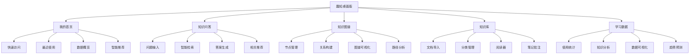
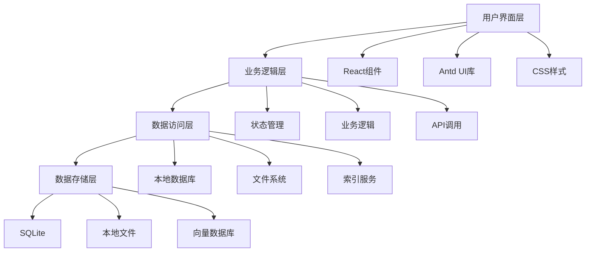
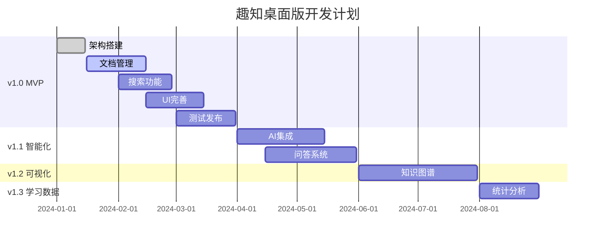

# 趣知桌面版 - 产品设计文档

<div align="center">
  <h1>🎓 趣知桌面版产品设计</h1>
  <p>现代化桌面知识管理应用的产品规划与设计</p>
</div>

---

## 📖 目录

1. [产品概述](#1-产品概述)
2. [市场分析](#2-市场分析)
3. [用户研究](#3-用户研究)
4. [产品定位](#4-产品定位)
5. [功能规划](#5-功能规划)
6. [用户体验设计](#6-用户体验设计)
7. [技术方案](#7-技术方案)
8. [桌面端特殊考虑](#8-桌面端特殊考虑)
9. [产品路线图](#9-产品路线图)
10. [风险评估](#10-风险评估)
11. [商业模式](#11-商业模式)
12. [成功指标](#12-成功指标)

---

## 1. 产品概述

### 1.1 产品愿景
**打造最优雅、最高效的桌面知识管理生态**

让知识工作者能够通过直观美观的界面，高效地组织、管理和利用个人知识资产，构建属于自己的知识体系。

### 1.2 产品使命
- 🧠 **智能化知识管理** - 通过AI技术提升知识组织和检索效率
- 🎨 **极致用户体验** - 现代化设计语言，流畅的交互体验
- 🔗 **知识图谱可视化** - 让知识关系一目了然
- 📚 **数字图书管理** - 统一管理多格式数字资源

### 1.3 核心价值主张
- **视觉美学**: 深色主题+毛玻璃效果，护眼且现代
- **智能问答**: AI驱动的知识检索和问答系统
- **图谱化思维**: 可视化知识关系，构建知识网络
- **离线优先**: 桌面端原生体验，数据安全可控

### 1.4 目标用户群体
- 🎓 **学生群体**: 大学生、研究生、博士生
- 👨‍💻 **知识工作者**: 研发人员、咨询师、分析师
- 📝 **内容创作者**: 作家、博主、自媒体从业者
- 📊 **研究人员**: 科研工作者、学习数据师

---

## 2. 市场分析

### 2.1 市场现状
**知识管理软件市场规模持续增长**

- 全球知识管理软件市场预计2025年达到1,135亿美元
- 个人知识管理需求激增，疫情后远程办公加速需求
- 现有产品多为网页端，桌面端体验普遍不佳

### 2.2 竞品分析

#### 2.2.1 直接竞品
| 产品 | 优势 | 劣势 | 市场定位 |
|------|------|------|----------|
| Obsidian | 插件生态丰富 | 学习门槛高 | 专业用户 |
| Logseq | 本地优先，开源 | UI设计一般 | 程序员群体 |
| Roam Research | 双向链接先驱 | 订阅制昂贵 | 企业用户 |

#### 2.2.2 间接竞品
| 产品 | 特点 | 目标群体 |
|------|------|----------|
| Notion | 全能型工作空间 | 团队协作 |
| Evernote | 传统笔记应用 | 个人用户 |
| OneNote | Microsoft生态 | Office用户 |

### 2.3 市场机会
- ✅ **桌面端体验差异化**: 相对于网页端产品的性能优势
- ✅ **视觉设计空白**: 现有产品UI设计普遍落后
- ✅ **本地化需求**: 中文用户的本地化使用习惯
- ✅ **AI集成机会**: 知识图谱+AI问答的创新组合

---

## 3. 用户研究

### 3.1 目标用户画像

#### 👨‍🎓 用户画像A: 研究生小张
- **基本信息**: 25岁，计算机专业研究生
- **使用场景**: 文献管理、论文写作、知识整理
- **痛点**: 文献分散存储，知识点关联性不强
- **需求**: 可视化知识关系，便于论文引用

#### 👩‍💻 用户画像B: 产品经理小李
- **基本信息**: 28岁，互联网公司产品经理
- **使用场景**: 竞品分析、行业研究、需求整理
- **痛点**: 信息碎片化严重，缺乏系统整理
- **需求**: 高效检索，学习数据可视化

#### 👨‍💼 用户画像C: 自媒体作者老王
- **基本信息**: 32岁，知识付费博主
- **使用场景**: 素材收集、内容创作、知识沉淀
- **痛点**: 素材管理混乱，创作效率不高
- **需求**: 美观界面，素材快速检索

### 3.2 用户需求层次

#### 3.2.1 基础需求 (Must Have)
- 📁 **文件管理**: 多格式文档存储和管理
- 🔍 **搜索功能**: 全文检索，快速定位内容
- 📝 **笔记记录**: 支持markdown、富文本编辑
- 🗂️ **分类组织**: 标签、文件夹等组织方式

#### 3.2.2 期望需求 (Should Have)  
- 🤖 **智能问答**: AI驱动的知识问答系统
- 🕸️ **知识图谱**: 可视化知识关系网络
- 📊 **学习数据**: 学习数据统计和可视化
- 🎨 **界面美观**: 现代化UI设计

#### 3.2.3 兴奋需求 (Could Have)
- 🔄 **多端同步**: 云端数据同步
- 🧩 **插件扩展**: 功能插件生态系统
- 🤝 **协作功能**: 团队知识共享
- 📱 **移动端适配**: 移动设备支持

### 3.3 使用场景分析

#### 场景1: 学术研究
```
用户目标: 整理研究文献，构建知识体系
使用流程: 导入文献 → 添加笔记 → 建立关联 → 可视化分析
关键需求: 文献管理、知识关联、图谱可视化
```

#### 场景2: 工作学习
```
用户目标: 提升工作效率，积累专业知识
使用流程: 收集资料 → 分类整理 → 快速检索 → 知识复用
关键需求: 分类管理、全文搜索、数据统计
```

#### 场景3: 内容创作
```
用户目标: 素材管理，提高创作效率  
使用流程: 素材收集 → 灵感记录 → 内容创作 → 发布分享
关键需求: 素材管理、灵感捕捉、快速编辑
```

---

## 4. 产品定位

### 4.1 产品定位声明
**面向知识工作者的现代化桌面知识管理工具**

趣知桌面版定位为一款专为中文用户设计的高颜值、高性能桌面知识管理应用，通过AI技术和可视化设计，让知识管理变得简单优雅。

### 4.2 差异化优势

#### 4.2.1 设计优势
- 🎨 **视觉设计领先**: 深色主题+毛玻璃效果
- ✨ **流畅动效**: 精心设计的交互动画
- 🌈 **统一色彩系统**: 基于#38b2ac的完整设计语言

#### 4.2.2 技术优势  
- ⚡ **桌面端性能**: Electron架构，原生体验
- 🧠 **AI技术集成**: 智能问答，知识推荐
- 📊 **可视化能力**: 知识图谱，数据大屏

#### 4.2.3 功能优势
- 🔗 **知识关联**: 双向链接，图谱可视化
- 📚 **多格式支持**: PDF、Markdown、富文本等
- 📈 **数据洞察**: 学习分析，使用统计

### 4.3 品牌理念
- **极简**: 去除冗余，专注核心功能
- **美观**: 现代设计，视觉愉悦
- **智能**: AI赋能，提升效率
- **安全**: 本地存储，数据可控

---

## 5. 功能规划

### 5.1 功能模块总览



### 5.2 核心功能详述

#### 5.2.1 我的首页 🏠
**个性化工作台，快速访问核心功能**

**功能特性:**
- 📊 **数据仪表盘**: 知识库统计、使用情况概览
- 🚀 **快速操作**: 新建笔记、导入文档、搜索入口
- 📅 **最近使用**: 最近访问的文档和笔记
- 🎯 **智能推荐**: 基于使用习惯的内容推荐
- 📈 **进度跟踪**: 学习进度、目标完成情况

**交互设计:**
- 卡片式布局，信息层次清晰
- 拖拽排序，个性化定制
- 实时数据更新，动态效果

#### 5.2.2 知识问答 🤖  
**AI驱动的智能问答系统**

**功能特性:**
- 💬 **自然语言输入**: 支持中文自然语言问答
- 🔍 **智能检索**: 在知识库中查找相关内容
- 🧠 **上下文理解**: 基于对话历史的语义理解
- 📝 **答案生成**: 基于检索结果生成准确答案
- 🔗 **来源追溯**: 显示答案来源，支持跳转查看
- 💡 **相关推荐**: 推荐相关问题和内容

**技术实现:**
- 本地向量数据库存储
- 语义搜索算法
- 大语言模型集成(可选本地/云端)

#### 5.2.3 知识图谱 🕸️
**可视化知识关系网络**

**功能特性:**
- 🔗 **双向链接**: 文档间的双向关联关系
- 👁️ **图谱可视化**: 3D/2D知识关系图展示
- 🎯 **节点管理**: 知识点的创建、编辑、删除
- 📊 **关系分析**: 节点重要性、路径分析
- 🔍 **图谱搜索**: 在图谱中快速定位节点
- 🎨 **样式自定义**: 节点颜色、大小、布局算法

**可视化特性:**
- 力导向布局算法
- 节点聚类和分组
- 交互式缩放和平移
- 路径高亮显示

#### 5.2.4 知识库 📚
**数字图书管理中心**

**功能特性:**
- 📥 **多格式导入**: PDF、EPUB、Markdown、Word等
- 🗂️ **智能分类**: 自动识别文档类型和主题
- 📖 **内置阅读器**: 支持多种格式的原生阅读
- ✏️ **批注笔记**: 划线、高亮、添加笔记
- 🔍 **全文搜索**: 跨文档的全文检索功能
- 📊 **阅读统计**: 阅读时长、进度跟踪

**阅读体验:**
- 护眼模式和字体调节
- 书签和目录导航
- 阅读进度同步
- 批注导出功能

#### 5.2.5 学习数据 📈
**知识管理数据洞察**

**功能特性:**
- 📊 **使用统计**: 应用使用时长、功能使用频率
- 📈 **知识增长**: 知识库规模增长趋势
- 🎯 **学习分析**: 学习效率、知识点掌握度
- 🔥 **热点内容**: 最常访问的文档和知识点
- 📅 **时间分析**: 使用时间分布、效率分析
- 📋 **报表导出**: 支持多种格式的数据导出

**可视化组件:**
- 交互式图表(基于@ant-design/charts)
- 实时数据大屏
- 自定义报表配置

### 5.3 功能优先级

#### P0 - 核心功能 (MVP)
- ✅ 基础文档管理
- ✅ 笔记编辑器  
- ✅ 全文搜索
- ✅ 简单分类

#### P1 - 重要功能
- 🔄 知识图谱基础功能
- 🔄 智能问答系统
- 🔄 多格式阅读器
- 🔄 数据统计面板

#### P2 - 增强功能  
- 🕐 高级图谱可视化
- 🕐 AI内容推荐
- 🕐 批注和高亮
- 🕐 学习数据报表

#### P3 - 扩展功能
- 🕐 插件系统
- 🕐 多端同步
- 🕐 团队协作
- 🕐 API开放

---

## 6. 用户体验设计

### 6.1 设计原则

#### 6.1.1 美学原则
- **视觉统一**: 统一的色彩、字体、间距系统
- **层次清晰**: 合理的信息层级和视觉权重
- **现代感**: 毛玻璃效果、渐变、阴影等现代设计语言

#### 6.1.2 可用性原则  
- **简单易用**: 降低学习成本，直观的操作流程
- **效率优先**: 减少操作步骤，提供快捷键支持
- **容错性**: 提供撤销功能，避免误操作

#### 6.1.3 可访问性原则
- **对比度**: 确保足够的颜色对比度
- **键盘导航**: 完整的键盘操作支持
- **屏幕阅读器**: 支持无障碍技术

### 6.2 信息架构

#### 6.2.1 导航结构
```
趣知桌面版
├── 我的首页 (默认页面)
│   ├── 快速操作区
│   ├── 数据概览
│   ├── 最近使用  
│   └── 智能推荐
├── 知识问答
│   ├── 问答界面
│   ├── 历史记录
│   └── 收藏夹
├── 知识图谱  
│   ├── 图谱画布
│   ├── 节点管理
│   └── 关系设置
├── 知识库
│   ├── 文档列表
│   ├── 分类管理
│   ├── 阅读器
│   └── 笔记中心
└── 学习数据
    ├── 使用统计
    ├── 知识分析
    └── 自定义报表
```

#### 6.2.2 页面布局
- **侧边栏**: 主导航，可折叠设计
- **内容区**: 核心功能展示区域
- **状态栏**: 显示当前状态和快捷操作

### 6.3 用户流程设计

#### 6.3.1 新用户引导流程


#### 6.3.2 核心操作流程

**知识问答流程:**


**文档管理流程:**


### 6.4 交互设计规范

#### 6.4.1 操作反馈
- **即时反馈**: 鼠标悬停、点击的视觉反馈
- **进度指示**: 长时间操作的进度显示
- **状态变化**: 明确的状态切换动画

#### 6.4.2 快捷键支持
| 功能 | 快捷键 | 描述 |
|------|--------|------|
| 全局搜索 | `Cmd/Ctrl + K` | 打开全局搜索 |
| 新建笔记 | `Cmd/Ctrl + N` | 创建新笔记 |
| 快速问答 | `Cmd/Ctrl + Q` | 打开问答界面 |
| 切换侧边栏 | `Cmd/Ctrl + B` | 折叠/展开侧边栏 |
| 知识图谱 | `Cmd/Ctrl + G` | 打开知识图谱 |

---

## 7. 技术方案

### 7.1 技术架构

#### 7.1.1 整体架构


#### 7.1.2 技术栈选择

**前端技术栈:**
- **框架**: React 19.0.0 + TypeScript 5.8.2
- **UI库**: Ant Design 5.27.1
- **可视化**: @ant-design/charts 2.6.2
- **状态管理**: React Hooks + Context API
- **样式**: CSS Modules + CSS Variables

**桌面端技术栈:**
- **框架**: Electron 35.0.2
- **构建**: Webpack 5.98.0 + Babel
- **开发工具**: ESLint + Prettier + Jest

**数据存储:**
- **关系数据库**: SQLite (用户数据、文档元数据)
- **全文搜索**: Lunr.js/ElasticLunr (文档内容索引)
- **向量数据库**: Faiss/Hnswlib (语义搜索)
- **文件存储**: 本地文件系统

### 7.2 数据库设计

#### 7.2.1 核心数据表
```sql
-- 文档表
CREATE TABLE documents (
    id INTEGER PRIMARY KEY,
    title TEXT NOT NULL,
    content TEXT,
    file_path TEXT,
    file_type TEXT,
    created_at DATETIME,
    updated_at DATETIME,
    tags TEXT -- JSON格式存储标签
);

-- 知识节点表  
CREATE TABLE knowledge_nodes (
    id INTEGER PRIMARY KEY,
    title TEXT NOT NULL,
    description TEXT,
    node_type TEXT,
    metadata TEXT, -- JSON格式存储元数据
    created_at DATETIME
);

-- 关系表
CREATE TABLE relationships (
    id INTEGER PRIMARY KEY, 
    source_id INTEGER,
    target_id INTEGER,
    relation_type TEXT,
    weight REAL DEFAULT 1.0,
    FOREIGN KEY (source_id) REFERENCES knowledge_nodes(id),
    FOREIGN KEY (target_id) REFERENCES knowledge_nodes(id)
);

-- 问答记录表
CREATE TABLE qa_records (
    id INTEGER PRIMARY KEY,
    question TEXT NOT NULL,
    answer TEXT,
    sources TEXT, -- JSON格式存储来源文档
    created_at DATETIME
);
```

#### 7.2.2 数据索引策略
- **全文搜索索引**: 对文档内容建立倒排索引
- **向量索引**: 对文档和问题建立向量索引
- **关系索引**: 对知识节点关系建立图索引

### 7.3 AI集成方案

#### 7.3.1 语义搜索
```typescript
interface SemanticSearchService {
  // 文档向量化
  embedDocument(content: string): Promise<number[]>;
  
  // 问题向量化  
  embedQuery(query: string): Promise<number[]>;
  
  // 相似度搜索
  search(queryVector: number[], topK: number): Promise<SearchResult[]>;
}
```

#### 7.3.2 问答生成
```typescript
interface QAService {
  // 生成答案
  generateAnswer(question: string, context: string[]): Promise<string>;
  
  // 提取关键词
  extractKeywords(text: string): Promise<string[]>;
  
  // 相关推荐
  recommendRelated(question: string): Promise<string[]>;
}
```

### 7.4 性能优化

#### 7.4.1 前端性能
- **代码分割**: 路由级别的懒加载
- **虚拟滚动**: 大数据列表优化
- **缓存策略**: 文档内容和搜索结果缓存
- **Web Workers**: 耗时计算异步处理

#### 7.4.2 数据库性能
- **索引优化**: 关键查询字段建立索引
- **分页查询**: 避免一次性加载大量数据
- **连接池**: 数据库连接复用
- **预加载**: 常用数据预先加载到内存

---

## 8. 桌面端特殊考虑

### 8.1 跨平台兼容性

#### 8.1.1 操作系统支持
- **Windows**: Windows 10+ (x64, arm64)
- **macOS**: macOS 10.15+ (x64, Apple Silicon)
- **Linux**: Ubuntu 18.04+, CentOS 7+

#### 8.1.2 平台差异处理
- **菜单栏**: macOS使用系统菜单栏，Windows/Linux使用应用内菜单
- **快捷键**: 适配不同平台的按键映射 (Cmd vs Ctrl)
- **文件路径**: 处理不同平台的路径分隔符
- **通知系统**: 集成各平台的原生通知API

### 8.2 本地数据管理

#### 8.2.1 数据存储位置
```
Windows: %APPDATA%/FunKnowledge/
macOS: ~/Library/Application Support/FunKnowledge/
Linux: ~/.config/FunKnowledge/

├── databases/          # 数据库文件
│   ├── main.db        # 主数据库
│   ├── search.db      # 搜索索引
│   └── vectors.db     # 向量数据库
├── documents/         # 文档文件  
├── attachments/       # 附件文件
├── backups/          # 备份文件
└── logs/             # 日志文件
```

#### 8.2.2 数据备份策略
- **自动备份**: 每日增量备份，每周全量备份
- **手动备份**: 用户可手动创建备份
- **备份恢复**: 支持从备份文件恢复数据
- **数据导出**: 支持导出为标准格式

### 8.3 系统集成

#### 8.3.1 文件关联
- 注册常用文件类型(.md, .txt, .pdf等)
- 支持拖拽导入文件
- 右键菜单集成

#### 8.3.2 系统通知
- 新内容导入提醒
- 备份完成通知
- 搜索结果推送

#### 8.3.3 全局快捷键
- 全局搜索快捷键
- 快速捕获灵感
- 显示/隐藏应用窗口

### 8.4 离线功能设计

#### 8.4.1 离线优先架构
- **本地存储**: 所有数据默认本地存储
- **离线搜索**: 本地全文搜索和向量搜索
- **离线AI**: 支持本地AI模型(可选)
- **同步机制**: 可选的云端同步功能

#### 8.4.2 同步策略(可选功能)
```typescript
interface SyncService {
  // 上传本地变更
  uploadChanges(): Promise<void>;
  
  // 下载远程变更
  downloadChanges(): Promise<void>;
  
  // 冲突解决
  resolveConflicts(conflicts: Conflict[]): Promise<void>;
}
```

### 8.5 安装和更新

#### 8.5.1 安装包配置
```json
{
  "build": {
    "productName": "趣知桌面版",
    "appId": "com.funknowledge.desktop",
    "mac": {
      "target": ["arm64", "x64"],
      "category": "public.app-category.productivity"
    },
    "win": {
      "target": ["nsis"],
      "requestedExecutionLevel": "asInvoker"
    },
    "linux": {
      "target": ["AppImage", "deb"],
      "category": "Office"
    }
  }
}
```

#### 8.5.2 自动更新机制
- **增量更新**: 只下载变更部分
- **静默更新**: 后台自动检查和下载
- **更新通知**: 用户确认后安装更新
- **回滚机制**: 更新失败时自动回滚

---

## 9. 产品路线图

### 9.1 版本规划

#### 9.1.1 v1.0 MVP版本 (3个月)
**核心功能实现**
- ✅ 基础架构搭建 (已完成)
- 🔄 文档管理系统
- 🔄 笔记编辑器
- 🔄 全文搜索功能
- 🔄 简单分类管理
- 🔄 基础UI框架 (已完成)

**里程碑:**
- 月末1: 完成数据库设计和基础CRUD
- 月末2: 完成编辑器和搜索功能
- 月末3: 完成测试和发布准备

#### 9.1.2 v1.1 智能化版本 (2个月)
**AI功能集成**
- 🕐 智能问答系统
- 🕐 语义搜索
- 🕐 内容推荐
- 🕐 关键词提取

**里程碑:**
- 月末1: 完成AI服务集成
- 月末2: 完成功能测试和优化

#### 9.1.3 v1.2 可视化版本 (2个月)  
**知识图谱功能**
- 🕐 双向链接
- 🕐 图谱可视化
- 🕐 关系管理
- 🕐 路径分析

**里程碑:**
- 月末1: 完成图谱基础功能
- 月末2: 完成可视化和交互

#### 9.1.4 v1.3 学习数据版本 (1个月)
**分析统计功能**
- 🕐 使用数据统计
- 🕐 知识分析报表
- 🕐 可视化图表
- 🕐 导出功能

#### 9.1.5 v2.0 生态版本 (3个月)
**扩展功能**
- 🕐 插件系统
- 🕐 多端同步
- 🕐 团队协作
- 🕐 API开放

### 9.2 功能迭代计划



### 9.3 技术债务管理

#### 9.3.1 重构计划
- **代码重构**: 每个版本预留20%时间用于代码重构
- **性能优化**: 定期进行性能测试和优化
- **安全更新**: 及时更新依赖包，修复安全漏洞

#### 9.3.2 质量保证
- **单元测试**: 核心功能测试覆盖率达到80%
- **集成测试**: 主要用户流程的端到端测试
- **性能测试**: 大数据量下的性能基准测试

---

## 10. 风险评估

### 10.1 技术风险

#### 10.1.1 高风险项
| 风险项 | 概率 | 影响 | 缓解策略 |
|--------|------|------|----------|
| AI模型集成复杂度 | 高 | 高 | 分阶段实施，先简单后复杂 |
| 跨平台兼容性问题 | 中 | 高 | 早期测试，持续集成 |
| 大数据量性能问题 | 中 | 中 | 性能测试，优化算法 |

#### 10.1.2 中风险项  
| 风险项 | 概率 | 影响 | 缓解策略 |
|--------|------|------|----------|
| 第三方依赖更新 | 中 | 中 | 版本锁定，定期更新 |
| 数据迁移问题 | 低 | 高 | 完善的备份恢复机制 |
| 内存泄漏问题 | 中 | 中 | 内存监控，代码审查 |

### 10.2 市场风险

#### 10.2.1 竞争风险
- **大厂入局**: 可能面临大型科技公司的竞争
- **开源替代**: 开源项目的快速发展可能冲击市场
- **缓解策略**: 专注差异化功能，建立用户社区

#### 10.2.2 需求风险
- **需求变化**: 用户需求可能快速变化
- **市场萎缩**: 知识管理市场可能饱和
- **缓解策略**: 敏捷开发，快速响应用户反馈

### 10.3 运营风险

#### 10.3.1 团队风险
- **人员流失**: 核心开发人员可能离职
- **技能缺失**: 可能缺乏某些关键技能
- **缓解策略**: 知识文档化，交叉培训

#### 10.3.2 资源风险
- **开发资源**: 开发周期可能超预期
- **资金压力**: 可能面临资金不足
- **缓解策略**: 分阶段发布，控制开发成本

---

## 11. 商业模式

### 11.1 产品定价策略

#### 11.1.1 免费增值模式
**基础版 (免费)**
- 文档数量限制: 1000个文档
- 存储空间: 2GB本地存储  
- 基础功能: 文档管理、搜索、简单分类
- AI问答: 每日10次免费额度

**专业版 (¥99/年)**
- 无文档数量限制
- 无存储空间限制
- 完整功能: 知识图谱、学习数据
- AI问答: 无限制使用
- 优先技术支持

**企业版 (¥299/年/用户)**
- 专业版所有功能
- 团队协作功能
- 数据同步和备份
- 企业级安全
- 定制化支持

#### 11.1.2 订阅收费模式
- **月度订阅**: ¥19/月 (专业版功能)
- **年度订阅**: ¥99/年 (优惠45%)
- **终身授权**: ¥399 (一次性付费)

### 11.2 收入来源

#### 11.2.1 主要收入
- **软件订阅费**: 70%
- **企业授权费**: 20%
- **增值服务费**: 10%

#### 11.2.2 增值服务
- **数据恢复服务**: ¥50/次
- **定制化培训**: ¥500/小时
- **企业部署咨询**: ¥1000/天
- **API接口调用**: ¥0.01/次

### 11.3 市场推广策略

#### 11.3.1 初期推广 (0-6个月)
- **产品内测**: 邀请200名种子用户
- **社区运营**: 在知识管理相关社区推广
- **内容营销**: 发布知识管理相关文章
- **KOL合作**: 邀请行业专家试用推荐

#### 11.3.2 成长期推广 (6-18个月)  
- **付费广告**: 在相关平台投放精准广告
- **合作推广**: 与相关工具建立合作关系
- **用户转介**: 建立用户推荐奖励机制
- **线下活动**: 参加相关行业会议和展会

#### 11.3.3 成熟期推广 (18个月以后)
- **品牌建设**: 建立知识管理领域的品牌认知
- **渠道拓展**: 建立代理商和渠道合作体系
- **国际化**: 拓展海外市场
- **生态建设**: 建立插件和API生态系统

---

## 12. 成功指标

### 12.1 产品指标

#### 12.1.1 用户增长指标
- **用户注册量**: 月新增用户数
- **用户留存率**: 
  - 次日留存率 > 60%
  - 7日留存率 > 40%  
  - 30日留存率 > 25%
- **活跃用户数**: 
  - 日活跃用户(DAU)
  - 月活跃用户(MAU)

#### 12.1.2 用户参与指标
- **使用时长**: 平均单次使用时长 > 30分钟
- **功能使用率**: 各核心功能的使用率
- **用户行为**: 
  - 文档导入数量
  - 问答使用频率
  - 图谱互动次数

#### 12.1.3 用户满意度指标
- **NPS得分**: 净推荐值 > 50
- **应用评分**: App Store/其他平台评分 > 4.5
- **用户反馈**: 用户反馈响应率和处理时间

### 12.2 商业指标

#### 12.2.1 收入指标
- **月度经常性收入(MRR)**: 月度订阅收入
- **年度经常性收入(ARR)**: 年度订阅收入  
- **每用户平均收入(ARPU)**: 平均每用户贡献收入
- **客户生命周期价值(LTV)**: 单个用户的总价值

#### 12.2.2 成本指标
- **客户获取成本(CAC)**: 获取单个付费用户的成本
- **LTV/CAC比例**: 应大于3:1
- **运营成本**: 服务器、开发、运营等成本控制

#### 12.2.3 转化指标
- **免费到付费转化率**: > 5%
- **试用到付费转化率**: > 15%
- **续费率**: 年度续费率 > 80%

### 12.3 技术指标

#### 12.3.1 性能指标
- **启动时间**: 应用启动时间 < 3秒
- **搜索响应时间**: 全文搜索响应 < 500ms
- **内存使用**: 空闲时内存使用 < 200MB
- **崩溃率**: 应用崩溃率 < 0.1%

#### 12.3.2 稳定性指标
- **系统可用性**: 99.9%以上
- **数据丢失率**: 0% (通过备份机制保证)
- **Bug修复时间**: 严重Bug 24小时内修复

### 12.4 里程碑目标

#### 12.4.1 短期目标 (6个月)
- 🎯 完成MVP版本发布
- 🎯 获得1000名注册用户
- 🎯 用户留存率达到目标
- 🎯 收集100份用户反馈

#### 12.4.2 中期目标 (12个月)
- 🎯 月活跃用户达到5000人
- 🎯 付费用户达到500人
- 🎯 月收入达到5万元
- 🎯 完成v1.2版本发布

#### 12.4.3 长期目标 (24个月)
- 🎯 月活跃用户达到2万人
- 🎯 付费用户达到3000人  
- 🎯 年收入达到500万元
- 🎯 建立完整产品生态

---

## 📝 总结

趣知桌面版作为一款面向知识工作者的现代化桌面知识管理工具，通过以下核心策略打造产品竞争力:

### 🎯 核心优势
1. **设计领先**: 深色主题+毛玻璃效果的现代化视觉设计
2. **AI赋能**: 智能问答和语义搜索提升使用效率  
3. **图谱可视化**: 知识关系的直观展示和管理
4. **桌面端体验**: 原生性能和离线优先的使用体验

### 📈 发展路径
1. **v1.0**: 构建MVP，验证核心功能价值
2. **v1.1-1.3**: 逐步增加AI和可视化功能
3. **v2.0**: 建立生态系统，扩展商业化能力

### 🎖️ 成功关键
- **用户体验**: 持续优化产品易用性和美观度
- **技术创新**: 保持AI和可视化技术的领先性  
- **社区建设**: 建立活跃的用户社区和反馈机制
- **商业化平衡**: 在免费和付费功能间找到平衡点

通过系统化的产品规划和精细化的执行，趣知桌面版有望成为知识管理领域的优秀产品，为用户创造价值的同时实现商业成功。

---

*本文档将随着产品开发进展持续更新和完善。*
