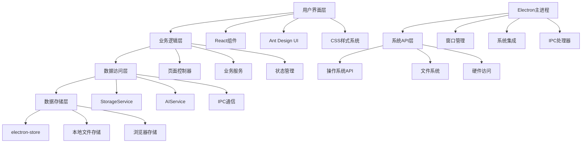
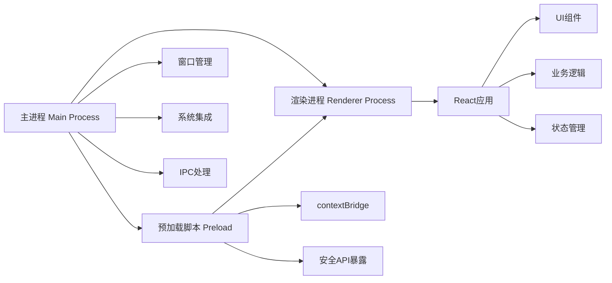
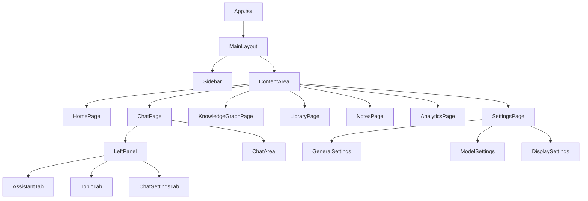
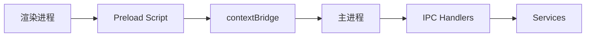

# 趣知桌面版 - 架构设计

<div align="center">
  <h1>🏗️ 趣知桌面版架构设计</h1>
  <p>现代化桌面知识管理应用的技术架构与实现方案</p>
</div>

---

## 📖 目录

1. [项目概述](#1-项目概述)
2. [整体架构设计](#2-整体架构设计)
3. [技术栈选择](#3-技术栈选择)
4. [前端架构设计](#4-前端架构设计)
5. [主进程架构设计](#5-主进程架构设计)
6. [数据架构设计](#6-数据架构设计)
7. [核心模块设计](#7-核心模块设计)
8. [通信机制设计](#8-通信机制设计)
9. [性能优化策略](#9-性能优化策略)
10. [安全架构设计](#10-安全架构设计)
11. [扩展性设计](#11-扩展性设计)

---

## 1. 项目概述

### 1.1 产品定位

趣知桌面版是一款面向知识工作者的现代化桌面知识管理工具，通过AI技术和可视化设计，提供智能问答、知识图谱、文档管理等核心功能。

### 1.2 技术目标

- **跨平台支持**: Windows、macOS、Linux 三大平台
- **离线优先**: 本地数据存储和处理为主
- **高性能**: 桌面端原生体验，响应迅速
- **现代化UI**: 深色主题+毛玻璃效果的视觉体验
- **可扩展性**: 支持插件系统和功能扩展

### 1.3 当前实现状态

```
✅ 基础架构搭建 (Electron + React + TypeScript)
✅ 现代化UI系统 (Ant Design + 自定义主题)
✅ 页面路由和导航系统
✅ 响应式布局框架
✅ AI问答系统集成
✅ 本地数据持久化
✅ IPC通信机制
🔄 核心业务功能开发中
🕐 知识图谱和数据层实现待开发
```

---

## 2. 整体架构设计

### 2.1 分层架构



### 2.2 Electron进程模型



### 2.3 架构特点

- **前后分离**: 渲染进程专注UI，主进程处理系统集成
- **模块化设计**: 功能模块独立，便于维护和扩展
- **数据驱动**: 基于状态管理的响应式数据流
- **离线优先**: 本地数据存储，可选云端同步
- **安全隔离**: 进程隔离和安全API设计

---

## 3. 技术栈选择

### 3.1 核心技术栈

#### 前端技术

```typescript
{
  "框架": "React 19.0.0",
  "语言": "TypeScript 5.8.2", 
  "UI库": "Ant Design 5.27.1",
  "可视化": "@ant-design/charts 2.6.2",
  "路由": "React Router DOM 7.3.0",
  "样式": "CSS Modules + CSS Variables"
}
```

#### 桌面端技术

```typescript
{
  "框架": "Electron 35.0.2",
  "构建工具": "Webpack 5.98.0",
  "包管理": "npm",
  "代码质量": ["ESLint", "Prettier", "Jest"]
}
```

#### 数据存储

```typescript
{
  "配置存储": "electron-store 10.0.0",
  "本地存储": "localStorage / IndexedDB",
  "文件存储": "本地文件系统",
  "未来计划": {
    "关系数据库": "SQLite",
    "全文搜索": "Lunr.js / ElasticLunr",
    "向量数据库": "Faiss / Hnswlib"
  }
}
```

### 3.2 技术选型原因

#### Electron选择理由

- ✅ 跨平台一致性体验
- ✅ 丰富的系统API访问能力
- ✅ 成熟的生态系统和社区支持
- ✅ 便于集成现有Web技术栈
- ✅ 活跃的开发和维护

#### React选择理由

- ✅ 组件化开发，代码复用率高
- ✅ 丰富的生态系统和第三方库
- ✅ TypeScript支持完善
- ✅ 团队技术栈契合
- ✅ 性能优化方案成熟

#### Ant Design选择理由

- ✅ 企业级UI组件库，功能完善
- ✅ 中文友好，设计规范统一
- ✅ Dark主题支持和自定义主题能力
- ✅ 数据可视化图表组件集成
- ✅ 持续维护和更新

#### electron-store选择理由

- ✅ 简单易用的持久化方案
- ✅ 自动处理文件读写
- ✅ 支持JSON Schema验证
- ✅ 加密存储支持
- ✅ 跨平台兼容性好

---

## 4. 前端架构设计

### 4.1 项目结构

```
src/renderer/
├── App.tsx                 # 应用根组件
├── App.css                 # 全局样式
├── renderer.tsx            # 渲染进程入口
├── components/             # 组件目录
│   ├── MainLayout.tsx      # 主布局
│   ├── Sidebar.tsx         # 侧边栏
│   ├── ContentArea.tsx     # 内容区
│   ├── home/              # 首页模块
│   ├── chat/              # 知识问答模块
│   │   ├── ChatPage.tsx
│   │   └── components/
│   │       ├── LeftPanel.tsx      # 左侧面板
│   │       ├── ChatArea.tsx       # 对话区域
│   │       ├── AssistantTab.tsx   # 助手标签页
│   │       ├── TopicTab.tsx       # 主题标签页
│   │       ├── ChatSettingsTab.tsx # 设置标签页
│   │       └── AssistantSettings/ # 助手配置
│   ├── knowledge/         # 知识图谱模块
│   ├── library/           # 知识库模块
│   ├── notes/             # 笔记模块
│   ├── analytics/         # 学习数据模块
│   └── settings/          # 设置模块
│       ├── SettingsPage.tsx
│       ├── components/
│       │   ├── GeneralSettings.tsx
│       │   ├── DisplaySettings.tsx
│       │   ├── DataSettings.tsx
│       │   └── ModelSettings/
│       │       ├── index.tsx
│       │       ├── components/
│       │       ├── hooks/
│       │       └── services/
├── contexts/              # React Context
│   └── ChatContext.tsx    # 聊天上下文
├── hooks/                 # 自定义Hooks
│   ├── UseStorage.ts      # 存储Hook
│   ├── UseSettingsStorage.ts  # 设置存储Hook
│   └── UseModelConfig.ts  # 模型配置Hook
├── services/              # 业务服务
│   ├── StorageService.ts  # 存储服务
│   └── ai/               # AI服务
│       ├── ChatCompletion.ts     # 聊天完成
│       ├── UrlUtils.ts           # URL工具
│       ├── RequestBuilder.ts     # 请求构建
│       ├── StreamHandler.ts      # 流处理
│       ├── ResponseHandler.ts    # 响应处理
│       ├── RrrorHandler.ts       # 错误处理
│       └── model/                # 数据模型
│           ├── ChatMessage.ts
│           ├── ChatCompletionOptions.ts
│           ├── ChatCompletionResult.ts
│           ├── ApiResponse.ts
│           └── TokenUsage.ts
├── types/                 # 类型定义
│   ├── Assistant.ts       # 助手类型
│   └── AI.ts              # AI类型
└── styles/                # 样式系统
    └── Theme.css          # 主题样式
```

### 4.2 组件架构

#### 组件分层



#### 组件设计原则

1. **单一职责**: 每个组件只负责一个功能
2. **Props向下，Events向上**: 父子组件通信规范
3. **可复用性**: 通用组件提取为独立模块
4. **类型安全**: 完整的TypeScript类型定义
5. **样式隔离**: CSS Modules避免样式污染

### 4.3 状态管理

#### Context架构

```typescript
// ChatContext: 聊天相关状态管理
interface ChatContextType {
  // 助手管理
  assistants: Assistant[];
  currentAssistant: Assistant | null;
  addAssistant: (assistant: Omit<Assistant, 'id'>) => void;
  updateAssistant: (id: string, updates: Partial<Assistant>) => void;
  deleteAssistant: (id: string) => void;
  setCurrentAssistant: (id: string) => void;
  
  // 主题管理
  topics: Topic[];
  currentTopic: Topic | null;
  addTopic: (assistantId: string, topic: Omit<Topic, 'id'>) => void;
  updateTopic: (topicId: string, updates: Partial<Topic>) => void;
  deleteTopic: (topicId: string) => void;
  setCurrentTopic: (topicId: string) => void;
  
  // 消息管理
  currentMessages: Message[];
  addMessage: (message: Omit<Message, 'id' | 'timestamp'>) => void;
  updateMessage: (id: string, updates: Partial<Message>) => void;
  deleteMessage: (id: string) => void;
  clearMessages: () => void;
}
```

#### 状态持久化

```typescript
// 使用自定义Hook实现状态持久化
const useChatState = () => {
  const [assistants, setAssistants] = useSettingsStorage<Assistant[]>(
    'assistants',
    []
  );
  
  const [topics, setTopics] = useSettingsStorage<Topic[]>(
    'topics',
    []
  );
  
  // 自动保存到electron-store
  useEffect(() => {
    window.electronAPI?.storage.set('assistants', assistants);
  }, [assistants]);
  
  return { assistants, topics, /* ... */ };
};
```

### 4.4 路由设计

#### 基于Tab的路由

```typescript
// ContentArea组件: 根据selectedTab渲染对应页面
const ContentArea: React.FC<{ selectedTab: string }> = ({ selectedTab }) => {
  const renderContent = () => {
    switch (selectedTab) {
      case 'home': return <HomePage />;
      case 'qna': return <ChatPage />;
      case 'knowledge-graph': return <KnowledgeGraphPage />;
      case 'library': return <LibraryPage />;
      case 'notes': return <NotesPage />;
      case 'analytics': return <AnalyticsPage />;
      case 'settings': return <SettingsPage />;
      default: return <HomePage />;
    }
  };

  return (
    <Suspense fallback={<LoadingSpinner />}>
      <div className="content-area">
        {renderContent()}
      </div>
    </Suspense>
  );
};
```

### 4.5 主题系统

#### CSS Variables主题

```css
/* Theme.css - 深色主题系统 */
:root {
  /* 主色调 */
  --primary-color: #38b2ac;
  --primary-dark: #329a94;
  --primary-light: #4dc4bc;
  
  /* 背景色彩系统 */
  --bg-primary: #0f0f23;
  --bg-secondary: #1a1a2e;
  --bg-tertiary: #16213e;
  --bg-gradient: linear-gradient(135deg, #0f0f23 0%, #1a1a2e 50%, #16213e 100%);
  
  /* 文本色彩 */
  --text-primary: #ffffff;
  --text-secondary: rgba(255, 255, 255, 0.65);
  --text-tertiary: rgba(255, 255, 255, 0.45);
  --text-disabled: rgba(255, 255, 255, 0.25);
  
  /* 毛玻璃效果 */
  --backdrop-blur-light: blur(8px);
  --backdrop-blur-medium: blur(15px);
  --backdrop-blur-heavy: blur(25px);
  --bg-translucent-light: rgba(26, 26, 46, 0.4);
  --bg-translucent-medium: rgba(26, 26, 46, 0.6);
  --bg-translucent-heavy: rgba(26, 26, 46, 0.85);
  
  /* 边框和阴影 */
  --border-color: rgba(56, 178, 172, 0.2);
  --border-color-hover: rgba(56, 178, 172, 0.4);
  --box-shadow: 0 4px 12px rgba(0, 0, 0, 0.15);
  --box-shadow-hover: 0 8px 24px rgba(56, 178, 172, 0.2);
  
  /* 动画过渡 */
  --transition-fast: 0.15s cubic-bezier(0.25, 0.46, 0.45, 0.94);
  --transition-standard: 0.3s cubic-bezier(0.25, 0.46, 0.45, 0.94);
  --transition-slow: 0.5s cubic-bezier(0.25, 0.46, 0.45, 0.94);
}
```

#### Ant Design主题配置

```typescript
// App.tsx - ConfigProvider配置
const antdTheme = {
  token: {
    colorPrimary: '#38b2ac',
    colorBgBase: '#0f0f23',
    colorBgContainer: '#1a1a2e',
    colorText: '#ffffff',
    colorTextSecondary: 'rgba(255, 255, 255, 0.65)',
    colorBorder: 'rgba(56, 178, 172, 0.2)',
    borderRadius: 8,
    fontSize: 14,
  },
  algorithm: theme.darkAlgorithm,
};
```

---

## 5. 主进程架构设计

### 5.1 主进程结构

```
src/
├── main.ts                 # 主进程入口
├── preload.ts              # 预加载脚本
├── main/                   # 主进程模块
│   ├── services/
│   │   └── StorageService.ts  # 存储服务
│   └── types/
│       ├── Global.d.ts     # 全局类型
│       └── Storage.ts      # 存储类型
└── ipc/                    # IPC处理器
    └── StorageHandlers.ts  # 存储IPC处理
```

### 5.2 窗口管理

```typescript
// main.ts - 窗口创建和管理
const createWindow = async () => {
  mainWindow = new BrowserWindow({
    show: false,
    width: 1200,
    height: 800,
    minWidth: 800,
    minHeight: 600,
    icon: getAssetPath('icon.png'),
    webPreferences: {
      nodeIntegration: false,        // 禁用Node集成
      contextIsolation: true,        // 启用上下文隔离
      enableRemoteModule: false,     // 禁用remote模块
      preload: path.join(__dirname, 'preload.js'),
      webSecurity: true,             // 启用Web安全
    },
    // 窗口样式
    titleBarStyle: process.platform === 'darwin' ? 'hiddenInset' : 'default',
    frame: process.platform !== 'darwin',
    backgroundColor: '#0f0f23',
  });

  // 窗口事件处理
  mainWindow.on('ready-to-show', () => {
    mainWindow?.show();
  });

  mainWindow.on('closed', () => {
    mainWindow = null;
  });
};
```

### 5.3 系统集成

#### 应用菜单

```typescript
// 创建应用菜单
const buildMenu = (): Menu => {
  const template: MenuItemConstructorOptions[] = [
    {
      label: '文件',
      submenu: [
        { label: '新建笔记', accelerator: 'CmdOrCtrl+N' },
        { label: '导入文档', accelerator: 'CmdOrCtrl+O' },
        { type: 'separator' },
        { label: '退出', role: 'quit' },
      ],
    },
    {
      label: '编辑',
      submenu: [
        { label: '撤销', role: 'undo' },
        { label: '重做', role: 'redo' },
        { type: 'separator' },
        { label: '剪切', role: 'cut' },
        { label: '复制', role: 'copy' },
        { label: '粘贴', role: 'paste' },
      ],
    },
    {
      label: '查看',
      submenu: [
        { label: '重新加载', role: 'reload' },
        { label: '开发者工具', role: 'toggleDevTools' },
        { type: 'separator' },
        { label: '全屏', role: 'togglefullscreen' },
      ],
    },
  ];

  return Menu.buildFromTemplate(template);
};
```

### 5.4 安全策略

```typescript
// 安全配置
const securityConfig = {
  // Web安全
  nodeIntegration: false,
  contextIsolation: true,
  enableRemoteModule: false,
  webSecurity: true,
  allowRunningInsecureContent: false,
  
  // CSP内容安全策略
  csp: "default-src 'self'; script-src 'self' 'unsafe-inline'; style-src 'self' 'unsafe-inline';",
};

// 会话权限请求处理
session.defaultSession.setPermissionRequestHandler((webContents, permission, callback) => {
  const allowedPermissions = ['notifications', 'media'];
  callback(allowedPermissions.includes(permission));
});
```

---

## 6. 数据架构设计

### 6.1 当前数据存储方案

#### electron-store存储

```typescript
// 配置存储结构
interface AppConfig {
  version: string;
  settings: {
    general: GeneralSettings;
    display: DisplaySettings;
    model: ModelSettings;
    shortcuts: ShortcutSettings;
  };
  assistants: Assistant[];
  topics: Topic[];
  messages: Record<string, Message[]>;  // topicId -> messages
}

// 存储服务
class StorageService {
  private store: Store<AppConfig>;
  
  constructor() {
    this.store = new Store({
      name: 'app-config',
      defaults: defaultConfig,
      encryptionKey: 'your-encryption-key',  // 敏感数据加密
    });
  }
  
  get<K extends keyof AppConfig>(key: K): AppConfig[K] {
    return this.store.get(key);
  }
  
  set<K extends keyof AppConfig>(key: K, value: AppConfig[K]): void {
    this.store.set(key, value);
  }
}
```

### 6.2 未来数据库设计

#### SQLite数据模型

```sql
-- 文档表
CREATE TABLE documents (
    id INTEGER PRIMARY KEY AUTOINCREMENT,
    title TEXT NOT NULL,
    content TEXT,
    file_path TEXT,
    file_type TEXT,
    file_size INTEGER,
    created_at DATETIME DEFAULT CURRENT_TIMESTAMP,
    updated_at DATETIME DEFAULT CURRENT_TIMESTAMP,
    tags TEXT,  -- JSON格式
    metadata TEXT,  -- JSON格式
    INDEX idx_created_at (created_at),
    INDEX idx_file_type (file_type)
);

-- 知识节点表
CREATE TABLE knowledge_nodes (
    id INTEGER PRIMARY KEY AUTOINCREMENT,
    title TEXT NOT NULL,
    description TEXT,
    node_type TEXT DEFAULT 'concept',
    position_x REAL DEFAULT 0,
    position_y REAL DEFAULT 0,
    color TEXT DEFAULT '#38b2ac',
    size INTEGER DEFAULT 10,
    created_at DATETIME DEFAULT CURRENT_TIMESTAMP,
    metadata TEXT,  -- JSON格式
    INDEX idx_node_type (node_type)
);

-- 知识关系表
CREATE TABLE knowledge_relationships (
    id INTEGER PRIMARY KEY AUTOINCREMENT,
    source_id INTEGER NOT NULL,
    target_id INTEGER NOT NULL,
    relation_type TEXT DEFAULT 'related_to',
    weight REAL DEFAULT 1.0,
    description TEXT,
    created_at DATETIME DEFAULT CURRENT_TIMESTAMP,
    FOREIGN KEY (source_id) REFERENCES knowledge_nodes(id) ON DELETE CASCADE,
    FOREIGN KEY (target_id) REFERENCES knowledge_nodes(id) ON DELETE CASCADE,
    INDEX idx_source (source_id),
    INDEX idx_target (target_id)
);

-- 问答记录表
CREATE TABLE qa_records (
    id INTEGER PRIMARY KEY AUTOINCREMENT,
    assistant_id TEXT NOT NULL,
    topic_id TEXT NOT NULL,
    question TEXT NOT NULL,
    answer TEXT,
    model TEXT,
    tokens_used INTEGER,
    created_at DATETIME DEFAULT CURRENT_TIMESTAMP,
    is_bookmarked BOOLEAN DEFAULT FALSE,
    INDEX idx_assistant (assistant_id),
    INDEX idx_topic (topic_id),
    INDEX idx_created_at (created_at)
);
```

### 6.3 数据访问层

```typescript
// 数据访问层接口
interface DataAccessLayer {
  // 文档管理
  documents: {
    create(doc: Partial<Document>): Promise<Document>;
    update(id: number, updates: Partial<Document>): Promise<void>;
    delete(id: number): Promise<void>;
    find(query: DocumentQuery): Promise<Document[]>;
    findById(id: number): Promise<Document | null>;
  };
  
  // 知识图谱
  knowledgeGraph: {
    createNode(node: Partial<KnowledgeNode>): Promise<KnowledgeNode>;
    createRelationship(rel: Partial<KnowledgeRelationship>): Promise<KnowledgeRelationship>;
    getGraphData(filters?: GraphFilters): Promise<GraphData>;
    findPath(sourceId: number, targetId: number): Promise<KnowledgeNode[]>;
  };
  
  // 搜索
  search: {
    fullText(query: string): Promise<SearchResult[]>;
    semantic(embedding: number[]): Promise<SearchResult[]>;
  };
  
  // 统计
  analytics: {
    getUsageStats(timeRange: TimeRange): Promise<UsageStats>;
    getDocumentStats(): Promise<DocumentStats>;
  };
}
```

---

## 7. 核心模块设计

### 7.1 AI服务模块

#### 模块结构

```
src/renderer/services/ai/
├── ChatCompletion.ts           # 主入口
├── UrlUtils.ts                 # URL处理
├── RequestBuilder.ts           # 请求构建
├── StreamHandler.ts            # 流式响应处理
├── ResponseHandler.ts          # 响应处理
├── RrrorHandler.ts            # 错误处理
└── model/                      # 数据模型
    ├── ChatMessage.ts
    ├── ChatCompletionOptions.ts
    ├── ChatCompletionResult.ts
    ├── ApiResponse.ts
    └── TokenUsage.ts
```

#### 核心接口

```typescript
// 聊天完成接口
export async function chatCompletion(
  options: ChatCompletionOptions
): Promise<ChatCompletionResult> {
  try {
    // 1. 构建请求URL
    const url = prepareEndpointUrl(options);
    
    // 2. 构建请求体和头部
    const body = buildRequestBody(options);
    const headers = buildRequestHeaders(options);
    
    // 3. 发送请求
    const response = await fetch(url, {
      method: 'POST',
      headers,
      body: JSON.stringify(body),
    });
    
    // 4. 处理响应
    if (options.stream) {
      return await handleStreamResponse(response, options);
    } else {
      return await handleNormalResponse(response);
    }
  } catch (error) {
    return handleNetworkError(error);
  }
}
```

### 7.2 存储服务模块

```typescript
// StorageService.ts - 统一存储服务
export class StorageService {
  private static instance: StorageService;
  
  private constructor() {}
  
  static getInstance(): StorageService {
    if (!StorageService.instance) {
      StorageService.instance = new StorageService();
    }
    return StorageService.instance;
  }
  
  // 通用存储方法
  async get<T>(key: string, defaultValue?: T): Promise<T | undefined> {
    if (window.electronAPI?.storage) {
      return await window.electronAPI.storage.get(key, defaultValue);
    }
    // 降级到localStorage
    const value = localStorage.getItem(key);
    return value ? JSON.parse(value) : defaultValue;
  }
  
  async set<T>(key: string, value: T): Promise<void> {
    if (window.electronAPI?.storage) {
      await window.electronAPI.storage.set(key, value);
    } else {
      localStorage.setItem(key, JSON.stringify(value));
    }
  }
  
  async delete(key: string): Promise<void> {
    if (window.electronAPI?.storage) {
      await window.electronAPI.storage.delete(key);
    } else {
      localStorage.removeItem(key);
    }
  }
}
```

### 7.3 设置管理模块

```typescript
// 设置管理Hook
export function useSettingsStorage<T>(
  key: string,
  defaultValue: T
): [T, (value: T) => void] {
  const [value, setValue] = useState<T>(defaultValue);
  const storageService = StorageService.getInstance();
  
  // 初始化加载
  useEffect(() => {
    storageService.get<T>(key, defaultValue).then((stored) => {
      if (stored !== undefined) {
        setValue(stored);
      }
    });
  }, [key]);
  
  // 保存更新
  const updateValue = useCallback((newValue: T) => {
    setValue(newValue);
    storageService.set(key, newValue);
  }, [key]);
  
  return [value, updateValue];
}
```

---

## 8. 通信机制设计

### 8.1 IPC通信架构



### 8.2 Preload脚本

```typescript
// preload.ts - 安全API暴露
const electronAPI = {
  // 存储API
  storage: {
    get: (key: string, defaultValue?: any) => 
      ipcRenderer.invoke('storage:get', key, defaultValue),
    set: (key: string, value: any) => 
      ipcRenderer.invoke('storage:set', key, value),
    delete: (key: string) => 
      ipcRenderer.invoke('storage:delete', key),
    has: (key: string) => 
      ipcRenderer.invoke('storage:has', key),
    clear: () => 
      ipcRenderer.invoke('storage:clear'),
  },
  
  // 文件API
  file: {
    open: (filePath: string) => 
      ipcRenderer.invoke('file:open', filePath),
    save: (filePath: string, content: string) => 
      ipcRenderer.invoke('file:save', filePath, content),
  },
  
  // 系统API
  system: {
    openExternal: (url: string) => 
      ipcRenderer.invoke('system:openExternal', url),
    showInFolder: (path: string) => 
      ipcRenderer.invoke('system:showInFolder', path),
  },
};

contextBridge.exposeInMainWorld('electronAPI', electronAPI);
```

### 8.3 IPC处理器

```typescript
// StorageHandlers.ts - 存储IPC处理
export function registerStorageHandlers(store: Store) {
  ipcMain.handle('storage:get', async (_, key: string, defaultValue?: any) => {
    try {
      return store.get(key, defaultValue);
    } catch (error) {
      console.error('Storage get error:', error);
      return defaultValue;
    }
  });
  
  ipcMain.handle('storage:set', async (_, key: string, value: any) => {
    try {
      store.set(key, value);
      return { success: true };
    } catch (error) {
      console.error('Storage set error:', error);
      return { success: false, error: error.message };
    }
  });
  
  // 其他处理器...
}
```

---

## 9. 性能优化策略

### 9.1 前端性能优化

#### React优化

```typescript
// 组件缓存
const MemoizedChatArea = React.memo(ChatArea, (prev, next) => {
  return prev.topicId === next.topicId &&
         prev.messages.length === next.messages.length;
});

// 懒加载
const SettingsPage = lazy(() => import('./components/settings/SettingsPage'));

// 虚拟滚动（未来实现）
const VirtualMessageList: React.FC = ({ messages }) => {
  return (
    <FixedSizeList
      height={600}
      itemCount={messages.length}
      itemSize={80}
      overscanCount={5}
    >
      {({ index, style }) => (
        <div style={style}>
          <MessageItem message={messages[index]} />
        </div>
      )}
    </FixedSizeList>
  );
};
```

#### CSS性能优化

```css
/* GPU加速 */
.animated-element {
  will-change: transform;
  transform: translateZ(0);
}

/* 优化毛玻璃效果 */
.glass-effect {
  backdrop-filter: blur(15px);
  -webkit-backdrop-filter: blur(15px);
}

/* 低性能设备降级 */
@media (prefers-reduced-motion: reduce) {
  .glass-effect {
    backdrop-filter: none;
    background: var(--bg-translucent-heavy);
  }
}
```

### 9.2 数据加载优化

```typescript
// 分页加载
const usePagedMessages = (topicId: string, pageSize = 50) => {
  const [messages, setMessages] = useState<Message[]>([]);
  const [page, setPage] = useState(1);
  const [hasMore, setHasMore] = useState(true);
  
  const loadMore = useCallback(async () => {
    const newMessages = await fetchMessages(topicId, page, pageSize);
    setMessages(prev => [...prev, ...newMessages]);
    setPage(prev => prev + 1);
    setHasMore(newMessages.length === pageSize);
  }, [topicId, page]);
  
  return { messages, loadMore, hasMore };
};

// 缓存策略
const useCache = <T,>(key: string, fetcher: () => Promise<T>, ttl = 5 * 60 * 1000) => {
  const [data, setData] = useState<T | null>(null);
  const cacheRef = useRef<{ data: T; timestamp: number } | null>(null);
  
  useEffect(() => {
    const loadData = async () => {
      const now = Date.now();
      if (cacheRef.current && now - cacheRef.current.timestamp < ttl) {
        setData(cacheRef.current.data);
        return;
      }
      
      const freshData = await fetcher();
      cacheRef.current = { data: freshData, timestamp: now };
      setData(freshData);
    };
    
    loadData();
  }, [key]);
  
  return data;
};
```

---

## 10. 安全架构设计

### 10.1 进程安全

```typescript
// 主进程安全配置
const securityConfig = {
  webPreferences: {
    nodeIntegration: false,
    contextIsolation: true,
    enableRemoteModule: false,
    webSecurity: true,
    allowRunningInsecureContent: false,
    experimentalFeatures: false,
  }
};

// CSP策略
const csp = `
  default-src 'self';
  script-src 'self' 'unsafe-inline';
  style-src 'self' 'unsafe-inline';
  img-src 'self' data: https:;
  connect-src 'self' https://api.openai.com https://api.anthropic.com;
  font-src 'self' data:;
`.replace(/\s+/g, ' ').trim();
```

### 10.2 数据安全

```typescript
// 敏感数据加密
import Store from 'electron-store';

const store = new Store({
  name: 'secure-config',
  encryptionKey: process.env.ENCRYPTION_KEY,  // 环境变量中的密钥
  fileExtension: 'enc',
});

// API Key安全存储
const saveApiKey = async (provider: string, apiKey: string) => {
  await store.set(`apiKeys.${provider}`, apiKey);
};

const getApiKey = async (provider: string): Promise<string | undefined> => {
  return await store.get(`apiKeys.${provider}`);
};
```

### 10.3 输入验证

```typescript
// URL验证
const isValidUrl = (url: string): boolean => {
  try {
    const parsed = new URL(url);
    return ['http:', 'https:'].includes(parsed.protocol);
  } catch {
    return false;
  }
};

// 文件路径验证
const isValidFilePath = (filePath: string): boolean => {
  const normalized = path.normalize(filePath);
  return !normalized.includes('../') && path.isAbsolute(normalized);
};

// XSS防护
const sanitizeHtml = (html: string): string => {
  return html
    .replace(/</g, '&lt;')
    .replace(/>/g, '&gt;')
    .replace(/"/g, '&quot;')
    .replace(/'/g, '&#x27;');
};
```

---

## 11. 扩展性设计

### 11.1 插件系统（未来规划）

```typescript
// 插件接口
interface Plugin {
  id: string;
  name: string;
  version: string;
  activate(api: PluginAPI): Promise<void>;
  deactivate(): Promise<void>;
}

// 插件API
interface PluginAPI {
  // UI扩展
  ui: {
    addMenuItem(item: MenuItem): void;
    addToolbarButton(button: ToolbarButton): void;
    addSidebarPanel(panel: SidebarPanel): void;
  };
  
  // 数据访问
  data: {
    query(sql: string, params?: any[]): Promise<any[]>;
    createTable(schema: TableSchema): Promise<void>;
  };
  
  // 事件监听
  events: {
    onDocumentImported(callback: (doc: Document) => void): void;
    onMessageSent(callback: (message: Message) => void): void;
  };
}
```

### 11.2 主题系统扩展

```typescript
// 主题接口
interface Theme {
  id: string;
  name: string;
  variables: Record<string, string>;
  customCSS?: string;
}

// 主题管理器
class ThemeManager {
  private themes = new Map<string, Theme>();
  private activeTheme: string = 'dark-default';
  
  registerTheme(theme: Theme): void {
    this.themes.set(theme.id, theme);
  }
  
  setActiveTheme(themeId: string): void {
    const theme = this.themes.get(themeId);
    if (!theme) return;
    
    // 应用CSS变量
    Object.entries(theme.variables).forEach(([key, value]) => {
      document.documentElement.style.setProperty(key, value);
    });
    
    this.activeTheme = themeId;
  }
}
```

---

## 📝 总结

### 🎯 架构核心特点

1. **分层架构**: UI层、业务层、数据层职责清晰
2. **进程隔离**: 主进程和渲染进程安全隔离
3. **模块化设计**: 功能模块独立，易于维护
4. **类型安全**: 完整的TypeScript类型系统
5. **性能优化**: 多层次性能优化策略
6. **安全可靠**: 全方位安全设计

### 📈 技术亮点

- ✅ Electron + React + TypeScript 现代化技术栈
- ✅ electron-store 简单可靠的持久化方案
- ✅ 模块化的AI服务架构
- ✅ 安全的IPC通信机制
- ✅ 响应式的UI设计系统
- ✅ 可扩展的插件架构（规划中）

### 🎖️ 架构优势

- **跨平台一致性**: 一套代码支持三大操作系统
- **离线优先**: 本地数据处理，云端同步可选
- **现代化UI**: 深色主题和毛玻璃效果
- **高性能**: 原生桌面应用性能
- **安全可控**: 企业级安全设计
- **易于扩展**: 清晰的架构便于功能扩展

通过这套完整的架构设计，趣知桌面版建立了坚实的技术基础，为产品的长期发展提供了可靠保障。

---

*本文档将随着项目开发进展持续更新和完善。*
*最后更新: 2025-10-19*
