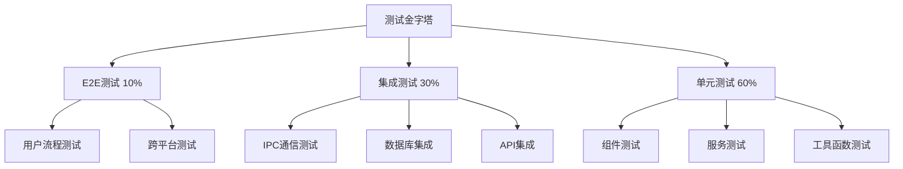

# 趣知桌面版 - 研发测试

<div align="center">
  <h1>🧪 趣知桌面版研发测试</h1>
  <p>完整的测试策略与质量保障体系</p>
</div>

---

## 📖 目录

1. [测试策略](#1-测试策略)
2. [测试架构](#2-测试架构)
3. [单元测试](#3-单元测试)
4. [集成测试](#4-集成测试)
5. [端到端测试](#5-端到端测试)
6. [性能测试](#6-性能测试)
7. [开发工具链](#7-开发工具链)
8. [质量保障](#8-质量保障)

---

## 1. 测试策略

### 1.1 测试金字塔



### 1.2 测试原则

#### 测试优先级

1. **P0 - 关键路径**: 核心业务流程必须测试
2. **P1 - 重要功能**: 主要功能需要测试
3. **P2 - 辅助功能**: 非关键功能选择性测试

#### 测试类型分配

| 测试类型 | 覆盖率目标 | 执行频率 | 执行环境 |
|----------|------------|----------|----------|
| 单元测试 | 80% | 每次提交 | 本地+CI |
| 集成测试 | 60% | 每日构建 | CI |
| E2E测试 | 核心流程 | 发布前 | CI+手动 |
| 性能测试 | 关键指标 | 每周 | 专用环境 |

#### 测试质量标准

- **代码覆盖率**: 总体 > 80%，核心模块 > 90%
- **测试通过率**: > 99%
- **执行时间**: 单元测试 < 5分钟，完整测试 < 30分钟
- **维护成本**: 测试代码与业务代码比例 < 1:2

---

## 2. 测试架构

### 2.1 测试技术栈

#### 测试框架

```typescript
{
  "单元测试": "Jest 29.7.0",
  "组件测试": "@testing-library/react 14.0.0",
  "E2E测试": "Playwright 1.40.0",
  "Mock工具": "jest-mock",
  "覆盖率": "jest-coverage"
}
```

#### 测试工具

- **Jest**: 单元测试和集成测试框架
- **Testing Library**: React组件测试
- **Playwright**: 端到端测试
- **MSW**: API Mock服务
- **jest-electron**: Electron环境测试

### 2.2 测试目录结构

```
src/
├── __tests__/                    # 测试根目录
│   ├── unit/                    # 单元测试
│   │   ├── components/         # 组件测试
│   │   │   ├── Sidebar.test.tsx
│   │   │   ├── ChatArea.test.tsx
│   │   │   └── MainLayout.test.tsx
│   │   ├── services/           # 服务测试
│   │   │   ├── StorageService.test.ts
│   │   │   ├── AIService.test.ts
│   │   │   └── SearchService.test.ts
│   │   ├── hooks/              # Hooks测试
│   │   │   ├── useStorage.test.ts
│   │   │   └── useModelConfig.test.ts
│   │   └── utils/              # 工具函数测试
│   │       ├── apiTest.test.ts
│   │       └── validators.test.ts
│   ├── integration/             # 集成测试
│   │   ├── ipc/                # IPC通信测试
│   │   ├── database/           # 数据库测试
│   │   └── workflow/           # 业务流程测试
│   ├── e2e/                     # 端到端测试
│   │   ├── chat.spec.ts        # 聊天功能测试
│   │   ├── document.spec.ts    # 文档管理测试
│   │   └── settings.spec.ts    # 设置功能测试
│   ├── performance/             # 性能测试
│   │   ├── startup.test.ts     # 启动性能
│   │   ├── rendering.test.ts   # 渲染性能
│   │   └── memory.test.ts      # 内存测试
│   ├── fixtures/                # 测试数据
│   │   ├── documents/
│   │   ├── mocks/
│   │   └── data.json
│   ├── helpers/                 # 测试辅助函数
│   │   ├── setup.ts
│   │   ├── mocks.ts
│   │   └── utils.ts
│   └── coverage/                # 覆盖率报告
└── playwright.config.ts         # Playwright配置
```

### 2.3 测试配置

#### Jest配置

```javascript
// jest.config.js
module.exports = {
  preset: 'ts-jest',
  testEnvironment: 'jsdom',
  
  // 测试匹配
  testMatch: [
    '**/__tests__/**/*.test.ts',
    '**/__tests__/**/*.test.tsx'
  ],
  
  // 覆盖率配置
  collectCoverageFrom: [
    'src/**/*.{ts,tsx}',
    '!src/**/*.d.ts',
    '!src/__tests__/**',
    '!src/main/main.ts'
  ],
  
  // 覆盖率阈值
  coverageThreshold: {
    global: {
      branches: 80,
      functions: 80,
      lines: 80,
      statements: 80
    }
  },
  
  // 设置文件
  setupFilesAfterEnv: ['<rootDir>/src/__tests__/helpers/setup.ts'],
  
  // 模块映射
  moduleNameMapper: {
    '\\.(css|less|scss|sass)$': 'identity-obj-proxy',
    '\\.(jpg|jpeg|png|gif|svg)$': '<rootDir>/src/__tests__/helpers/fileMock.js'
  },
  
  // 转换配置
  transform: {
    '^.+\\.tsx?$': ['ts-jest', {
      tsconfig: 'tsconfig.json'
    }]
  }
};
```

#### Playwright配置

```typescript
// playwright.config.ts
import { PlaywrightTestConfig } from '@playwright/test';

const config: PlaywrightTestConfig = {
  testDir: './src/__tests__/e2e',
  
  // 超时配置
  timeout: 30000,
  
  // 重试配置
  retries: 2,
  
  // 并行配置
  workers: 4,
  
  // 报告配置
  reporter: [
    ['html', { outputFolder: 'test-results/html' }],
    ['junit', { outputFile: 'test-results/junit.xml' }]
  ],
  
  // 浏览器配置
  use: {
    headless: true,
    screenshot: 'only-on-failure',
    video: 'retain-on-failure',
    trace: 'on-first-retry'
  },
  
  // 项目配置
  projects: [
    {
      name: 'Electron',
      use: {
        browserName: 'chromium',
        launchOptions: {
          executablePath: require('electron')
        }
      }
    }
  ]
};

export default config;
```

---

## 3. 单元测试

### 3.1 组件测试

#### 基础组件测试

```typescript
// __tests__/unit/components/Sidebar.test.tsx
import { render, screen, fireEvent } from '@testing-library/react';
import { Sidebar } from '@/components/Sidebar';

describe('Sidebar Component', () => {
  const mockProps = {
    collapsed: false,
    selectedTab: 'home',
    onTabChange: jest.fn(),
    onToggle: jest.fn()
  };

  beforeEach(() => {
    jest.clearAllMocks();
  });

  describe('Rendering', () => {
    test('renders all navigation items', () => {
      render(<Sidebar {...mockProps} />);
      
      expect(screen.getByText('我的首页')).toBeInTheDocument();
      expect(screen.getByText('知识问答')).toBeInTheDocument();
      expect(screen.getByText('知识图谱')).toBeInTheDocument();
      expect(screen.getByText('知识库')).toBeInTheDocument();
      expect(screen.getByText('笔记')).toBeInTheDocument();
      expect(screen.getByText('学习数据')).toBeInTheDocument();
      expect(screen.getByText('设置')).toBeInTheDocument();
    });

    test('applies active class to selected tab', () => {
      render(<Sidebar {...mockProps} selectedTab="qna" />);
      
      const qnaButton = screen.getByText('知识问答').closest('button');
      expect(qnaButton).toHaveClass('active');
    });

    test('renders in collapsed state', () => {
      render(<Sidebar {...mockProps} collapsed={true} />);
      
      const sidebar = screen.getByRole('navigation');
      expect(sidebar).toHaveClass('collapsed');
    });
  });

  describe('Interactions', () => {
    test('handles tab selection', async () => {
      render(<Sidebar {...mockProps} />);
      
      const qnaButton = screen.getByText('知识问答');
      fireEvent.click(qnaButton);
      
      expect(mockProps.onTabChange).toHaveBeenCalledWith('qna');
      expect(mockProps.onTabChange).toHaveBeenCalledTimes(1);
    });

    test('handles toggle button click', async () => {
      render(<Sidebar {...mockProps} />);
      
      const toggleButton = screen.getByRole('button', { name: /fold/i });
      fireEvent.click(toggleButton);
      
      expect(mockProps.onToggle).toHaveBeenCalled();
    });
  });

  describe('Accessibility', () => {
    test('has proper ARIA attributes', () => {
      render(<Sidebar {...mockProps} />);
      
      const nav = screen.getByRole('navigation');
      expect(nav).toHaveAttribute('aria-label');
    });

    test('supports keyboard navigation', () => {
      render(<Sidebar {...mockProps} />);
      
      const firstButton = screen.getByText('我的首页');
      firstButton.focus();
      
      expect(firstButton).toHaveFocus();
    });
  });
});
```

#### 复杂组件测试

```typescript
// __tests__/unit/components/ChatArea.test.tsx
import { render, screen, fireEvent, waitFor } from '@testing-library/react';
import { ChatArea } from '@/components/chat/components/ChatArea';
import { ChatProvider } from '@/contexts/ChatContext';
import * as aiService from '@/services/ai/ChatCompletion';

// Mock AI服务
jest.mock('@/services/ai/ChatCompletion');

describe('ChatArea Component', () => {
  const mockChatCompletion = aiService.chatCompletion as jest.MockedFunction<
    typeof aiService.chatCompletion
  >;

  beforeEach(() => {
    jest.clearAllMocks();
  });

  const renderWithProvider = (component: React.ReactElement) => {
    return render(
      <ChatProvider>
        {component}
      </ChatProvider>
    );
  };

  describe('Message Display', () => {
    test('displays chat messages', () => {
      renderWithProvider(<ChatArea />);
      
      // 验证消息列表渲染
      const messageList = screen.getByRole('list');
      expect(messageList).toBeInTheDocument();
    });

    test('displays user and assistant messages differently', async () => {
      mockChatCompletion.mockResolvedValueOnce({
        content: 'AI回复内容',
        finishReason: 'stop',
        usage: { promptTokens: 10, completionTokens: 20, totalTokens: 30 }
      });

      renderWithProvider(<ChatArea />);
      
      // 发送消息
      const input = screen.getByPlaceholderText(/输入消息/i);
      const sendButton = screen.getByRole('button', { name: /发送/i });
      
      fireEvent.change(input, { target: { value: '测试问题' } });
      fireEvent.click(sendButton);
      
      // 验证用户消息
      await waitFor(() => {
        expect(screen.getByText('测试问题')).toBeInTheDocument();
      });
      
      // 验证AI回复
      await waitFor(() => {
        expect(screen.getByText('AI回复内容')).toBeInTheDocument();
      });
    });
  });

  describe('Message Sending', () => {
    test('sends message on button click', async () => {
      mockChatCompletion.mockResolvedValueOnce({
        content: '回复',
        finishReason: 'stop',
        usage: { promptTokens: 10, completionTokens: 20, totalTokens: 30 }
      });

      renderWithProvider(<ChatArea />);
      
      const input = screen.getByPlaceholderText(/输入消息/i);
      const sendButton = screen.getByRole('button', { name: /发送/i });
      
      fireEvent.change(input, { target: { value: '你好' } });
      fireEvent.click(sendButton);
      
      await waitFor(() => {
        expect(mockChatCompletion).toHaveBeenCalled();
      });
    });

    test('sends message on Enter key', async () => {
      renderWithProvider(<ChatArea />);
      
      const input = screen.getByPlaceholderText(/输入消息/i);
      
      fireEvent.change(input, { target: { value: '你好' } });
      fireEvent.keyPress(input, { key: 'Enter', code: 13, charCode: 13 });
      
      await waitFor(() => {
        expect(mockChatCompletion).toHaveBeenCalled();
      });
    });

    test('clears input after sending', async () => {
      renderWithProvider(<ChatArea />);
      
      const input = screen.getByPlaceholderText(/输入消息/i) as HTMLInputElement;
      const sendButton = screen.getByRole('button', { name: /发送/i });
      
      fireEvent.change(input, { target: { value: '你好' } });
      fireEvent.click(sendButton);
      
      await waitFor(() => {
        expect(input.value).toBe('');
      });
    });
  });

  describe('Error Handling', () => {
    test('displays error message on API failure', async () => {
      mockChatCompletion.mockRejectedValueOnce(new Error('API错误'));

      renderWithProvider(<ChatArea />);
      
      const input = screen.getByPlaceholderText(/输入消息/i);
      const sendButton = screen.getByRole('button', { name: /发送/i });
      
      fireEvent.change(input, { target: { value: '你好' } });
      fireEvent.click(sendButton);
      
      await waitFor(() => {
        expect(screen.getByText(/错误/i)).toBeInTheDocument();
      });
    });
  });
});
```

### 3.2 服务测试

#### 存储服务测试

```typescript
// __tests__/unit/services/StorageService.test.ts
import { StorageService } from '@/services/StorageService';

describe('StorageService', () => {
  let storageService: StorageService;
  
  beforeEach(() => {
    storageService = new StorageService();
    // 清理存储
    storageService.clear();
  });

  describe('Basic Operations', () => {
    test('stores and retrieves data', () => {
      const testData = { name: 'test', value: 123 };
      
      storageService.set('testKey', testData);
      const retrieved = storageService.get('testKey');
      
      expect(retrieved).toEqual(testData);
    });

    test('returns undefined for non-existent key', () => {
      const result = storageService.get('nonExistentKey');
      
      expect(result).toBeUndefined();
    });

    test('deletes data', () => {
      storageService.set('testKey', 'value');
      storageService.delete('testKey');
      
      const result = storageService.get('testKey');
      expect(result).toBeUndefined();
    });

    test('checks key existence', () => {
      storageService.set('testKey', 'value');
      
      expect(storageService.has('testKey')).toBe(true);
      expect(storageService.has('nonExistentKey')).toBe(false);
    });

    test('clears all data', () => {
      storageService.set('key1', 'value1');
      storageService.set('key2', 'value2');
      
      storageService.clear();
      
      expect(storageService.has('key1')).toBe(false);
      expect(storageService.has('key2')).toBe(false);
    });
  });

  describe('Complex Data Types', () => {
    test('handles arrays', () => {
      const testArray = [1, 2, 3, 4, 5];
      
      storageService.set('arrayKey', testArray);
      const retrieved = storageService.get('arrayKey');
      
      expect(retrieved).toEqual(testArray);
    });

    test('handles nested objects', () => {
      const nestedObject = {
        level1: {
          level2: {
            value: 'deep'
          }
        }
      };
      
      storageService.set('nestedKey', nestedObject);
      const retrieved = storageService.get('nestedKey');
      
      expect(retrieved).toEqual(nestedObject);
    });
  });
});
```

#### AI服务测试

```typescript
// __tests__/unit/services/ai/ChatCompletion.test.ts
import { chatCompletion } from '@/services/ai/ChatCompletion';
import * as urlUtils from '@/services/ai/UrlUtils';
import * as requestBuilder from '@/services/ai/RequestBuilder';

// Mock依赖
jest.mock('@/services/ai/UrlUtils');
jest.mock('@/services/ai/RequestBuilder');

global.fetch = jest.fn();

describe('ChatCompletion Service', () => {
  beforeEach(() => {
    jest.clearAllMocks();
  });

  test('sends chat completion request successfully', async () => {
    const mockResponse = {
      choices: [
        {
          message: {
            role: 'assistant',
            content: '测试回复'
          },
          finish_reason: 'stop'
        }
      ],
      usage: {
        prompt_tokens: 10,
        completion_tokens: 20,
        total_tokens: 30
      }
    };

    (global.fetch as jest.Mock).mockResolvedValueOnce({
      ok: true,
      json: async () => mockResponse
    });

    const result = await chatCompletion({
      messages: [{ role: 'user', content: '你好' }],
      apiUrl: 'https://api.openai.com/v1',
      apiKey: 'test-key',
      model: 'gpt-3.5-turbo'
    });

    expect(result.content).toBe('测试回复');
    expect(result.finishReason).toBe('stop');
    expect(result.usage?.totalTokens).toBe(30);
  });

  test('handles API errors', async () => {
    (global.fetch as jest.Mock).mockResolvedValueOnce({
      ok: false,
      status: 401,
      json: async () => ({ error: { message: '无效的API密钥' } })
    });

    await expect(
      chatCompletion({
        messages: [{ role: 'user', content: '你好' }],
        apiUrl: 'https://api.openai.com/v1',
        apiKey: 'invalid-key',
        model: 'gpt-3.5-turbo'
      })
    ).rejects.toThrow();
  });

  test('handles network errors', async () => {
    (global.fetch as jest.Mock).mockRejectedValueOnce(
      new Error('Network error')
    );

    await expect(
      chatCompletion({
        messages: [{ role: 'user', content: '你好' }],
        apiUrl: 'https://api.openai.com/v1',
        apiKey: 'test-key',
        model: 'gpt-3.5-turbo'
      })
    ).rejects.toThrow('Network error');
  });
});
```

### 3.3 Hooks测试

```typescript
// __tests__/unit/hooks/useStorage.test.ts
import { renderHook, act } from '@testing-library/react';
import { useStorage } from '@/hooks/UseStorage';

describe('useStorage Hook', () => {
  beforeEach(() => {
    // 清理electron API mock
    (window as any).electronAPI = {
      storage: {
        get: jest.fn(),
        set: jest.fn(),
        delete: jest.fn()
      }
    };
  });

  test('initializes with default value', () => {
    const { result } = renderHook(() => 
      useStorage('testKey', 'defaultValue')
    );

    expect(result.current[0]).toBe('defaultValue');
  });

  test('updates value', async () => {
    const mockSet = jest.fn().mockResolvedValue(undefined);
    (window as any).electronAPI.storage.set = mockSet;

    const { result } = renderHook(() => 
      useStorage('testKey', 'initial')
    );

    await act(async () => {
      await result.current[1]('newValue');
    });

    expect(mockSet).toHaveBeenCalledWith('testKey', 'newValue');
  });

  test('handles storage errors', async () => {
    const mockSet = jest.fn().mockRejectedValue(new Error('Storage error'));
    (window as any).electronAPI.storage.set = mockSet;

    const { result } = renderHook(() => 
      useStorage('testKey', 'initial')
    );

    await expect(
      act(async () => {
        await result.current[1]('newValue');
      })
    ).rejects.toThrow('Storage error');
  });
});
```

---

## 4. 集成测试

### 4.1 IPC通信测试

```typescript
// __tests__/integration/ipc/storage.test.ts
import { ipcMain, ipcRenderer } from 'electron';
import { StorageHandlers } from '@/ipc/StorageHandlers';

describe('Storage IPC Integration', () => {
  let storageHandlers: StorageHandlers;

  beforeAll(() => {
    storageHandlers = new StorageHandlers();
    storageHandlers.registerHandlers();
  });

  test('get storage value via IPC', async () => {
    const testData = { value: 'test' };
    
    // 模拟渲染进程调用
    const result = await ipcRenderer.invoke('storage:get', 'testKey');
    
    expect(result).toBeDefined();
  });

  test('set storage value via IPC', async () => {
    const testData = { value: 'test' };
    
    await ipcRenderer.invoke('storage:set', 'testKey', testData);
    const result = await ipcRenderer.invoke('storage:get', 'testKey');
    
    expect(result).toEqual(testData);
  });

  test('delete storage value via IPC', async () => {
    await ipcRenderer.invoke('storage:set', 'testKey', 'value');
    await ipcRenderer.invoke('storage:delete', 'testKey');
    
    const result = await ipcRenderer.invoke('storage:get', 'testKey');
    expect(result).toBeUndefined();
  });
});
```

### 4.2 数据库集成测试

```typescript
// __tests__/integration/database/documents.test.ts
import { DatabaseService } from '@/main/services/DatabaseService';

describe('Document Database Integration', () => {
  let db: DatabaseService;

  beforeAll(async () => {
    db = new DatabaseService(':memory:'); // 使用内存数据库
    await db.initialize();
  });

  afterAll(async () => {
    await db.close();
  });

  describe('Document CRUD', () => {
    test('creates document', async () => {
      const document = await db.createDocument({
        title: '测试文档',
        content: '测试内容',
        tags: ['test']
      });

      expect(document.id).toBeDefined();
      expect(document.title).toBe('测试文档');
    });

    test('retrieves document by id', async () => {
      const created = await db.createDocument({
        title: '测试文档',
        content: '测试内容'
      });

      const retrieved = await db.getDocument(created.id);

      expect(retrieved).toEqual(created);
    });

    test('updates document', async () => {
      const created = await db.createDocument({
        title: '原标题',
        content: '原内容'
      });

      await db.updateDocument(created.id, {
        title: '新标题'
      });

      const updated = await db.getDocument(created.id);
      expect(updated.title).toBe('新标题');
      expect(updated.content).toBe('原内容');
    });

    test('deletes document', async () => {
      const created = await db.createDocument({
        title: '待删除文档',
        content: '内容'
      });

      await db.deleteDocument(created.id);

      const retrieved = await db.getDocument(created.id);
      expect(retrieved).toBeNull();
    });
  });

  describe('Document Query', () => {
    beforeEach(async () => {
      // 创建测试数据
      await db.createDocument({ title: '文档1', tags: ['tag1'] });
      await db.createDocument({ title: '文档2', tags: ['tag2'] });
      await db.createDocument({ title: '文档3', tags: ['tag1', 'tag2'] });
    });

    test('lists all documents', async () => {
      const documents = await db.listDocuments();

      expect(documents.length).toBeGreaterThanOrEqual(3);
    });

    test('filters documents by tag', async () => {
      const documents = await db.listDocuments({ tags: ['tag1'] });

      expect(documents.length).toBe(2);
      expect(documents.every(doc => doc.tags.includes('tag1'))).toBe(true);
    });

    test('searches documents', async () => {
      const results = await db.searchDocuments('文档1');

      expect(results.length).toBeGreaterThan(0);
      expect(results[0].title).toContain('文档1');
    });
  });
});
```

---

## 5. 端到端测试

### 5.1 用户流程测试

```typescript
// __tests__/e2e/chat.spec.ts
import { test, expect, _electron as electron } from '@playwright/test';
import { ElectronApplication } from 'playwright';

test.describe('Chat Workflow', () => {
  let electronApp: ElectronApplication;

  test.beforeAll(async () => {
    electronApp = await electron.launch({
      args: ['dist/main.js']
    });
  });

  test.afterAll(async () => {
    await electronApp.close();
  });

  test('complete chat workflow', async () => {
    const window = await electronApp.firstWindow();

    // 1. 等待应用加载
    await expect(window).toHaveTitle('趣知桌面版');

    // 2. 导航到知识问答
    await window.click('[data-testid="nav-qna"]');
    await expect(window.locator('.chat-page')).toBeVisible();

    // 3. 选择助手
    await window.click('[data-testid="assistant-list"]');
    await window.click('[data-testid="assistant-item"]:first-child');

    // 4. 输入问题
    const input = window.locator('[data-testid="chat-input"]');
    await input.fill('什么是人工智能？');

    // 5. 发送消息
    await window.click('[data-testid="send-button"]');

    // 6. 等待回复
    await expect(window.locator('[data-testid="message-assistant"]'))
      .toBeVisible({ timeout: 10000 });

    // 7. 验证对话历史
    const messages = window.locator('[data-testid^="message-"]');
    await expect(messages).toHaveCount(2); // 用户消息 + AI回复
  });

  test('creates new assistant', async () => {
    const window = await electronApp.firstWindow();

    // 导航到知识问答
    await window.click('[data-testid="nav-qna"]');

    // 点击新建助手
    await window.click('[data-testid="new-assistant"]');

    // 填写助手信息
    await window.fill('[data-testid="assistant-name"]', '测试助手');
    await window.fill('[data-testid="system-prompt"]', '你是一个helpful的助手');

    // 保存
    await window.click('[data-testid="save-assistant"]');

    // 验证助手已创建
    await expect(window.locator('text=测试助手')).toBeVisible();
  });
});
```

### 5.2 跨平台测试

```typescript
// __tests__/e2e/cross-platform.spec.ts
import { test, expect } from '@playwright/test';

test.describe('Cross-Platform Compatibility', () => {
  test('works on macOS', async () => {
    test.skip(process.platform !== 'darwin', 'macOS only');
    
    // macOS特定测试
  });

  test('works on Windows', async () => {
    test.skip(process.platform !== 'win32', 'Windows only');
    
    // Windows特定测试
  });

  test('works on Linux', async () => {
    test.skip(process.platform !== 'linux', 'Linux only');
    
    // Linux特定测试
  });
});
```

---

## 6. 性能测试

### 6.1 启动性能测试

```typescript
// __tests__/performance/startup.test.ts
import { _electron as electron } from '@playwright/test';

describe('Application Startup Performance', () => {
  test('应用启动时间应小于3秒', async () => {
    const startTime = Date.now();

    const app = await electron.launch({
      args: ['dist/main.js']
    });

    const window = await app.firstWindow();
    await window.waitForLoadState('domcontentloaded');

    const endTime = Date.now();
    const startupTime = endTime - startTime;

    expect(startupTime).toBeLessThan(3000);

    await app.close();
  });
});
```

### 6.2 渲染性能测试

```typescript
// __tests__/performance/rendering.test.ts
describe('Rendering Performance', () => {
  test('大量消息渲染性能', async () => {
    const { result } = renderHook(() => useChatContext());

    // 生成1000条消息
    const messages = Array.from({ length: 1000 }, (_, i) => ({
      id: `msg-${i}`,
      role: i % 2 === 0 ? 'user' : 'assistant',
      content: `消息 ${i}`
    }));

    const startTime = performance.now();

    act(() => {
      messages.forEach(msg => result.current.addMessage(msg));
    });

    const endTime = performance.now();
    const renderTime = endTime - startTime;

    // 1000条消息渲染时间应小于1秒
    expect(renderTime).toBeLessThan(1000);
  });
});
```

### 6.3 内存测试

```typescript
// __tests__/performance/memory.test.ts
describe('Memory Usage', () => {
  test('内存使用保持合理范围', async () => {
    const app = await electron.launch({
      args: ['dist/main.js']
    });

    // 执行一系列操作
    const window = await app.firstWindow();
    
    // 获取初始内存
    const initialMemory = await getMemoryUsage(app);

    // 执行大量操作
    for (let i = 0; i < 100; i++) {
      await window.click('[data-testid="new-document"]');
      await window.fill('[data-testid="document-content"]', 'content');
      await window.click('[data-testid="save-document"]');
    }

    // 获取最终内存
    const finalMemory = await getMemoryUsage(app);

    // 内存增长应小于200MB
    const memoryIncrease = finalMemory - initialMemory;
    expect(memoryIncrease).toBeLessThan(200 * 1024 * 1024);

    await app.close();
  });
});
```

---

## 7. 开发工具链

### 7.1 代码质量工具

#### ESLint配置

```javascript
// .eslintrc.js
module.exports = {
  extends: [
    'airbnb-typescript',
    'plugin:@typescript-eslint/recommended',
    'plugin:react-hooks/recommended',
    'prettier'
  ],
  parser: '@typescript-eslint/parser',
  parserOptions: {
    project: './tsconfig.json',
    ecmaVersion: 2020,
    sourceType: 'module',
    ecmaFeatures: {
      jsx: true
    }
  },
  rules: {
    '@typescript-eslint/no-unused-vars': ['error', { 
      argsIgnorePattern: '^_' 
    }],
    'react/react-in-jsx-scope': 'off',
    'import/prefer-default-export': 'off',
    'no-console': ['warn', { allow: ['warn', 'error'] }]
  }
};
```

#### Prettier配置

```javascript
// .prettierrc.js
module.exports = {
  semi: true,
  trailingComma: 'es5',
  singleQuote: true,
  printWidth: 100,
  tabWidth: 2,
  useTabs: false,
  arrowParens: 'avoid',
  endOfLine: 'lf'
};
```

### 7.2 Git Hooks

```javascript
// .husky/pre-commit
#!/usr/bin/env sh
. "$(dirname -- "$0")/_/husky.sh"

# 运行lint-staged
npx lint-staged

# 运行类型检查
npm run type-check
```

```javascript
// .husky/pre-push
#!/usr/bin/env sh
. "$(dirname -- "$0")/_/husky.sh"

# 运行测试
npm run test

# 运行构建检查
npm run build
```

```json
// package.json - lint-staged配置
{
  "lint-staged": {
    "*.{ts,tsx}": [
      "eslint --fix",
      "prettier --write"
    ],
    "*.{json,md,yml}": [
      "prettier --write"
    ]
  }
}
```

### 7.3 CI/CD配置

```yaml
# .github/workflows/test.yml
name: Test

on: [push, pull_request]

jobs:
  test:
    runs-on: ${{ matrix.os }}
    
    strategy:
      matrix:
        os: [macos-latest, windows-latest, ubuntu-latest]
        node-version: [18.x]
    
    steps:
      - uses: actions/checkout@v3
      
      - name: Setup Node.js
        uses: actions/setup-node@v3
        with:
          node-version: ${{ matrix.node-version }}
          cache: 'npm'
      
      - name: Install dependencies
        run: npm ci
      
      - name: Run linting
        run: npm run lint
      
      - name: Run type check
        run: npm run type-check
      
      - name: Run tests
        run: npm run test:coverage
      
      - name: Upload coverage
        uses: codecov/codecov-action@v3
        with:
          files: ./coverage/lcov.info
      
      - name: Build application
        run: npm run build
```

---

## 8. 质量保障

### 8.1 质量指标

| 指标 | 目标值 | 当前值 | 状态 |
|------|--------|--------|------|
| 代码覆盖率 | > 80% | 75% | 🔄 |
| 测试通过率 | > 99% | 98% | 🔄 |
| 构建成功率 | > 95% | 96% | ✅ |
| 平均修复时间 | < 24h | 18h | ✅ |
| Bug密度 | < 5个/KLOC | 4个/KLOC | ✅ |

### 8.2 测试报告

#### 覆盖率报告

```bash
# 生成覆盖率报告
npm run test:coverage

# 查看HTML报告
open coverage/lcov-report/index.html
```

#### 测试执行报告

```bash
# 生成测试报告
npm run test -- --json --outputFile=test-results.json

# 生成HTML报告
npm run test -- --reporters=default --reporters=jest-html-reporter
```

### 8.3 最佳实践

#### 测试命名规范

```typescript
// ✅ 好的命名
describe('UserService', () => {
  describe('createUser', () => {
    test('creates user with valid data', () => {});
    test('throws error with invalid email', () => {});
    test('throws error with duplicate username', () => {});
  });
});

// ❌ 不好的命名
describe('test1', () => {
  test('should work', () => {});
});
```

#### 测试组织原则

1. **AAA模式**: Arrange(准备) - Act(执行) - Assert(断言)
2. **单一职责**: 每个测试只测试一个功能点
3. **独立性**: 测试之间不应相互依赖
4. **可重复性**: 测试结果应该稳定可重复
5. **快速执行**: 单元测试应该快速完成

---

## 📝 总结

### 🎯 测试策略核心

1. **金字塔原则**: 60%单元测试 + 30%集成测试 + 10%E2E测试
2. **持续集成**: 每次提交都运行测试
3. **质量门禁**: 测试覆盖率和通过率达标才能合并
4. **性能监控**: 定期进行性能基准测试

### 📈 质量保障措施

- 自动化测试覆盖关键路径
- 代码审查和结对编程
- 持续重构减少技术债务
- 定期进行安全审计

### 🎖️ 成功要素

- **完善的测试体系**: 覆盖单元、集成、E2E各层次
- **自动化工具链**: CI/CD、代码质量工具
- **质量文化**: 团队重视测试和代码质量
- **持续改进**: 根据指标不断优化

通过完善的测试策略和质量保障体系，确保趣知桌面版的稳定性和可靠性。

---

*本文档将随着项目发展持续更新和完善。*
*最后更新: 2025-10-19*

