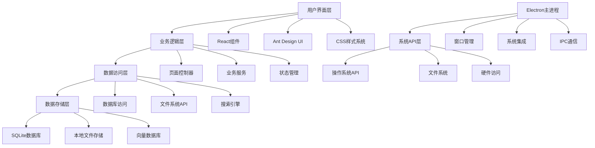
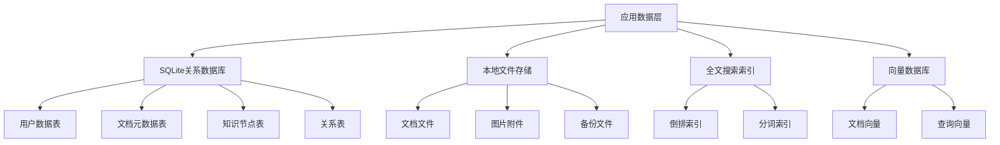
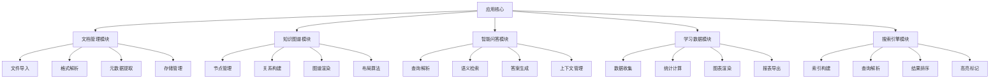

# 趣知桌面版 - 架构设计文档

<div align="center">
  <h1>🏗️ 趣知桌面版架构设计</h1>
  <p>现代化桌面知识管理应用的技术架构与实现方案</p>
</div>

---

## 📖 目录

1. [项目概述](#1-项目概述)
2. [整体架构设计](#2-整体架构设计)
3. [技术栈选择](#3-技术栈选择)
4. [前端架构设计](#4-前端架构设计)
5. [主进程架构设计](#5-主进程架构设计)
6. [数据架构设计](#6-数据架构设计)
7. [核心模块设计](#7-核心模块设计)
8. [通信机制设计](#8-通信机制设计)
9. [性能优化策略](#9-性能优化策略)
10. [安全架构设计](#10-安全架构设计)
11. [部署与分发](#11-部署与分发)
12. [开发工具链](#12-开发工具链)
13. [监控与日志](#13-监控与日志)
14. [扩展性设计](#14-扩展性设计)
15. [测试策略](#15-测试策略)

---

## 1. 项目概述

### 1.1 产品定位
趣知桌面版是一款面向知识工作者的现代化桌面知识管理工具，通过AI技术和可视化设计，提供智能问答、知识图谱、文档管理等核心功能。

### 1.2 技术目标
- **跨平台支持**: Windows、macOS、Linux 三大平台
- **离线优先**: 本地数据存储和处理为主
- **高性能**: 桌面端原生体验，响应迅速
- **现代化UI**: 深色主题+毛玻璃效果的视觉体验
- **可扩展性**: 支持插件系统和功能扩展

### 1.3 当前实现状态
```
✅ 基础架构搭建 (Electron + React + TypeScript)
✅ 现代化UI系统 (Ant Design + 自定义主题)
✅ 页面路由和导航系统
✅ 响应式布局框架
🔄 核心业务功能开发中
🕐 AI集成和数据层实现待开发
```

---

## 2. 整体架构设计

### 2.1 分层架构


### 2.2 架构特点
- **前后分离**: 渲染进程专注UI，主进程处理系统集成
- **模块化设计**: 功能模块独立，便于维护和扩展
- **数据驱动**: 基于状态管理的响应式数据流
- **离线优先**: 本地数据存储，可选云端同步

---

## 3. 技术栈选择

### 3.1 核心技术栈

#### 前端技术
```typescript
{
  "框架": "React 19.0.0",
  "语言": "TypeScript 5.8.2", 
  "UI库": "Ant Design 5.27.1",
  "可视化": "@ant-design/charts 2.6.2",
  "路由": "React Router DOM 7.3.0",
  "样式": "CSS Modules + CSS Variables"
}
```

#### 桌面端技术
```typescript
{
  "框架": "Electron 35.0.2",
  "构建工具": "Webpack 5.98.0",
  "包管理": "npm",
  "代码质量": ["ESLint", "Prettier", "Jest"]
}
```

#### 数据存储
```typescript
{
  "关系数据库": "SQLite",
  "全文搜索": "Lunr.js / ElasticLunr",
  "向量数据库": "Faiss / Hnswlib",
  "文件存储": "本地文件系统"
}
```

### 3.2 技术选型原因

#### Electron选择理由
- ✅ 跨平台一致性体验
- ✅ 丰富的系统API访问能力
- ✅ 成熟的生态系统和社区支持
- ✅ 便于集成现有Web技术栈

#### React选择理由
- ✅ 组件化开发，代码复用率高
- ✅ 丰富的生态系统和第三方库
- ✅ TypeScript支持完善
- ✅ 团队技术栈契合

#### Ant Design选择理由
- ✅ 企业级UI组件库，功能完善
- ✅ 中文友好，设计规范统一
- ✅ Dark主题支持和自定义主题能力
- ✅ 数据可视化图表组件集成

---

## 4. 前端架构设计

### 4.1 组件架构
```
src/renderer/
├── App.tsx                 # 应用根组件
├── components/            # 组件目录
│   ├── Layout/           # 布局组件
│   │   └── MainLayout.tsx
│   ├── Sidebar/          # 侧边栏组件
│   │   └── Sidebar.tsx
│   ├── Content/          # 内容区组件
│   │   └── ContentArea.tsx
│   └── Pages/            # 页面组件
│       ├── Home/         # 首页
│       ├── QnA/         # 知识问答
│       ├── KnowledgeGraph/ # 知识图谱
│       ├── Library/      # 知识库
│       └── Analytics/    # 学习数据
└── styles/              # 样式系统
    └── theme.css        # 主题样式
```

### 4.2 状态管理架构
```typescript
// 使用React Context + useReducer进行状态管理
interface AppState {
  // 用户状态
  user: UserState;
  
  // UI状态
  ui: {
    sidebarCollapsed: boolean;
    selectedTab: string;
    theme: 'dark' | 'light';
    loading: boolean;
  };
  
  // 业务数据状态
  documents: DocumentState;
  knowledgeGraph: KnowledgeGraphState;
  search: SearchState;
  analytics: AnalyticsState;
}

// 状态更新动作
type AppAction = 
  | { type: 'SET_SIDEBAR_COLLAPSED'; payload: boolean }
  | { type: 'SET_SELECTED_TAB'; payload: string }
  | { type: 'ADD_DOCUMENT'; payload: Document }
  | { type: 'UPDATE_KNOWLEDGE_NODE'; payload: KnowledgeNode }
  | { type: 'SET_SEARCH_RESULTS'; payload: SearchResult[] };
```

### 4.3 路由设计
```typescript
// 基于selectedTab的条件渲染路由
const ContentArea: React.FC = ({ selectedTab }) => {
  const renderContent = () => {
    switch (selectedTab) {
      case 'home': return <HomePage />;
      case 'qna': return <QnAPage />;
      case 'knowledge-graph': return <KnowledgeGraphPage />;
      case 'library': return <LibraryPage />;
      case 'analytics': return <AnalyticsPage />;
      default: return <HomePage />;
    }
  };

  return (
    <Suspense fallback={<Loading />}>
      {renderContent()}
    </Suspense>
  );
};
```

### 4.4 主题系统设计
```css
/* CSS Variables主题系统 */
:root {
  /* 主色调系统 */
  --primary-color: #38b2ac;
  --primary-dark: #329a94;
  
  /* 背景色彩系统 */
  --bg-primary: #0f0f23;
  --bg-secondary: #1a1a2e;
  --bg-gradient: linear-gradient(135deg, #0f0f23 0%, #1a1a2e 50%, #16213e 100%);
  
  /* 毛玻璃效果 */
  --backdrop-blur-medium: blur(15px);
  --bg-translucent-medium: rgba(26, 26, 46, 0.6);
  
  /* 动画过渡 */
  --transition-standard: 0.3s cubic-bezier(0.25, 0.46, 0.45, 0.94);
}
```

### 4.5 性能优化策略
- **代码分割**: 使用`React.lazy()`对页面组件进行懒加载
- **组件缓存**: 使用`React.memo`缓存纯组件
- **虚拟滚动**: 长列表使用虚拟滚动优化渲染性能
- **图片懒加载**: 非可视区域图片延迟加载

---

## 5. 主进程架构设计

### 5.1 主进程结构
```
src/main/
├── main.ts              # 主进程入口
├── menu.ts              # 菜单系统
├── preload.ts           # 预加载脚本
└── services/            # 主进程服务
    ├── window.service.ts    # 窗口管理服务
    ├── file.service.ts      # 文件系统服务
    ├── database.service.ts  # 数据库服务
    └── search.service.ts    # 搜索服务
```

### 5.2 窗口管理
```typescript
// 窗口配置
const createWindow = async () => {
  mainWindow = new BrowserWindow({
    show: false,
    width: 1200,
    height: 800,
    minWidth: 800,
    minHeight: 600,
    icon: getAssetPath('icon.png'),
    webPreferences: {
      nodeIntegration: false,
      contextIsolation: true,
      enableRemoteModule: false,
      preload: path.join(__dirname, 'preload.js'),
      webSecurity: true
    },
    titleBarStyle: 'hiddenInset', // macOS样式
    frame: process.platform !== 'darwin' // Windows/Linux显示边框
  });
};
```

### 5.3 系统集成功能
- **原生菜单**: 跨平台菜单系统
- **文件关联**: 注册文件类型打开
- **系统通知**: 原生通知推送
- **托盘图标**: 系统托盘集成
- **全局快捷键**: 全局热键支持
- **自动更新**: electron-updater集成

### 5.4 安全策略
```typescript
// 安全配置
const securityConfig = {
  nodeIntegration: false,        // 禁用Node集成
  contextIsolation: true,        // 启用上下文隔离
  enableRemoteModule: false,     // 禁用remote模块
  webSecurity: true,             // 启用Web安全
  allowRunningInsecureContent: false  // 禁止不安全内容
};

// CSP内容安全策略
const cspPolicy = "default-src 'self'; script-src 'self' 'unsafe-inline'; style-src 'self' 'unsafe-inline';";
```

---

## 6. 数据架构设计

### 6.1 数据存储架构


### 6.2 核心数据模型
```sql
-- 文档表
CREATE TABLE documents (
    id INTEGER PRIMARY KEY AUTOINCREMENT,
    title TEXT NOT NULL,
    content TEXT,
    file_path TEXT,
    file_type TEXT,
    file_size INTEGER,
    created_at DATETIME DEFAULT CURRENT_TIMESTAMP,
    updated_at DATETIME DEFAULT CURRENT_TIMESTAMP,
    tags TEXT, -- JSON格式存储标签数组
    metadata TEXT, -- JSON格式存储额外元数据
    INDEX(created_at),
    INDEX(file_type),
    FULLTEXT(title, content)
);

-- 知识节点表
CREATE TABLE knowledge_nodes (
    id INTEGER PRIMARY KEY AUTOINCREMENT,
    title TEXT NOT NULL,
    description TEXT,
    node_type TEXT DEFAULT 'concept', -- concept, document, person, etc.
    position_x REAL DEFAULT 0,
    position_y REAL DEFAULT 0,
    color TEXT DEFAULT '#38b2ac',
    size INTEGER DEFAULT 10,
    created_at DATETIME DEFAULT CURRENT_TIMESTAMP,
    metadata TEXT, -- JSON格式存储节点属性
    INDEX(node_type),
    INDEX(created_at)
);

-- 知识关系表
CREATE TABLE knowledge_relationships (
    id INTEGER PRIMARY KEY AUTOINCREMENT,
    source_id INTEGER NOT NULL,
    target_id INTEGER NOT NULL,
    relation_type TEXT DEFAULT 'related_to', -- related_to, part_of, causes, etc.
    weight REAL DEFAULT 1.0,
    description TEXT,
    created_at DATETIME DEFAULT CURRENT_TIMESTAMP,
    FOREIGN KEY (source_id) REFERENCES knowledge_nodes(id) ON DELETE CASCADE,
    FOREIGN KEY (target_id) REFERENCES knowledge_nodes(id) ON DELETE CASCADE,
    INDEX(source_id),
    INDEX(target_id),
    INDEX(relation_type)
);

-- 问答记录表
CREATE TABLE qa_records (
    id INTEGER PRIMARY KEY AUTOINCREMENT,
    question TEXT NOT NULL,
    answer TEXT,
    sources TEXT, -- JSON格式存储来源文档ID数组
    confidence_score REAL DEFAULT 0.0,
    created_at DATETIME DEFAULT CURRENT_TIMESTAMP,
    is_bookmarked BOOLEAN DEFAULT FALSE,
    FULLTEXT(question, answer),
    INDEX(created_at),
    INDEX(is_bookmarked)
);

-- 标签表
CREATE TABLE tags (
    id INTEGER PRIMARY KEY AUTOINCREMENT,
    name TEXT UNIQUE NOT NULL,
    color TEXT DEFAULT '#38b2ac',
    count INTEGER DEFAULT 0,
    created_at DATETIME DEFAULT CURRENT_TIMESTAMP,
    INDEX(name)
);

-- 使用统计表
CREATE TABLE usage_stats (
    id INTEGER PRIMARY KEY AUTOINCREMENT,
    event_type TEXT NOT NULL, -- document_open, search_query, etc.
    event_data TEXT, -- JSON格式存储事件详情
    timestamp DATETIME DEFAULT CURRENT_TIMESTAMP,
    INDEX(event_type),
    INDEX(timestamp)
);
```

### 6.3 数据访问层设计
```typescript
// 数据访问层接口
interface DatabaseService {
  // 文档管理
  createDocument(doc: Partial<Document>): Promise<Document>;
  updateDocument(id: number, updates: Partial<Document>): Promise<void>;
  deleteDocument(id: number): Promise<void>;
  findDocuments(query: DocumentQuery): Promise<Document[]>;
  
  // 知识图谱
  createNode(node: Partial<KnowledgeNode>): Promise<KnowledgeNode>;
  createRelationship(rel: Partial<KnowledgeRelationship>): Promise<KnowledgeRelationship>;
  getGraphData(filters?: GraphFilters): Promise<GraphData>;
  
  // 搜索功能
  searchDocuments(query: string): Promise<SearchResult[]>;
  semanticSearch(embedding: number[]): Promise<SearchResult[]>;
  
  // 统计分析
  getUsageStats(timeRange: TimeRange): Promise<UsageStats>;
  getDocumentStats(): Promise<DocumentStats>;
}
```

### 6.4 数据迁移策略
```typescript
// 数据库版本管理
interface Migration {
  version: number;
  description: string;
  up: (db: Database) => Promise<void>;
  down: (db: Database) => Promise<void>;
}

const migrations: Migration[] = [
  {
    version: 1,
    description: '初始数据库结构',
    up: async (db) => {
      await db.exec(createTablesSQL);
    },
    down: async (db) => {
      await db.exec(dropTablesSQL);
    }
  },
  // 后续版本迁移...
];
```

---

## 7. 核心模块设计

### 7.1 模块架构图


### 7.2 文档管理模块
```typescript
// 文档管理服务接口
interface DocumentService {
  // 文档导入
  importDocument(filePath: string): Promise<Document>;
  importFromClipboard(): Promise<Document>;
  batchImport(filePaths: string[]): Promise<Document[]>;
  
  // 文档操作
  createDocument(data: CreateDocumentData): Promise<Document>;
  updateDocument(id: number, updates: UpdateDocumentData): Promise<Document>;
  deleteDocument(id: number): Promise<void>;
  
  // 文档查询
  getDocument(id: number): Promise<Document | null>;
  listDocuments(query?: DocumentQuery): Promise<Document[]>;
  getRecentDocuments(limit?: number): Promise<Document[]>;
  
  // 文件格式支持
  getSupportedFormats(): string[];
  parseDocument(filePath: string, format: string): Promise<ParsedDocument>;
  
  // 元数据管理
  extractMetadata(filePath: string): Promise<DocumentMetadata>;
  updateMetadata(id: number, metadata: DocumentMetadata): Promise<void>;
}

// 支持的文件格式
const SUPPORTED_FORMATS = [
  '.pdf', '.docx', '.doc', '.txt', '.md', 
  '.rtf', '.odt', '.epub', '.html', '.xml'
];
```

### 7.3 知识图谱模块
```typescript
// 知识图谱服务
interface KnowledgeGraphService {
  // 节点管理
  createNode(data: CreateNodeData): Promise<KnowledgeNode>;
  updateNode(id: number, updates: UpdateNodeData): Promise<KnowledgeNode>;
  deleteNode(id: number): Promise<void>;
  
  // 关系管理
  createRelationship(data: CreateRelationshipData): Promise<KnowledgeRelationship>;
  updateRelationship(id: number, updates: UpdateRelationshipData): Promise<KnowledgeRelationship>;
  deleteRelationship(id: number): Promise<void>;
  
  // 图谱查询
  getGraphData(filters?: GraphFilters): Promise<GraphData>;
  getNodeNeighbors(nodeId: number, depth?: number): Promise<GraphData>;
  findShortestPath(sourceId: number, targetId: number): Promise<KnowledgeNode[]>;
  
  // 图谱分析
  calculateNodeImportance(): Promise<Map<number, number>>;
  detectCommunities(): Promise<Map<number, number>>;
  getGraphMetrics(): Promise<GraphMetrics>;
  
  // 布局算法
  applyForceDirectedLayout(data: GraphData): Promise<GraphData>;
  applyHierarchicalLayout(data: GraphData): Promise<GraphData>;
}

// 图谱可视化组件
const KnowledgeGraphViewer: React.FC<KnowledgeGraphViewerProps> = ({
  data,
  onNodeClick,
  onNodeDrag,
  layout = 'force-directed'
}) => {
  // 使用@antv/g6进行图谱渲染
  // 支持缩放、拖拽、选择等交互
  // 支持不同布局算法切换
};
```

### 7.4 智能问答模块
```typescript
// AI问答服务
interface QnAService {
  // 问答处理
  askQuestion(question: string, context?: QueryContext): Promise<QnAResult>;
  getQuestionSuggestions(input: string): Promise<string[]>;
  
  // 向量化服务
  embedText(text: string): Promise<number[]>;
  batchEmbedTexts(texts: string[]): Promise<number[][]>;
  
  // 语义搜索
  semanticSearch(query: string, limit?: number): Promise<SearchResult[]>;
  similaritySearch(embedding: number[], limit?: number): Promise<SearchResult[]>;
  
  // 上下文管理
  buildContext(searchResults: SearchResult[]): string;
  extractKeywords(text: string): Promise<string[]>;
  
  // 答案生成
  generateAnswer(question: string, context: string): Promise<string>;
  improveAnswer(answer: string, feedback: AnswerFeedback): Promise<string>;
}

// 本地AI模型配置
interface AIModelConfig {
  embeddingModel: {
    name: string;
    path: string;
    dimensions: number;
  };
  languageModel?: {
    name: string;
    path: string;
    maxTokens: number;
  };
  useLocalModel: boolean;
  apiEndpoint?: string;
}
```

### 7.5 搜索引擎模块
```typescript
// 搜索服务接口
interface SearchService {
  // 全文搜索
  fullTextSearch(query: string, options?: SearchOptions): Promise<SearchResult[]>;
  
  // 高级搜索
  advancedSearch(criteria: SearchCriteria): Promise<SearchResult[]>;
  
  // 索引管理
  buildIndex(documents: Document[]): Promise<void>;
  updateIndex(document: Document): Promise<void>;
  removeFromIndex(documentId: number): Promise<void>;
  
  // 搜索建议
  getSearchSuggestions(input: string): Promise<string[]>;
  getPopularQueries(): Promise<string[]>;
  
  // 搜索历史
  saveSearchHistory(query: string, results: SearchResult[]): Promise<void>;
  getSearchHistory(limit?: number): Promise<SearchHistory[]>;
}

// 搜索配置
const searchConfig = {
  // Lunr.js配置
  lunr: {
    pipeline: ['stopWordFilter', 'stemmer'],
    fields: {
      title: { boost: 10 },
      content: { boost: 1 },
      tags: { boost: 5 }
    }
  },
  
  // 向量搜索配置
  vector: {
    dimensions: 384,
    indexType: 'hnsw',
    similarity: 'cosine'
  }
};
```

---

## 8. 通信机制设计

### 8.1 IPC通信架构
```typescript
// IPC通道定义
interface IPCChannels {
  // 文档操作
  'document:import': {
    request: { filePath: string };
    response: Document;
  };
  'document:list': {
    request: { query?: DocumentQuery };
    response: Document[];
  };
  'document:delete': {
    request: { id: number };
    response: void;
  };
  
  // 搜索功能
  'search:fulltext': {
    request: { query: string; options?: SearchOptions };
    response: SearchResult[];
  };
  'search:semantic': {
    request: { query: string; limit?: number };
    response: SearchResult[];
  };
  
  // 知识图谱
  'graph:getData': {
    request: { filters?: GraphFilters };
    response: GraphData;
  };
  'graph:createNode': {
    request: CreateNodeData;
    response: KnowledgeNode;
  };
  
  // AI问答
  'qa:ask': {
    request: { question: string; context?: QueryContext };
    response: QnAResult;
  };
  
  // 统计分析
  'analytics:getStats': {
    request: { timeRange?: TimeRange };
    response: UsageStats;
  };
}
```

### 8.2 IPC安全封装
```typescript
// 预加载脚本API暴露
const electronAPI = {
  // 文档操作
  documents: {
    import: (filePath: string) => ipcRenderer.invoke('document:import', { filePath }),
    list: (query?: DocumentQuery) => ipcRenderer.invoke('document:list', { query }),
    delete: (id: number) => ipcRenderer.invoke('document:delete', { id }),
  },
  
  // 搜索功能
  search: {
    fullText: (query: string, options?: SearchOptions) => 
      ipcRenderer.invoke('search:fulltext', { query, options }),
    semantic: (query: string, limit?: number) => 
      ipcRenderer.invoke('search:semantic', { query, limit }),
  },
  
  // 系统功能
  system: {
    openFile: (filePath: string) => ipcRenderer.invoke('system:openFile', { filePath }),
    showInFolder: (filePath: string) => ipcRenderer.invoke('system:showInFolder', { filePath }),
  }
};

// 类型安全的API调用
contextBridge.exposeInMainWorld('electronAPI', electronAPI);
```

### 8.3 错误处理机制
```typescript
// IPC错误处理
class IPCError extends Error {
  constructor(
    message: string,
    public code: string,
    public channel: string
  ) {
    super(message);
    this.name = 'IPCError';
  }
}

// 统一错误处理
const handleIPCError = (channel: string, error: any): IPCError => {
  console.error(`IPC Error in ${channel}:`, error);
  
  return new IPCError(
    error.message || 'Unknown IPC error',
    error.code || 'UNKNOWN_ERROR',
    channel
  );
};
```

---

## 9. 性能优化策略

### 9.1 渲染性能优化

#### React性能优化
```typescript
// 组件懒加载
const HomePage = lazy(() => import('../Pages/Home/HomePage'));
const QnAPage = lazy(() => import('../Pages/QnA/QnAPage'));

// 组件缓存
const MemoizedDocumentList = React.memo(DocumentList, (prev, next) => {
  return prev.documents.length === next.documents.length &&
         prev.searchQuery === next.searchQuery;
});

// 虚拟滚动优化
const VirtualizedDocumentList: React.FC<{documents: Document[]}> = ({ documents }) => {
  const { height, width } = useWindowSize();
  
  return (
    <FixedSizeList
      height={height - 200}
      width={width}
      itemCount={documents.length}
      itemSize={80}
      overscanCount={5}
    >
      {({ index, style }) => (
        <div style={style}>
          <DocumentItem document={documents[index]} />
        </div>
      )}
    </FixedSizeList>
  );
};
```

#### CSS性能优化
```css
/* GPU加速关键动画 */
.nav-item {
  will-change: transform, opacity;
  transform: translateZ(0); /* 强制GPU加速 */
}

/* 减少重排的过渡动画 */
.hover-lift {
  transition: transform var(--transition-fast);
}

.hover-lift:hover {
  transform: translateY(-2px) translateZ(0);
}

/* 优化毛玻璃效果性能 */
.glass-effect {
  backdrop-filter: blur(10px);
  -webkit-backdrop-filter: blur(10px);
  /* 在低性能设备上回退 */
}

@media (prefers-reduced-motion: reduce) {
  .glass-effect {
    backdrop-filter: none;
    background: var(--bg-translucent-heavy);
  }
}
```

### 9.2 数据库性能优化
```sql
-- 关键字段索引
CREATE INDEX idx_documents_created_at ON documents(created_at);
CREATE INDEX idx_documents_file_type ON documents(file_type);
CREATE INDEX idx_documents_tags ON documents(tags);

-- 全文搜索索引
CREATE VIRTUAL TABLE documents_fts USING fts5(
  title, content, tags,
  content='documents',
  content_rowid='id'
);

-- 复合索引优化查询
CREATE INDEX idx_qa_created_bookmarked ON qa_records(created_at, is_bookmarked);

-- 分区表优化大数据量
-- (根据实际数据量考虑实施)
```

### 9.3 内存管理优化
```typescript
// 缓存管理
class CacheManager {
  private cache = new Map<string, { data: any; timestamp: number; ttl: number }>();
  private maxSize = 1000;
  
  set(key: string, data: any, ttl = 5 * 60 * 1000) { // 5分钟TTL
    if (this.cache.size >= this.maxSize) {
      this.evictOldest();
    }
    
    this.cache.set(key, {
      data,
      timestamp: Date.now(),
      ttl
    });
  }
  
  get(key: string): any | null {
    const item = this.cache.get(key);
    if (!item) return null;
    
    if (Date.now() - item.timestamp > item.ttl) {
      this.cache.delete(key);
      return null;
    }
    
    return item.data;
  }
  
  private evictOldest() {
    let oldest = Date.now();
    let oldestKey = '';
    
    for (const [key, item] of this.cache) {
      if (item.timestamp < oldest) {
        oldest = item.timestamp;
        oldestKey = key;
      }
    }
    
    if (oldestKey) {
      this.cache.delete(oldestKey);
    }
  }
}
```

### 9.4 启动性能优化
```typescript
// 延迟初始化非关键服务
class AppInitializer {
  private criticalServices: Service[] = [];
  private deferredServices: Service[] = [];
  
  async initializeCritical() {
    // 初始化关键服务：UI、基础数据库连接
    await Promise.all(this.criticalServices.map(service => service.initialize()));
  }
  
  async initializeDeferred() {
    // 延迟初始化：搜索索引、AI服务等
    for (const service of this.deferredServices) {
      await service.initialize();
      // 给UI响应时间
      await new Promise(resolve => setTimeout(resolve, 10));
    }
  }
}

// 预加载关键资源
const preloadCriticalResources = async () => {
  // 预加载关键组件
  await Promise.all([
    import('../components/Layout/MainLayout'),
    import('../components/Sidebar/Sidebar')
  ]);
  
  // 预加载关键数据
  await Promise.all([
    databaseService.getRecentDocuments(10),
    databaseService.getUsageStats({ days: 7 })
  ]);
};
```

---

## 10. 安全架构设计

### 10.1 Electron安全配置
```typescript
// 安全的BrowserWindow配置
const createSecureWindow = () => {
  return new BrowserWindow({
    webPreferences: {
      nodeIntegration: false,              // 禁用Node.js集成
      contextIsolation: true,              // 启用上下文隔离
      enableRemoteModule: false,           // 禁用remote模块
      webSecurity: true,                   // 启用网页安全
      allowRunningInsecureContent: false,  // 禁止不安全内容
      experimentalFeatures: false,         // 禁用实验性功能
      preload: path.join(__dirname, 'preload.js')
    }
  });
};

// CSP内容安全策略
const cspConfig = {
  'default-src': ["'self'"],
  'script-src': ["'self'", "'unsafe-inline'"],
  'style-src': ["'self'", "'unsafe-inline'"],
  'img-src': ["'self'", "data:", "file:"],
  'media-src': ["'none'"],
  'object-src': ["'none'"],
  'child-src': ["'none'"],
  'worker-src': ["'none'"],
  'connect-src': ["'self'"]
};
```

### 10.2 数据安全
```typescript
// 数据加密服务
interface EncryptionService {
  // 敏感数据加密
  encrypt(data: string, key?: string): Promise<string>;
  decrypt(encryptedData: string, key?: string): Promise<string>;
  
  // 文件加密
  encryptFile(filePath: string, outputPath: string): Promise<void>;
  decryptFile(encryptedFilePath: string, outputPath: string): Promise<void>;
  
  // 密钥管理
  generateKey(): string;
  deriveKeyFromPassword(password: string, salt: string): Promise<string>;
}

// 本地数据备份
interface BackupService {
  // 自动备份
  scheduleAutoBackup(intervalHours: number): void;
  createBackup(backupPath?: string): Promise<string>;
  
  // 备份恢复
  restoreFromBackup(backupPath: string): Promise<void>;
  validateBackup(backupPath: string): Promise<boolean>;
  
  // 增量备份
  createIncrementalBackup(lastBackupTime: Date): Promise<string>;
}
```

### 10.3 输入验证和清理
```typescript
// 输入验证服务
class InputValidator {
  // 文件路径验证
  static validateFilePath(filePath: string): boolean {
    // 防止路径遍历攻击
    const normalizedPath = path.normalize(filePath);
    return !normalizedPath.includes('../') && 
           !normalizedPath.startsWith('/') &&
           path.isAbsolute(normalizedPath);
  }
  
  // SQL注入防护
  static sanitizeSQLInput(input: string): string {
    return input.replace(/['";\\]/g, '');
  }
  
  // HTML/XSS防护
  static sanitizeHTML(html: string): string {
    return html
      .replace(/</g, '&lt;')
      .replace(/>/g, '&gt;')
      .replace(/"/g, '&quot;')
      .replace(/'/g, '&#x27;');
  }
  
  // 文件类型验证
  static validateFileType(filePath: string, allowedTypes: string[]): boolean {
    const ext = path.extname(filePath).toLowerCase();
    return allowedTypes.includes(ext);
  }
}
```

### 10.4 访问控制
```typescript
// 权限管理
interface PermissionManager {
  // 文件系统访问权限
  checkFileAccess(filePath: string, operation: 'read' | 'write' | 'delete'): boolean;
  
  // 网络访问权限
  checkNetworkAccess(url: string): boolean;
  
  // 系统API访问权限
  checkSystemAPIAccess(api: string): boolean;
}

// 安全上下文
class SecurityContext {
  private allowedDirectories: string[] = [];
  private allowedNetworkHosts: string[] = [];
  
  constructor(config: SecurityConfig) {
    this.allowedDirectories = config.allowedDirectories || [];
    this.allowedNetworkHosts = config.allowedNetworkHosts || [];
  }
  
  validateFileAccess(filePath: string): boolean {
    return this.allowedDirectories.some(dir => 
      path.normalize(filePath).startsWith(path.normalize(dir))
    );
  }
}
```

---

## 11. 部署与分发

### 11.1 构建配置
```json
{
  "build": {
    "productName": "趣知桌面版",
    "appId": "com.funknowledge.desktop",
    "asar": true,
    "directories": {
      "app": "release/app",
      "buildResources": "assets",
      "output": "release/build"
    },
    "files": [
      "dist",
      "node_modules",
      "package.json"
    ],
    "extraResources": [
      "./assets/**",
      "./models/**"
    ],
    "mac": {
      "target": [
        {
          "target": "dmg",
          "arch": ["arm64", "x64"]
        },
        {
          "target": "zip",
          "arch": ["arm64", "x64"]
        }
      ],
      "category": "public.app-category.productivity",
      "hardenedRuntime": true,
      "gatekeeperAssess": false,
      "notarize": {
        "teamId": "YOUR_TEAM_ID"
      }
    },
    "win": {
      "target": [
        {
          "target": "nsis",
          "arch": ["x64", "ia32"]
        },
        {
          "target": "portable",
          "arch": ["x64"]
        }
      ],
      "publisherName": "FunKnowledge Inc."
    },
    "linux": {
      "target": [
        {
          "target": "AppImage",
          "arch": ["x64"]
        },
        {
          "target": "deb",
          "arch": ["x64"]
        }
      ],
      "category": "Office"
    },
    "nsis": {
      "oneClick": false,
      "perMachine": false,
      "allowToChangeInstallationDirectory": true,
      "createDesktopShortcut": true,
      "createStartMenuShortcut": true
    }
  }
}
```

### 11.2 自动更新机制
```typescript
// 自动更新配置
class UpdateManager {
  private autoUpdater: AutoUpdater;
  
  constructor() {
    this.autoUpdater = new AutoUpdater();
    this.setupUpdateHandlers();
  }
  
  private setupUpdateHandlers() {
    // 检查更新
    this.autoUpdater.checkForUpdatesAndNotify();
    
    // 更新事件处理
    this.autoUpdater.on('checking-for-update', () => {
      log.info('检查更新中...');
    });
    
    this.autoUpdater.on('update-available', (info) => {
      log.info('发现新版本:', info.version);
      this.showUpdateDialog(info);
    });
    
    this.autoUpdater.on('update-not-available', () => {
      log.info('当前已是最新版本');
    });
    
    this.autoUpdater.on('download-progress', (progress) => {
      this.updateProgressBar(progress.percent);
    });
    
    this.autoUpdater.on('update-downloaded', () => {
      this.showRestartDialog();
    });
  }
  
  private showUpdateDialog(updateInfo: UpdateInfo) {
    const result = dialog.showMessageBoxSync(mainWindow!, {
      type: 'info',
      buttons: ['立即更新', '稍后提醒'],
      title: '发现新版本',
      message: `发现新版本 ${updateInfo.version}`,
      detail: updateInfo.releaseNotes as string
    });
    
    if (result === 0) {
      this.autoUpdater.downloadUpdate();
    }
  }
}
```

### 11.3 CI/CD流水线
```yaml
# GitHub Actions工作流示例
name: Build and Release

on:
  push:
    tags:
      - 'v*'

jobs:
  build:
    strategy:
      matrix:
        os: [macos-latest, windows-latest, ubuntu-latest]
    
    runs-on: ${{ matrix.os }}
    
    steps:
      - uses: actions/checkout@v3
      
      - name: Setup Node.js
        uses: actions/setup-node@v3
        with:
          node-version: '18'
          cache: 'npm'
      
      - name: Install dependencies
        run: npm ci
      
      - name: Run tests
        run: npm test
      
      - name: Build application
        run: npm run build
      
      - name: Package application
        run: npm run package
      
      - name: Upload artifacts
        uses: actions/upload-artifact@v3
        with:
          name: ${{ matrix.os }}-build
          path: release/build/
      
      - name: Create Release
        if: startsWith(github.ref, 'refs/tags/')
        uses: softprops/action-gh-release@v1
        with:
          files: release/build/*
```

---

## 12. 开发工具链

### 12.1 开发环境配置
```json
{
  "scripts": {
    "start": "concurrently \"npm run start:renderer\" \"npm run start:main\"",
    "start:renderer": "webpack serve --config webpack.renderer.dev.js",
    "start:main": "electron -r ts-node/register src/main/main.dev.ts",
    "build": "concurrently \"npm run build:renderer\" \"npm run build:main\"",
    "build:renderer": "webpack --config webpack.renderer.prod.js",
    "build:main": "webpack --config webpack.main.prod.js",
    "test": "jest",
    "test:watch": "jest --watch",
    "lint": "eslint . --ext .ts,.tsx",
    "lint:fix": "eslint . --ext .ts,.tsx --fix",
    "type-check": "tsc --noEmit"
  },
  "devDependencies": {
    "@typescript-eslint/eslint-plugin": "^5.0.0",
    "@typescript-eslint/parser": "^5.0.0",
    "eslint": "^8.0.0",
    "eslint-config-airbnb-typescript": "^17.0.0",
    "prettier": "^2.5.0",
    "husky": "^7.0.0",
    "lint-staged": "^12.0.0"
  }
}
```

### 12.2 代码质量工具
```typescript
// ESLint配置
module.exports = {
  extends: [
    'airbnb-typescript',
    '@typescript-eslint/recommended',
    'prettier'
  ],
  parser: '@typescript-eslint/parser',
  parserOptions: {
    project: './tsconfig.json',
    ecmaVersion: 2020,
    sourceType: 'module'
  },
  rules: {
    // 自定义规则
    '@typescript-eslint/no-unused-vars': ['error', { argsIgnorePattern: '^_' }],
    'react/react-in-jsx-scope': 'off',
    'import/prefer-default-export': 'off'
  }
};

// Prettier配置
module.exports = {
  semi: true,
  trailingComma: 'es5',
  singleQuote: true,
  printWidth: 100,
  tabWidth: 2,
  useTabs: false
};
```

### 12.3 调试配置
```json
// VSCode调试配置
{
  "version": "0.2.0",
  "configurations": [
    {
      "name": "Debug Main Process",
      "type": "node",
      "request": "launch",
      "cwd": "${workspaceFolder}",
      "runtimeExecutable": "npm",
      "runtimeArgs": ["run", "start:main"],
      "skipFiles": ["<node_internals>/**"]
    },
    {
      "name": "Debug Renderer Process",
      "type": "chrome",
      "request": "launch",
      "url": "http://localhost:3000",
      "webRoot": "${workspaceFolder}/src/renderer"
    }
  ]
}
```

### 12.4 Git工作流
```bash
# Git提交规范
# feat: 新功能
# fix: 修复bug
# docs: 文档更新
# style: 代码格式调整
# refactor: 重构
# test: 测试相关
# chore: 构建过程或辅助工具变动

# 示例提交信息
git commit -m "feat(search): 添加语义搜索功能"
git commit -m "fix(ui): 修复侧边栏折叠状态问题"
git commit -m "docs(arch): 更新架构设计文档"
```

---

## 13. 监控与日志

### 13.1 日志系统
```typescript
// 日志配置
import log from 'electron-log';

// 主进程日志配置
log.transports.file.level = 'info';
log.transports.file.maxSize = 10 * 1024 * 1024; // 10MB
log.transports.file.format = '{y}-{m}-{d} {h}:{i}:{s} [{level}] {text}';
log.transports.file.archiveLog = (file) => {
  file.clear();
};

// 日志服务封装
class LoggerService {
  private logger = log.scope('main');
  
  info(message: string, ...args: any[]) {
    this.logger.info(message, ...args);
  }
  
  error(message: string, error?: Error, ...args: any[]) {
    if (error) {
      this.logger.error(message, error.stack, ...args);
    } else {
      this.logger.error(message, ...args);
    }
  }
  
  warn(message: string, ...args: any[]) {
    this.logger.warn(message, ...args);
  }
  
  debug(message: string, ...args: any[]) {
    this.logger.debug(message, ...args);
  }
}
```

### 13.2 性能监控
```typescript
// 性能监控服务
class PerformanceMonitor {
  private metrics = new Map<string, PerformanceEntry[]>();
  
  startTiming(name: string) {
    performance.mark(`${name}-start`);
  }
  
  endTiming(name: string) {
    performance.mark(`${name}-end`);
    performance.measure(name, `${name}-start`, `${name}-end`);
    
    const measure = performance.getEntriesByName(name)[0];
    this.recordMetric(name, measure);
  }
  
  private recordMetric(name: string, entry: PerformanceEntry) {
    if (!this.metrics.has(name)) {
      this.metrics.set(name, []);
    }
    
    const entries = this.metrics.get(name)!;
    entries.push(entry);
    
    // 保留最近100条记录
    if (entries.length > 100) {
      entries.shift();
    }
  }
  
  getMetricSummary(name: string) {
    const entries = this.metrics.get(name) || [];
    if (entries.length === 0) return null;
    
    const durations = entries.map(e => e.duration);
    return {
      count: entries.length,
      min: Math.min(...durations),
      max: Math.max(...durations),
      avg: durations.reduce((a, b) => a + b, 0) / durations.length,
      p95: this.percentile(durations, 0.95)
    };
  }
  
  private percentile(arr: number[], p: number): number {
    const sorted = arr.slice().sort((a, b) => a - b);
    const index = Math.ceil(sorted.length * p) - 1;
    return sorted[index];
  }
}
```

### 13.3 错误监控
```typescript
// 错误监控和报告
class ErrorReporter {
  private errorQueue: ErrorReport[] = [];
  
  captureError(error: Error, context?: ErrorContext) {
    const report: ErrorReport = {
      message: error.message,
      stack: error.stack,
      timestamp: Date.now(),
      context: {
        platform: process.platform,
        arch: process.arch,
        version: app.getVersion(),
        ...context
      }
    };
    
    this.errorQueue.push(report);
    this.processErrorQueue();
  }
  
  private async processErrorQueue() {
    if (this.errorQueue.length === 0) return;
    
    const errors = this.errorQueue.splice(0, 10); // 批量处理
    
    try {
      // 记录到本地日志
      for (const error of errors) {
        log.error('Application Error:', error);
      }
      
      // 可选：发送到错误监控服务
      // await this.sendToMonitoringService(errors);
    } catch (e) {
      log.error('Failed to process error queue:', e);
    }
  }
}

// 全局错误处理
process.on('uncaughtException', (error) => {
  errorReporter.captureError(error, { type: 'uncaughtException' });
});

process.on('unhandledRejection', (reason, promise) => {
  errorReporter.captureError(
    new Error(`Unhandled Rejection: ${reason}`),
    { type: 'unhandledRejection', promise: promise.toString() }
  );
});
```

---

## 14. 扩展性设计

### 14.1 插件系统架构
```typescript
// 插件接口定义
interface PluginAPI {
  // 文档操作
  documents: {
    onDocumentImported: (callback: (doc: Document) => void) => void;
    onDocumentUpdated: (callback: (doc: Document) => void) => void;
    registerDocumentProcessor: (processor: DocumentProcessor) => void;
  };
  
  // UI扩展
  ui: {
    addMenuItem: (item: MenuItem) => void;
    addToolbarButton: (button: ToolbarButton) => void;
    addSidebarPanel: (panel: SidebarPanel) => void;
  };
  
  // 数据访问
  data: {
    query: (sql: string, params?: any[]) => Promise<any[]>;
    createTable: (schema: TableSchema) => Promise<void>;
  };
  
  // 工具函数
  utils: {
    showNotification: (message: string, type?: 'info' | 'warning' | 'error') => void;
    openDialog: (options: DialogOptions) => Promise<any>;
    httpRequest: (options: RequestOptions) => Promise<any>;
  };
}

// 插件生命周期管理
class PluginManager {
  private plugins = new Map<string, PluginInstance>();
  private api: PluginAPI;
  
  constructor(api: PluginAPI) {
    this.api = api;
  }
  
  async loadPlugin(pluginPath: string): Promise<void> {
    try {
      const plugin = await import(pluginPath);
      const instance = new plugin.default();
      
      // 插件初始化
      await instance.activate(this.api);
      
      this.plugins.set(instance.id, instance);
      log.info(`Plugin loaded: ${instance.name}`);
    } catch (error) {
      log.error(`Failed to load plugin: ${pluginPath}`, error);
    }
  }
  
  async unloadPlugin(pluginId: string): Promise<void> {
    const plugin = this.plugins.get(pluginId);
    if (!plugin) return;
    
    try {
      await plugin.deactivate();
      this.plugins.delete(pluginId);
      log.info(`Plugin unloaded: ${plugin.name}`);
    } catch (error) {
      log.error(`Failed to unload plugin: ${pluginId}`, error);
    }
  }
  
  getInstalledPlugins(): PluginInfo[] {
    return Array.from(this.plugins.values()).map(plugin => ({
      id: plugin.id,
      name: plugin.name,
      version: plugin.version,
      description: plugin.description,
      enabled: plugin.enabled
    }));
  }
}
```

### 14.2 API开放设计
```typescript
// 开放API接口
interface PublicAPI {
  // 版本信息
  version: string;
  
  // 文档管理API
  documents: {
    create: (data: CreateDocumentData) => Promise<Document>;
    update: (id: number, data: UpdateDocumentData) => Promise<Document>;
    delete: (id: number) => Promise<void>;
    list: (query?: DocumentQuery) => Promise<Document[]>;
    search: (query: string) => Promise<SearchResult[]>;
  };
  
  // 知识图谱API
  knowledgeGraph: {
    getNodes: (filters?: NodeFilters) => Promise<KnowledgeNode[]>;
    getRelationships: (filters?: RelationshipFilters) => Promise<KnowledgeRelationship[]>;
    createNode: (data: CreateNodeData) => Promise<KnowledgeNode>;
    createRelationship: (data: CreateRelationshipData) => Promise<KnowledgeRelationship>;
  };
  
  // 搜索API
  search: {
    fullText: (query: string, options?: SearchOptions) => Promise<SearchResult[]>;
    semantic: (query: string, options?: SearchOptions) => Promise<SearchResult[]>;
    getSuggestions: (input: string) => Promise<string[]>;
  };
  
  // 统计分析API
  analytics: {
    getUsageStats: (timeRange?: TimeRange) => Promise<UsageStats>;
    getDocumentStats: () => Promise<DocumentStats>;
    getSearchStats: (timeRange?: TimeRange) => Promise<SearchStats>;
  };
}

// API版本管理
class APIVersionManager {
  private versions = new Map<string, PublicAPI>();
  
  registerVersion(version: string, api: PublicAPI) {
    this.versions.set(version, api);
  }
  
  getAPI(version: string): PublicAPI | null {
    return this.versions.get(version) || null;
  }
  
  getLatestAPI(): PublicAPI {
    const versions = Array.from(this.versions.keys()).sort();
    const latestVersion = versions[versions.length - 1];
    return this.versions.get(latestVersion)!;
  }
}
```

### 14.3 主题系统扩展
```typescript
// 主题系统接口
interface ThemeSystem {
  // 主题管理
  registerTheme: (theme: Theme) => void;
  setActiveTheme: (themeId: string) => void;
  getAvailableThemes: () => Theme[];
  
  // 动态样式
  updateThemeVariable: (variable: string, value: string) => void;
  getThemeVariable: (variable: string) => string;
  
  // 主题导入导出
  exportTheme: (themeId: string) => Promise<ThemeConfig>;
  importTheme: (themeConfig: ThemeConfig) => Promise<string>;
}

// 主题配置
interface Theme {
  id: string;
  name: string;
  description: string;
  variables: Record<string, string>;
  customCSS?: string;
}

// 内置主题
const builtinThemes: Theme[] = [
  {
    id: 'dark-default',
    name: '深色默认',
    description: '默认深色主题',
    variables: {
      '--primary-color': '#38b2ac',
      '--bg-primary': '#0f0f23',
      '--bg-secondary': '#1a1a2e',
      '--text-primary': '#ffffff'
    }
  },
  {
    id: 'light-default',
    name: '浅色默认',
    description: '浅色主题',
    variables: {
      '--primary-color': '#38b2ac',
      '--bg-primary': '#ffffff',
      '--bg-secondary': '#f5f5f5',
      '--text-primary': '#333333'
    }
  }
];
```

---

## 15. 测试策略

### 15.1 测试架构
```
测试体系
├── 单元测试 (Jest + Testing Library)
│   ├── 组件测试
│   ├── 服务测试
│   └── 工具函数测试
├── 集成测试 (Jest + Spectron)
│   ├── IPC通信测试
│   ├── 数据库集成测试
│   └── 文件系统测试
├── 端到端测试 (Playwright)
│   ├── 用户流程测试
│   ├── 跨平台测试
│   └── 性能测试
└── 手动测试
    ├── 可用性测试
    ├── 兼容性测试
    └── 安全测试
```

### 15.2 单元测试
```typescript
// 组件测试示例
describe('Sidebar Component', () => {
  const mockProps = {
    collapsed: false,
    selectedTab: 'home',
    onTabChange: jest.fn(),
    onToggle: jest.fn()
  };

  beforeEach(() => {
    jest.clearAllMocks();
  });

  test('renders navigation items correctly', () => {
    render(<Sidebar {...mockProps} />);
    
    expect(screen.getByText('我的首页')).toBeInTheDocument();
    expect(screen.getByText('知识问答')).toBeInTheDocument();
    expect(screen.getByText('知识图谱')).toBeInTheDocument();
  });

  test('handles tab selection', async () => {
    render(<Sidebar {...mockProps} />);
    
    const qnaButton = screen.getByText('知识问答');
    await userEvent.click(qnaButton);
    
    expect(mockProps.onTabChange).toHaveBeenCalledWith('qna');
  });

  test('toggles collapse state', async () => {
    render(<Sidebar {...mockProps} />);
    
    const toggleButton = screen.getByRole('button', { name: /fold/i });
    await userEvent.click(toggleButton);
    
    expect(mockProps.onToggle).toHaveBeenCalled();
  });
});

// 服务测试示例
describe('DocumentService', () => {
  let documentService: DocumentService;
  let mockDatabase: jest.Mocked<Database>;

  beforeEach(() => {
    mockDatabase = createMockDatabase();
    documentService = new DocumentService(mockDatabase);
  });

  test('creates document successfully', async () => {
    const documentData = {
      title: 'Test Document',
      content: 'Test content',
      filePath: '/path/to/test.md'
    };

    mockDatabase.run.mockResolvedValueOnce({ lastID: 1 });
    
    const result = await documentService.createDocument(documentData);
    
    expect(result).toEqual({
      id: 1,
      ...documentData,
      createdAt: expect.any(Date),
      updatedAt: expect.any(Date)
    });
  });

  test('handles database errors', async () => {
    mockDatabase.run.mockRejectedValueOnce(new Error('Database error'));
    
    await expect(documentService.createDocument({}))
      .rejects.toThrow('Database error');
  });
});
```

### 15.3 集成测试
```typescript
// IPC通信集成测试
describe('IPC Integration', () => {
  let app: Application;
  
  beforeAll(async () => {
    app = new Application({
      path: electronPath,
      args: [path.join(__dirname, '..', 'dist', 'main.js')],
      env: { NODE_ENV: 'test' }
    });
    
    await app.start();
  });
  
  afterAll(async () => {
    if (app && app.isRunning()) {
      await app.stop();
    }
  });

  test('document import via IPC', async () => {
    const testFilePath = path.join(__dirname, 'fixtures', 'test.md');
    
    const result = await app.electron.ipcRenderer.invoke(
      'document:import',
      { filePath: testFilePath }
    );
    
    expect(result).toMatchObject({
      id: expect.any(Number),
      title: 'Test Document',
      filePath: testFilePath
    });
  });

  test('search functionality', async () => {
    const searchQuery = 'test content';
    
    const results = await app.electron.ipcRenderer.invoke(
      'search:fulltext',
      { query: searchQuery }
    );
    
    expect(results).toBeInstanceOf(Array);
    expect(results.length).toBeGreaterThan(0);
  });
});
```

### 15.4 端到端测试
```typescript
// Playwright端到端测试
import { test, expect } from '@playwright/test';
import { ElectronApplication, _electron as electron } from 'playwright';

test.describe('Application E2E Tests', () => {
  let electronApp: ElectronApplication;

  test.beforeAll(async () => {
    electronApp = await electron.launch({
      args: ['dist/main.js']
    });
  });

  test.afterAll(async () => {
    await electronApp.close();
  });

  test('application starts successfully', async () => {
    const window = await electronApp.firstWindow();
    
    // 检查窗口标题
    await expect(window).toHaveTitle('趣知桌面版');
    
    // 检查主要UI元素
    await expect(window.locator('.sidebar')).toBeVisible();
    await expect(window.locator('.main-content')).toBeVisible();
  });

  test('navigation between pages', async () => {
    const window = await electronApp.firstWindow();
    
    // 点击知识问答页面
    await window.click('[data-testid="nav-qna"]');
    
    // 验证页面内容
    await expect(window.locator('.qna-page')).toBeVisible();
    await expect(window.locator('text=知识问答')).toBeVisible();
  });

  test('document import workflow', async () => {
    const window = await electronApp.firstWindow();
    
    // 打开文档导入
    await window.click('[data-testid="import-document"]');
    
    // 模拟文件选择（需要预先准备测试文件）
    const [fileChooser] = await Promise.all([
      window.waitForEvent('filechooser'),
      window.click('[data-testid="select-file"]')
    ]);
    
    await fileChooser.setFiles(['test-fixtures/sample.pdf']);
    
    // 验证导入成功
    await expect(window.locator('text=导入成功')).toBeVisible();
  });
});
```

### 15.5 性能测试
```typescript
// 性能基准测试
describe('Performance Benchmarks', () => {
  test('application startup time', async () => {
    const startTime = Date.now();
    
    const app = new Application({
      path: electronPath,
      args: [path.join(__dirname, '..', 'dist', 'main.js')]
    });
    
    await app.start();
    await app.client.waitUntilWindowLoaded();
    
    const endTime = Date.now();
    const startupTime = endTime - startTime;
    
    // 启动时间应该在3秒内
    expect(startupTime).toBeLessThan(3000);
    
    await app.stop();
  });

  test('large dataset performance', async () => {
    // 测试大量文档的处理性能
    const documents = generateTestDocuments(1000);
    
    const startTime = performance.now();
    
    for (const doc of documents) {
      await documentService.createDocument(doc);
    }
    
    const endTime = performance.now();
    const processingTime = endTime - startTime;
    
    // 平均每个文档处理时间应该在10ms内
    const avgTime = processingTime / documents.length;
    expect(avgTime).toBeLessThan(10);
  });
});
```

### 15.6 测试配置
```json
{
  "jest": {
    "preset": "ts-jest",
    "testEnvironment": "jsdom",
    "setupFilesAfterEnv": ["<rootDir>/src/__tests__/setup.ts"],
    "moduleNameMapper": {
      "\\.(css|less|scss|sass)$": "identity-obj-proxy",
      "\\.(jpg|jpeg|png|gif|svg)$": "<rootDir>/src/__tests__/__mocks__/fileMock.js"
    },
    "collectCoverageFrom": [
      "src/**/*.{ts,tsx}",
      "!src/**/*.d.ts",
      "!src/__tests__/**",
      "!src/main/main.ts"
    ],
    "coverageThreshold": {
      "global": {
        "branches": 80,
        "functions": 80,
        "lines": 80,
        "statements": 80
      }
    }
  }
}
```

---

## 📝 总结

### 🎯 架构设计特色

1. **现代化技术栈**: 采用 Electron + React + TypeScript 构建跨平台桌面应用
2. **模块化设计**: 功能模块高内聚低耦合，便于维护和扩展
3. **性能优先**: 多层次性能优化，确保桌面端原生体验
4. **安全可靠**: 全方位安全设计，保护用户数据隐私
5. **可扩展性**: 插件系统和开放API支持功能扩展

### 📈 发展路径

1. **v1.0**: 完成基础架构和核心功能
2. **v1.1**: 集成AI服务和语义搜索
3. **v1.2**: 实现知识图谱可视化
4. **v1.3**: 添加学习数据和统计功能
5. **v2.0**: 建立插件生态和开放API

### 🎖️ 架构优势

- **跨平台一致性**: 一套代码支持三大操作系统
- **离线优先**: 本地数据处理，云端同步可选
- **现代化UI**: 深色主题和毛玻璃效果
- **高性能**: 多重优化确保流畅体验
- **安全可控**: 企业级安全设计
- **易于扩展**: 完善的插件系统

通过这套完整的架构设计，趣知桌面版将成为一款技术领先、用户体验优秀的现代化知识管理工具。

---

*本文档将随着项目开发进展持续更新和完善。*
